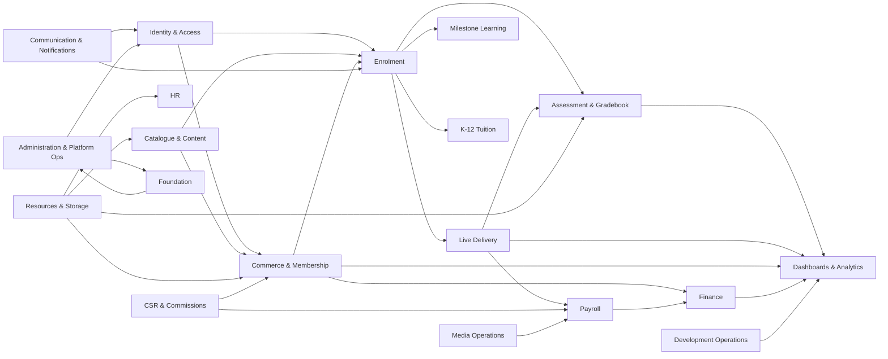
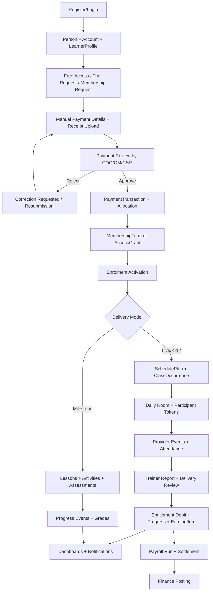

# Innovator Huzsam LMS & Operations System - Module, Entity and Relationship Model

_LMS+OPS System Only | Conceptual domain model and implementation planning reference_

> This document lists the proposed modules, domain entities/classes, relationships, lifecycle states, constraints and end-to-end flows for the new Innovator Huzsam LMS & Operations System. It is designed to sit beside the LMS+OPS Functional Requirements Specification v2.0 and to guide schema design, Supabase RLS design, API/service boundaries, UI planning and test-case development.

| Document field | Value |
| --- | --- |
| Version | 1.0 |
| Date | 10 August 2026 |
| Output format | Markdown |
| System scope | LMS portal, learning delivery, operations, finance, payroll, HR, Media Department, Development Department and administration |
| Explicit exclusion | Public website, marketing pages, SEO, public website CMS and landing-page-only features |
| Tech context | Next.js App Router + TypeScript, Supabase Auth/PostgreSQL/RLS/Storage/Realtime/Queues/Cron, Daily.co, Resend, manual payments at launch |
| Model level | Conceptual/logical domain model, not a final physical database migration |
| Entity count | 195 conceptual entities/classes |
| Module count | 20 LMS+OPS modules |

## 1. Purpose and Source Basis

### 1.1 Purpose

This document answers five implementation-planning questions:

1. Which major modules should the LMS+OPS system contain?
2. Which domain entities/classes should each module own?
3. How do entities relate to each other across module boundaries?
4. Which constraints, invariants and lifecycle states must be protected?
5. What are the main end-to-end business flows across modules?

The model is deliberately modular. A single deployable Next.js/Supabase product may contain all modules initially, but each module should be implemented behind clear service/repository boundaries so that identity, catalogue, commerce, enrolment, delivery, learning, finance and payroll do not become tightly coupled again.

### 1.2 Source basis

- LMS+OPS Functional Requirements Specification v2.0.
- Current LMS & Operations System Analysis and Next-System Direction.
- IHS Portal - Next Development Requirements.
- Confirmed stack and product decisions in this project: Next.js, Supabase, Daily.co, Resend and manual receipt-based payment approval at launch.

### 1.3 Important modeling notes

- This is a product/domain model, not a final SQL migration. Physical table names, indexes, functions, triggers and RLS policies should be designed after stakeholder review.
- `Person`, `Account`, `LearnerProfile`, `StaffProfile`, `GuardianRelationship`, `Enrolment`, `MembershipTerm`, `PaymentTransaction`, `ClassOccurrence` and `PayrollRun` are separate concepts and should not be collapsed into one record.
- Public website and marketing-site entities are not included. Portal discovery and free learner flows are included because they are part of the LMS product.
- The words "entity" and "class" are used conceptually. In implementation, they may become PostgreSQL tables, database views, TypeScript domain types, service classes, storage objects or read models depending on the use case.

## 2. Core Architecture Principles

| Principle | Design implication |
| --- | --- |
| Separate identity from relationships | An account is not a learner, a learner is not a payer, a staff member may also be a guardian or learner, and a person may hold multiple scoped roles. |
| Separate money, entitlement, delivery and payroll | Payments, memberships, class attendance, entitlement debits and trainer earnings reference each other but do not share one mutable status. |
| Use versioned records for changing business facts | Course versions, prices, membership terms, wage agreements, assessment rules and grading scales need snapshots/versions so historical outcomes remain explainable. |
| Use append-only ledgers/events for balances and high-value decisions | Credits, entitlement changes, approvals, payment postings, payroll earnings, grade corrections and audit events are appended rather than overwritten. |
| Make multi-course learning foundational | A learner may hold many enrolments across live classes, milestone courses and K-12 subjects. Dashboards and permissions must assume many active learning contexts. |
| Model group classes properly | A class occurrence has a participant list. Attendance, credit debit and notes are participant-specific. |
| Keep external providers behind adapters | Daily.co, Resend and future payment processors create evidence/events, but internal domain records remain source of truth. |
| Default to private storage and scoped access | Receipts, resources, submissions, HR documents, media files and exports are stored privately and served through authorized signed access. |
| Prefer archive/retention to destructive delete | Learner history, financial records, payroll, grades, attendance and HR documents should be archived/retained, not silently deleted. |

## 3. High-Level Domain Map



## 4. Module Registry

| # | Code | Module | Purpose | Primary owned entities |
| --- | --- | --- | --- | --- |
| 01 | FND | Platform Foundation | Defines the technical and operational foundations that all LMS+OPS modules depend on: organization scope, audit, jobs, files, id generation, reference data, integration adapters, and platform-wide events. | Organization, Branch, ReferenceDataSet, ReferenceDataValue, SystemSetting, ... |
| 02 | IAM | Identity, Authentication and Authorization | Separates account identity from learner, staff, guardian, payer and operational relationships. Supports public learner accounts, staff invitations, Google authentication, email/password authentication, scoped roles and future roles. | Person, Account, AuthenticationIdentity, ContactMethod, Role, ... |
| 03 | PORT | Learner Portal Catalogue and Free Users | Allows registered free learners to explore approved portal catalogue entries, previews, free resources and trial requests before purchasing membership. This is inside the LMS portal, not a marketing website module. | PortalCatalogueEntry, PreviewAccessRule, FreeAccessGrant, TrialRequest, TrialPreference, ... |
| 04 | CAT | Catalogue, Content Authoring, Products and Pricing | Defines the academic/course catalogue, course versions, content structure, reusable products, variants, bundles, pricing and publication lifecycle. | Course, CourseVersion, SyllabusNode, Lesson, LearningActivity, ... |
| 05 | COM | Commerce, Manual Payments and Memberships | Handles membership purchase/renewal requests, payer-entered payment details, private receipt upload, administrative review, approved payment transactions, allocations, access grants, entitlement ledgers and future payment-processor readiness. | Cart, MembershipRequest, RequestLine, ManualPaymentSubmission, PaymentReceiptFile, ... |
| 06 | ENR | Enrolment and Learner Relationships | Models the learner academic relationship separately from identity, payment and class records. Supports one learner taking multiple live, milestone and K-12 offerings at the same time. | Enrolment, EnrolmentStateHistory, CourseRun, RunMembership, TrainerAssignment, ... |
| 07 | LIVE | Live Classes and Trial Delivery | Schedules, provisions, tracks and approves live trial and regular classes using Daily.co while preserving participant-level attendance, educational reporting and independent entitlement/payroll outcomes. | ClassTemplate, ClassOccurrence, ClassParticipant, MeetingRoom, MeetingToken, ... |
| 08 | MILE | Milestone-Based Self-Paced Learning | Supports fixed milestone training where learners progress through levels, milestones, lessons, activities, quizzes, assignments and voice tasks with automated and/or trainer-reviewed completion rules. | Level, Milestone, LearnerMilestoneState, LessonCompletion, ProgressEvent, ... |
| 09 | K12 | K-12 Tuition | Supports grade/year-based subject tuition, subject products, bundles, syllabi, live sections, guardians, assessment categories, report cards and teacher grading. | AcademicYear, GradeLevel, SubjectCourse, K12Section, SyllabusOutline, ... |
| 10 | ASM | Assessments, Submissions and Gradebook | Provides reusable quizzes, assignments, voice submissions, rubrics, grading, feedback and gradebooks across live classes, milestone learning and K-12 tuition. | QuestionBank, Question, QuestionVersion, Assessment, AssessmentItem, ... |
| 11 | RES | Resources and Media Assets | Manages reliable private file/media storage for learning resources, receipts, submissions, HR documents, media department work and operational attachments. | ResourceAsset, ResourceVersion, StorageObjectMetadata, UploadIntent, FileAccessGrant, ... |
| 12 | MSG | Communication, Cases and Notifications | Provides course/context-aware chat, support cases, complaints, departmental communications, announcements, notification preferences and Resend-backed transactional email. | Conversation, ConversationParticipant, Message, MessageAttachment, Case, ... |
| 13 | DSH | Role Dashboards and Analytics | Provides role-specific dashboards, operational drill-downs, analytics snapshots and exportable reports based on source domains, without becoming the source of truth. | DashboardDefinition, DashboardWidget, MetricSnapshot, AnalyticsView, ReportExport, ... |
| 14 | FIN | Finance | Tracks approved learner payments, allocations, refunds, expenses, reconciliation, finance periods and accounting-style postings independently from enrolment, classes and payroll. | FinanceAccount, FinanceTransaction, FinanceLine, Expense, ExpenseReceiptFile, ... |
| 15 | PAY | Payroll and Compensation | Generates payable earning items from approved delivery, commissions, media work and salary adjustments; manages payroll runs, approval, settlement and pay statements independently from class status and learner payments. | RateAgreement, RateRule, EarningItem, PayrollPeriod, PayrollRun, ... |
| 16 | HR | HR Profiles, Documents and Letters | Manages staff profiles, onboarding/offboarding, verified employee information, relatives/emergency contacts, documents, letters/certificates and HR events. | Department, EmploymentRecord, EmployeeDetailEvent, EmergencyContact, StaffDocument, ... |
| 17 | CSR | CSR Enrolments and Commission | Tracks leads, follow-ups, trial conversions, CSR-attributed enrolments, sales values, commissions, verification and payout eligibility. | Lead, LeadEvent, FollowUpTask, CSRAttribution, CommissionPlan, ... |
| 18 | MED | Media Department Operations | Moves media team work from spreadsheets into the portal: assignments, editor submissions, reviews, revisions, quality ratings, video wages, analytics and payroll integration. | MediaProject, MediaTask, MediaSubmission, MediaReview, MediaRevisionRequest, ... |
| 19 | DEV | Development Department Operations | Tracks development tasks, bugs, features, assignments, progress updates, testing status, deployment status and CTO/developer dashboards. | DevelopmentProject, DevelopmentItem, DevelopmentUpdate, BugReport, TestingRecord, ... |
| 20 | ADM | Administration and Platform Operations | Provides administrative controls for configuration, permissions, integrations, imports/exports, audit review, retention, queues, support tooling and operational safety. | AdminAction, PermissionChangeRequest, IntegrationConfiguration, WebhookEndpoint, WebhookEvent, ... |

## 5. System-Wide Entity Registry

The following table is the consolidated conceptual entity/class inventory. Detailed fields and rules appear again inside each module section.

| # | Module | Entity/Class | Description |
| --- | --- | --- | --- |
| 001 | FND | `Organization` | Top-level business boundary for IHS if multi-branch support is enabled. |
| 002 | FND | `Branch` | Optional operating branch, market, or country unit. |
| 003 | FND | `ReferenceDataSet` | Controlled list such as countries, currencies, contact types, class types, statuses and document types. |
| 004 | FND | `ReferenceDataValue` | Individual controlled value inside a data set. |
| 005 | FND | `SystemSetting` | Runtime configuration managed by authorized administrators. |
| 006 | FND | `FeatureFlag` | Controlled rollout flag for screens, workflows and integrations. |
| 007 | FND | `AuditEvent` | Immutable record of sensitive actions and lifecycle transitions. |
| 008 | FND | `DomainEvent` | Internal event emitted by domain workflows. |
| 009 | FND | `OutboxJob` | Durable job generated from domain events. |
| 010 | FND | `IntegrationLog` | Normalized record of external API request/response or webhook processing. |
| 011 | IAM | `Person` | Human identity independent from login method or business relationship. |
| 012 | IAM | `Account` | Login-capable account linked to a person. |
| 013 | IAM | `AuthenticationIdentity` | External or password identity used to authenticate. |
| 014 | IAM | `ContactMethod` | Email, phone, WhatsApp or address/contact record. |
| 015 | IAM | `Role` | Permission template such as COO, Operational Manager, CSR, Trainer, Student, Guardian, Finance, HR, Media Head, Editor, CTO or Developer. |
| 016 | IAM | `Permission` | Atomic capability such as payment.review, grade.publish or payroll.settle. |
| 017 | IAM | `RolePermission` | Join record between role and permission. |
| 018 | IAM | `RoleAssignment` | Scoped assignment of a role to an account. |
| 019 | IAM | `PolicyAcknowledgement` | Staff/learner acceptance of required policies. |
| 020 | IAM | `StaffProfile` | Employment/contract relationship for a person. |
| 021 | IAM | `LearnerProfile` | Academic learner relationship for a person. |
| 022 | IAM | `GuardianRelationship` | Authorized relationship between guardian/payer and learner. |
| 023 | IAM | `Invitation` | Time-limited invitation for staff, trainer, guardian or assisted learner onboarding. |
| 024 | IAM | `MFAEnrollment` | Multi-factor method enrollment for sensitive users. |
| 025 | IAM | `LoginSession` | Application session metadata. |
| 026 | PORT | `PortalCatalogueEntry` | Learner-facing listing for an offering inside the portal. |
| 027 | PORT | `PreviewAccessRule` | Defines what a free learner may view. |
| 028 | PORT | `FreeAccessGrant` | Access grant for a registered non-paying learner. |
| 029 | PORT | `TrialRequest` | Learner request for a trial class. |
| 030 | PORT | `TrialPreference` | Structured preferences on class type, timing, language level and contact method. |
| 031 | PORT | `PortalActivityEvent` | Lightweight event for preview opened, resource viewed or CTA clicked. |
| 032 | CAT | `Course` | Academic/course identity such as Spoken English, IELTS, Digital Marketing, Practical AI, K-12 Mathematics. |
| 033 | CAT | `CourseVersion` | Immutable published or draft syllabus/content version. |
| 034 | CAT | `SyllabusNode` | Hierarchical structure: level, milestone, module, unit, chapter or lesson group. |
| 035 | CAT | `Lesson` | Instructional unit. |
| 036 | CAT | `LearningActivity` | Interactive or instructional activity attached to lesson. |
| 037 | CAT | `CourseResourceLink` | Association between course/version/node/lesson/activity and ResourceAsset. |
| 038 | CAT | `Product` | Commercial sellable item. |
| 039 | CAT | `ProductVariant` | Selectable delivery/service variant. |
| 040 | CAT | `Price` | Versioned price for product/variant. |
| 041 | CAT | `Bundle` | Commercial bundle grouping multiple child products or subject entitlements. |
| 042 | CAT | `BundleItem` | Child item inside bundle. |
| 043 | CAT | `PublicationReview` | Review workflow for course/product publication. |
| 044 | COM | `Cart` | Optional short-lived learner/payer selection container. |
| 045 | COM | `MembershipRequest` | Order-like request for new membership, renewal or access. |
| 046 | COM | `RequestLine` | Requested product/variant/price snapshot. |
| 047 | COM | `ManualPaymentSubmission` | Payer-entered evidence for bank/e-wallet/manual payment. |
| 048 | COM | `PaymentReceiptFile` | Private uploaded receipt/evidence file metadata. |
| 049 | COM | `PaymentReview` | Administrative decision on manual payment submission. |
| 050 | COM | `PaymentTransaction` | Confirmed internal payment transaction. |
| 051 | COM | `PaymentAllocation` | Allocation of payment amount to request lines, terms or grants. |
| 052 | COM | `InvoiceOrReceipt` | Official financial document issued after approval. |
| 053 | COM | `MembershipTerm` | Commercial/service agreement for a live or K-12 relationship. |
| 054 | COM | `AccessGrant` | Non-live access such as milestone course access or free preview. |
| 055 | COM | `EntitlementLedgerEntry` | Append-only credit/access balance event. |
| 056 | COM | `RefundOrReversal` | Controlled reversal of payment/allocation/entitlement effect. |
| 057 | COM | `FutureProcessorEvent` | Normalized future gateway event placeholder. |
| 058 | ENR | `Enrolment` | Learner relationship to a course version/run. |
| 059 | ENR | `EnrolmentStateHistory` | Immutable transitions for enrolment. |
| 060 | ENR | `CourseRun` | Operational delivery instance/cohort/section for live or K-12 course. |
| 061 | ENR | `RunMembership` | Join between enrolment and course run. |
| 062 | ENR | `TrainerAssignment` | Assignment of trainer/staff to enrolment or course run. |
| 063 | ENR | `SchedulePlan` | Planned recurring schedule or class cadence. |
| 064 | ENR | `MembershipEnrolmentAllocation` | Connects commercial term/access grant to academic enrolment. |
| 065 | ENR | `LearnerNote` | Private learner note attached to course, lesson or class. |
| 066 | LIVE | `ClassTemplate` | Reusable class configuration for trial, regular, makeup, group or special class. |
| 067 | LIVE | `ClassOccurrence` | Scheduled class instance. |
| 068 | LIVE | `ClassParticipant` | Learner/staff participant in an occurrence. |
| 069 | LIVE | `MeetingRoom` | Daily.co room or manual fallback meeting context. |
| 070 | LIVE | `MeetingToken` | Short-lived participant token. |
| 071 | LIVE | `MeetingProviderEvent` | Webhook or API event from Daily.co. |
| 072 | LIVE | `AttendanceRecord` | Reconciled attendance for participant. |
| 073 | LIVE | `TrainerClassReport` | Educational report submitted after class. |
| 074 | LIVE | `DeliveryReview` | Operations approval/rejection record for class delivery. |
| 075 | LIVE | `ClassRescheduleRequest` | Controlled request to move class. |
| 076 | LIVE | `CancellationRecord` | Cancellation/no-show/makeup record. |
| 077 | MILE | `Level` | Top-level course progression level. |
| 078 | MILE | `Milestone` | Progress checkpoint inside a level. |
| 079 | MILE | `LearnerMilestoneState` | Learner-specific state for milestone. |
| 080 | MILE | `LessonCompletion` | Learner completion of a lesson/activity. |
| 081 | MILE | `ProgressEvent` | Append-only learning progress event. |
| 082 | MILE | `UnlockRule` | Reusable rule for level/milestone/lesson unlock. |
| 083 | MILE | `ProgressSummary` | Materialized dashboard summary. |
| 084 | K12 | `AcademicYear` | Academic cycle. |
| 085 | K12 | `GradeLevel` | K-12 grade/class level. |
| 086 | K12 | `SubjectCourse` | Subject-specific course identity. |
| 087 | K12 | `K12Section` | Live group/section for subject tuition. |
| 088 | K12 | `SyllabusOutline` | High-level K-12 syllabus/chapter plan. |
| 089 | K12 | `AssessmentCategory` | K-12 gradebook category such as homework, quiz, exam, participation. |
| 090 | K12 | `GradingScale` | Scale for marks/grades. |
| 091 | K12 | `ReportCard` | Published academic report for learner/period. |
| 092 | K12 | `GuardianReportAccess` | Policy row controlling guardian view of reports. |
| 093 | ASM | `QuestionBank` | Reusable pool of questions. |
| 094 | ASM | `Question` | Question identity. |
| 095 | ASM | `QuestionVersion` | Versioned question content and answer rules. |
| 096 | ASM | `Assessment` | Assessment definition: quiz, assignment, exam, placement, homework. |
| 097 | ASM | `AssessmentItem` | Question/task placement inside assessment. |
| 098 | ASM | `AssessmentPolicy` | Attempts, time limit, late rules, pass threshold, randomization. |
| 099 | ASM | `AssessmentAssignment` | Assignment of assessment to enrolment, course run, milestone or class. |
| 100 | ASM | `QuizAttempt` | Learner quiz attempt. |
| 101 | ASM | `AttemptResponse` | Answer to an assessment item. |
| 102 | ASM | `AssignmentSubmission` | Text/link/file/voice submission. |
| 103 | ASM | `VoiceSubmission` | Specialized voice recording evidence. |
| 104 | ASM | `Rubric` | Grading rubric definition. |
| 105 | ASM | `RubricCriterion` | Rubric scoring dimension. |
| 106 | ASM | `Grade` | Grade/score assigned to attempt/submission/category. |
| 107 | ASM | `Feedback` | Trainer/system feedback on work. |
| 108 | ASM | `Gradebook` | Per enrolment/run grade aggregation. |
| 109 | RES | `ResourceAsset` | Logical asset such as PDF, slide, video, audio, image, text or link. |
| 110 | RES | `ResourceVersion` | Version of a resource asset. |
| 111 | RES | `StorageObjectMetadata` | Database metadata for private storage object. |
| 112 | RES | `UploadIntent` | Pre-authorized upload request. |
| 113 | RES | `FileAccessGrant` | Temporary permission to view/download a file. |
| 114 | RES | `ResourceAssignment` | Assignment of resource to student, class, programme, milestone, enrolment or staff group. |
| 115 | RES | `FileProcessingJob` | Virus scan, thumbnail, transcript, compression or backup job. |
| 116 | RES | `ArchiveRecord` | Controlled archive/removal reason for asset or version. |
| 117 | MSG | `Conversation` | Contextual chat thread. |
| 118 | MSG | `ConversationParticipant` | Participant and role in conversation. |
| 119 | MSG | `Message` | Chat message. |
| 120 | MSG | `MessageAttachment` | File attachment in conversation. |
| 121 | MSG | `Case` | Structured complaint/support/feedback issue. |
| 122 | MSG | `CaseEvent` | Append-only case timeline event. |
| 123 | MSG | `Announcement` | One-to-many message to role/course/department audience. |
| 124 | MSG | `Notification` | In-app notification record. |
| 125 | MSG | `NotificationPreference` | User preference for email/in-app/future WhatsApp. |
| 126 | MSG | `EmailTemplate` | Versioned Resend template metadata. |
| 127 | MSG | `EmailDeliveryAttempt` | Resend send attempt and delivery result. |
| 128 | MSG | `SLARule` | Service-level rule for cases/follow-ups. |
| 129 | DSH | `DashboardDefinition` | Configured dashboard for a role or workspace. |
| 130 | DSH | `DashboardWidget` | Individual metric/table/calendar/chart component. |
| 131 | DSH | `MetricSnapshot` | Time-stamped metric value for reporting. |
| 132 | DSH | `AnalyticsView` | Saved filtered analytical view. |
| 133 | DSH | `ReportExport` | Generated export file request/result. |
| 134 | DSH | `AlertRule` | Operational threshold for exceptions. |
| 135 | FIN | `FinanceAccount` | Internal cash/bank/wallet or expense account. |
| 136 | FIN | `FinanceTransaction` | Accounting-style transaction/posting. |
| 137 | FIN | `FinanceLine` | Line item inside finance transaction. |
| 138 | FIN | `Expense` | Operational expense record. |
| 139 | FIN | `ExpenseReceiptFile` | Evidence file for expense. |
| 140 | FIN | `ReconciliationBatch` | Periodic reconciliation group. |
| 141 | FIN | `ReconciliationItem` | Individual matched/unmatched item. |
| 142 | FIN | `FinancePeriod` | Monthly/period close boundary. |
| 143 | FIN | `CreditNote` | Financial credit/adjustment owed to payer. |
| 144 | PAY | `RateAgreement` | Effective-dated wage/compensation agreement. |
| 145 | PAY | `RateRule` | Specific pay rule by class type, duration, membership, group size, media item or role. |
| 146 | PAY | `EarningItem` | Immutable payable item from approved source. |
| 147 | PAY | `PayrollPeriod` | Pay period. |
| 148 | PAY | `PayrollRun` | Draft/approved/settled payroll run. |
| 149 | PAY | `PayrollLine` | Line in payroll run. |
| 150 | PAY | `PayrollReservation` | Atomic reservation of earning item for a run. |
| 151 | PAY | `PayrollApproval` | Approval/rejection of payroll run. |
| 152 | PAY | `PayrollSettlement` | Payment/settlement record. |
| 153 | PAY | `PayStatement` | Staff-facing statement file/record. |
| 154 | HR | `Department` | Organizational unit such as Operations, CSR, Training, Media, Development, Finance, HR. |
| 155 | HR | `EmploymentRecord` | Employment lifecycle record. |
| 156 | HR | `EmployeeDetailEvent` | Timeline event for profile/detail changes. |
| 157 | HR | `EmergencyContact` | Parent, guardian, spouse or emergency contact for employee. |
| 158 | HR | `StaffDocument` | HR document metadata. |
| 159 | HR | `LetterTemplate` | Template for offer, joining, employment, experience, completion, termination, suspension, warning, fine and other letters. |
| 160 | HR | `GeneratedLetter` | Issued letter/certificate. |
| 161 | HR | `HRCase` | Sensitive HR matter. |
| 162 | HR | `DisciplinaryEvent` | Warning, penalty, fine, suspension or related event. |
| 163 | HR | `OnboardingChecklist` | Required onboarding tasks for staff role. |
| 164 | CSR | `Lead` | Prospect or sales opportunity. |
| 165 | CSR | `LeadEvent` | Timeline event for lead. |
| 166 | CSR | `FollowUpTask` | CSR follow-up task. |
| 167 | CSR | `CSRAttribution` | Attribution of enrolment/membership to CSR. |
| 168 | CSR | `CommissionPlan` | Rules for calculating CSR commission. |
| 169 | CSR | `CommissionItem` | Potential/payable commission. |
| 170 | CSR | `CommissionReview` | COO/authorized review of commission. |
| 171 | MED | `MediaProject` | Campaign, channel or content project. |
| 172 | MED | `MediaTask` | Assigned video/content editing task. |
| 173 | MED | `MediaSubmission` | Editor submitted file/link/details. |
| 174 | MED | `MediaReview` | Review decision/comment/rating. |
| 175 | MED | `MediaRevisionRequest` | Requested changes after review. |
| 176 | MED | `MediaWageRule` | Pay rule for media work/video. |
| 177 | MED | `MediaEarningSource` | Approved media work prepared for payroll. |
| 178 | MED | `MediaAnalyticsSnapshot` | Aggregated media counts/ratings/wages. |
| 179 | DEV | `DevelopmentProject` | Product/engineering project area. |
| 180 | DEV | `DevelopmentItem` | Task, bug or feature. |
| 181 | DEV | `DevelopmentUpdate` | Progress note/update on item. |
| 182 | DEV | `BugReport` | Detailed bug report. |
| 183 | DEV | `TestingRecord` | QA/testing result. |
| 184 | DEV | `DeploymentRecord` | Deployment/release evidence. |
| 185 | DEV | `Blocker` | Blocked reason/dependency. |
| 186 | ADM | `AdminAction` | High-risk administrative command record. |
| 187 | ADM | `PermissionChangeRequest` | Request/approval for role or permission change. |
| 188 | ADM | `IntegrationConfiguration` | Configured provider settings metadata. |
| 189 | ADM | `WebhookEndpoint` | Registered webhook handler metadata. |
| 190 | ADM | `WebhookEvent` | Inbound webhook record. |
| 191 | ADM | `JobQueueItem` | Scheduled/retryable work item. |
| 192 | ADM | `DataImportBatch` | Bulk import batch. |
| 193 | ADM | `DataExportRequest` | Controlled export request. |
| 194 | ADM | `RetentionPolicy` | Data retention/archive rule. |
| 195 | ADM | `SupportImpersonationSession` | Temporary support access session. |

## 6. Canonical Relationship Map

### 6.1 High-level ER overview

```mermaid
erDiagram
  PERSON ||--o{ ACCOUNT : owns
  ACCOUNT ||--o{ AUTHENTICATION_IDENTITY : uses
  ACCOUNT ||--o{ ROLE_ASSIGNMENT : receives
  ROLE ||--o{ ROLE_PERMISSION : includes
  PERMISSION ||--o{ ROLE_PERMISSION : maps
  PERSON ||--o| LEARNER_PROFILE : may_have
  PERSON ||--o| STAFF_PROFILE : may_have
  PERSON ||--o{ GUARDIAN_RELATIONSHIP : participates
  LEARNER_PROFILE ||--o{ ENROLMENT : has
  COURSE ||--o{ COURSE_VERSION : versions
  COURSE_VERSION ||--o{ SYLLABUS_NODE : contains
  COURSE_VERSION ||--o{ ENROLMENT : used_by
  COURSE ||--o{ PRODUCT : commercialized_by
  PRODUCT ||--o{ PRODUCT_VARIANT : offers
  PRODUCT_VARIANT ||--o{ PRICE : priced_by
  MEMBERSHIP_REQUEST ||--o{ REQUEST_LINE : contains
  MEMBERSHIP_REQUEST ||--o{ MANUAL_PAYMENT_SUBMISSION : evidenced_by
  MANUAL_PAYMENT_SUBMISSION ||--o{ PAYMENT_RECEIPT_FILE : attaches
  MANUAL_PAYMENT_SUBMISSION ||--o{ PAYMENT_REVIEW : reviewed_by
  PAYMENT_TRANSACTION ||--o{ PAYMENT_ALLOCATION : allocates
  MEMBERSHIP_TERM ||--o{ ENTITLEMENT_LEDGER_ENTRY : records
  ENROLMENT ||--o{ CLASS_PARTICIPANT : joins
  CLASS_OCCURRENCE ||--o{ CLASS_PARTICIPANT : includes
  CLASS_PARTICIPANT ||--o| ATTENDANCE_RECORD : reconciles
  CLASS_OCCURRENCE ||--o| MEETING_ROOM : provisions
  MEETING_ROOM ||--o{ MEETING_PROVIDER_EVENT : receives
  CLASS_OCCURRENCE ||--o{ TRAINER_CLASS_REPORT : reports
  CLASS_OCCURRENCE ||--o{ DELIVERY_REVIEW : reviewed_by
  ENROLMENT ||--o{ PROGRESS_EVENT : produces
  ASSESSMENT ||--o{ ASSESSMENT_ITEM : contains
  ASSESSMENT_ASSIGNMENT ||--o{ QUIZ_ATTEMPT : attempts
  ASSESSMENT_ASSIGNMENT ||--o{ ASSIGNMENT_SUBMISSION : submissions
  GRADEBOOK ||--o{ GRADE : summarizes
  RESOURCE_ASSET ||--o{ RESOURCE_VERSION : versions
  CONVERSATION ||--o{ MESSAGE : contains
  CASE ||--o{ CASE_EVENT : tracks
  NOTIFICATION ||--o{ EMAIL_DELIVERY_ATTEMPT : sends
  EARNING_ITEM ||--o{ PAYROLL_RESERVATION : reserved_by
  PAYROLL_RUN ||--o{ PAYROLL_LINE : contains
  PAYROLL_SETTLEMENT ||--o{ FINANCE_TRANSACTION : posts
```



### 6.2 Relationship catalogue

| Source | Target | Cardinality | Meaning / constraint |
| --- | --- | --- | --- |
| `Person` | `Account` | 1 to many | A human may have accounts/identities over time; each active login maps to a person. |
| `Account` | `AuthenticationIdentity` | 1 to many | Supports email/password, Google and future channels. |
| `Account` | `RoleAssignment` | 1 to many | Authorization is scoped and effective-dated. |
| `Role` | `Permission` | many to many | RolePermission defines permission templates. |
| `Person` | `LearnerProfile` | 1 to 0..1 | Learner relationship is separate from staff/guardian/payer. |
| `LearnerProfile` | `Enrolment` | 1 to many | Multi-course support foundation. |
| `Course` | `CourseVersion` | 1 to many | Published versions are immutable for historical consistency. |
| `CourseVersion` | `SyllabusNode` | 1 to many | Hierarchical content model. |
| `SyllabusNode` | `SyllabusNode` | 1 to many recursive | Levels/milestones/modules/units/lessons nest inside version. |
| `Lesson` | `LearningActivity` | 1 to many | Video/audio/text/quiz/assignment/voice activities. |
| `Product` | `ProductVariant` | 1 to many | Class type/duration/audience variations. |
| `ProductVariant` | `Price` | 1 to many | Versioned prices. |
| `MembershipRequest` | `RequestLine` | 1 to many | Order-like snapshot of selected products/prices. |
| `MembershipRequest` | `ManualPaymentSubmission` | 1 to many | One request can have corrections/resubmissions. |
| `ManualPaymentSubmission` | `PaymentReceiptFile` | 1 to many | Private uploaded receipt evidence. |
| `ManualPaymentSubmission` | `PaymentReview` | 1 to many | Decision history. |
| `PaymentReview` | `PaymentTransaction` | 1 to 0..1 | Created only on approval. |
| `PaymentTransaction` | `PaymentAllocation` | 1 to many | Allocates money to terms/access grants. |
| `PaymentAllocation` | `MembershipTerm or AccessGrant` | 1 to many | Activates service/access through allocation. |
| `MembershipTerm` | `EntitlementLedgerEntry` | 1 to many | Credit/access ledger is append-only. |
| `MembershipTerm` | `Enrolment` | many to 1 through allocation | Commercial term supplies academic enrolment. |
| `CourseRun` | `ClassOccurrence` | 1 to many | Live delivery schedule. |
| `ClassOccurrence` | `ClassParticipant` | 1 to many | True group and one-to-one class support. |
| `ClassParticipant` | `AttendanceRecord` | 1 to 0..1 | Participant-level attendance. |
| `ClassOccurrence` | `MeetingRoom` | 1 to 0..1 active | Daily.co room or controlled fallback. |
| `MeetingRoom` | `MeetingProviderEvent` | 1 to many | Provider evidence for attendance. |
| `ClassOccurrence` | `TrainerClassReport` | 1 to many | Educational reports after class. |
| `DeliveryReview` | `EntitlementLedgerEntry` | 1 to many via event | Approved attendance debits credits. |
| `DeliveryReview` | `EarningItem` | 1 to many via event | Approved delivery generates payable earning. |
| `Assessment` | `AssessmentItem` | 1 to many | Questions/tasks inside assessment. |
| `AssessmentAssignment` | `QuizAttempt or AssignmentSubmission` | 1 to many | Learner work evidence. |
| `QuizAttempt` | `AttemptResponse` | 1 to many | Answers per item. |
| `Grade` | `Feedback` | 1 to many | Learner-visible and staff feedback. |
| `Enrolment` | `ProgressEvent` | 1 to many | Append-only learning progress. |
| `ResourceAsset` | `ResourceVersion` | 1 to many | Versioned private files/resources. |
| `UploadIntent` | `StorageObjectMetadata` | 1 to many | Secure file upload lifecycle. |
| `Conversation` | `Message` | 1 to many | Context-aware chat. |
| `Case` | `CaseEvent` | 1 to many | Support/complaint timeline. |
| `Notification` | `EmailDeliveryAttempt` | 1 to many | Resend delivery attempts. |
| `RateAgreement` | `RateRule` | 1 to many | Effective-dated wage rules. |
| `EarningItem` | `PayrollReservation` | 1 to 0..1 active | Prevents duplicate payroll drafts. |
| `PayrollRun` | `PayrollLine` | 1 to many | Earnings/deductions/adjustments. |
| `PayrollSettlement` | `FinanceTransaction` | 1 to 1 or many | Settlement posts finance expense. |
| `StaffProfile` | `GeneratedLetter` | 1 to many | HR letter history. |
| `MediaTask` | `MediaSubmission` | 1 to many | Revision-ready media workflow. |
| `MediaReview` | `MediaEarningSource` | 1 to 0..1 | Approved media work becomes payable. |
| `DevelopmentItem` | `TestingRecord/DeploymentRecord` | 1 to many | Tracks development QA and deployment. |

## 7. Global Constraints and Invariants

| Constraint | Rule |
| --- | --- |
| Identity boundary | A person/account cannot directly contain programme, trainer, credits, payments, payroll status or class status fields. |
| Multi-enrolment | LearnerProfile to Enrolment is one-to-many; all learner dashboards, payment allocations, resources and progress must support multiple simultaneous enrolments. |
| Manual payment evidence | ManualPaymentSubmission and PaymentReceiptFile are evidence only; they do not activate terms, credits, enrolments or commissions until approved. |
| Atomic approval | Payment approval creates PaymentTransaction, PaymentAllocation, MembershipTerm/AccessGrant, EntitlementLedgerEntry, notifications and audit events in one transactional workflow. |
| Participant attendance | Attendance belongs to ClassParticipant, not only to ClassOccurrence, so group classes can track every learner separately. |
| Immutable source events | Approved deliveries, payment postings, grade publications, payroll settlements and finance period locks are corrected through reversals/adjustments, not destructive edits. |
| Course versioning | Historical enrolments remain tied to their CourseVersion; new course edits create versions and do not rewrite learner history. |
| Price and wage snapshots | RequestLine, MembershipTerm, RateRule and EarningItem must snapshot the values used at the time of agreement/work. |
| Payroll uniqueness | One approved source event creates at most one original EarningItem; one EarningItem has at most one active PayrollReservation. |
| Provider adapters | Daily.co and Resend provider identifiers are stored as integration evidence and normalized into internal records; providers do not own business state. |
| RLS and server authorization | Every exposed entity is protected by Supabase RLS plus server-side permission and scope checks. |
| Private storage | Files are private by default, validated by metadata/checksum/scan status and served through short-lived signed access. |
| Auditability | Role changes, approvals, financial actions, grade changes, payroll changes, HR events, file removal and data exports require immutable AuditEvent records. |
| Idempotency | External webhooks, payment approval, entitlement debits, meeting events, email sending and payroll earning generation require idempotency keys/unique constraints. |
| No hidden coupling | A class status cannot be a payroll status; a payment label cannot be a credit ledger; a receipt cannot be a payment; a learner cannot be a single programme record. |

## 8. Lifecycle State Catalogue

| Entity / process | Recommended lifecycle |
| --- | --- |
| `Account` | Invited -> Active -> Suspended -> Disabled -> Archived |
| `Staff onboarding` | Draft Profile -> Invitation Sent -> Invitation Accepted -> Policy/MFA Complete -> Active -> Suspended/Offboarded |
| `TrialRequest` | Submitted -> Qualified -> Scheduled -> Completed -> Converted/Lost/Closed |
| `CourseVersion` | Draft -> In Review -> Published -> Archived |
| `Product/Price` | Draft -> In Review -> Active -> Retired |
| `MembershipRequest` | Draft -> Submitted -> Awaiting Payment Evidence -> Under Review -> Approved/Rejected/Correction Requested -> Cancelled/Completed |
| `ManualPaymentSubmission` | Draft -> Uploaded -> Submitted -> Claimed -> Approved/Rejected/Correction Requested -> Superseded |
| `MembershipTerm` | Pending Activation -> Active -> Expiring -> Expired -> Suspended -> Cancelled -> Renewed |
| `Enrolment` | Pending -> Active -> Paused/Suspended -> Completed -> Withdrawn -> Archived |
| `ClassOccurrence` | Draft -> Scheduled -> Room Provisioned -> Live Window Open -> Completed/No Show/Cancelled -> Report Submitted -> Review Pending -> Approved/Rejected |
| `AttendanceRecord` | Expected -> Joined -> Left -> Reconciled -> Corrected/Disputed -> Approved |
| `LearnerMilestoneState` | Locked -> Unlocked -> In Progress -> Submitted/Review Pending -> Completed -> Reopened |
| `AssessmentAssignment` | Draft -> Assigned -> Open -> Submitted -> Grading -> Returned/Revision -> Published -> Closed |
| `Case` | Open -> In Review -> Waiting -> Resolved -> Closed -> Reopened |
| `Notification/Email` | Queued -> Sent -> Delivered/Bounced/Complained/Failed -> Retried/Dead Letter |
| `Expense` | Draft -> Submitted -> Under Review -> Approved/Rejected -> Posted -> Reversed |
| `PayrollRun` | Draft -> Submitted -> Approved/Rejected -> Settled -> Posted -> Locked |
| `MediaTask` | Assigned -> In Progress -> Submitted -> Under Review -> Revision Required/Approved -> Paid |
| `DevelopmentItem` | Planned -> Assigned -> In Progress -> Testing -> Completed -> Deployed -> Closed |
| `WebhookEvent` | Received -> Verified -> Processing -> Processed/Failed -> Retried/Dead Letter |

## 9. Detailed Module Models


### 9.1 FND - Platform Foundation

**Purpose:** Defines the technical and operational foundations that all LMS+OPS modules depend on: organization scope, audit, jobs, files, id generation, reference data, integration adapters, and platform-wide events.

#### Owned entities/classes

| Entity/Class | Description | Key attributes | Main relationships | Important constraints |
| --- | --- | --- | --- | --- |
| `Organization` | Top-level business boundary for IHS if multi-branch support is enabled. | id, name, legal_name, default_timezone, default_currency, status | Owns users, catalogue, enrolments, finance records, policies and configuration. | If single-organization launch is chosen, keep the entity as a future-proof scope or use a fixed system organization. |
| `Branch` | Optional operating branch, market, or country unit. | id, organization_id, name, country, timezone, status | May scope staff, learners, schedules, finance and reports. | Do not introduce branch-specific behavior unless IHS confirms separate branch operations. |
| `ReferenceDataSet` | Controlled list such as countries, currencies, contact types, class types, statuses and document types. | id, key, name, owner_module, status | Referenced by forms, validations and reporting. | Values used by historical records must not be deleted; archive instead. |
| `ReferenceDataValue` | Individual controlled value inside a data set. | id, data_set_id, code, label, sort_order, active | Used by entities that require controlled classifications. | Code must be unique inside a data set; label changes are versioned/audited when used in finance, payroll or academic reporting. |
| `SystemSetting` | Runtime configuration managed by authorized administrators. | id, key, value_json, environment, scope, updated_by | Controls feature limits, operational thresholds and defaults. | Sensitive values are never stored here; use secrets management. |
| `FeatureFlag` | Controlled rollout flag for screens, workflows and integrations. | id, key, enabled, audience_rule, start_at, end_at | Used by Next.js app and server actions to expose phased functionality. | All feature-flag changes require audit events. |
| `AuditEvent` | Immutable record of sensitive actions and lifecycle transitions. | id, actor_account_id, action, entity_type, entity_id, before_json, after_json, source_ip, created_at | Referenced by approvals, payments, role changes, grades, payroll, files and exports. | Append-only; no update/delete except exceptional system retention policy. |
| `DomainEvent` | Internal event emitted by domain workflows. | id, event_type, aggregate_type, aggregate_id, payload_json, idempotency_key, created_at | Feeds outbox, notifications, read models and integrations. | Idempotency key must be unique for externally repeated events. |
| `OutboxJob` | Durable job generated from domain events. | id, domain_event_id, job_type, payload_json, status, attempts, next_run_at | Used for emails, meeting provisioning, dashboard rollups, file processing and exports. | Must be retryable and idempotent. |
| `IntegrationLog` | Normalized record of external API request/response or webhook processing. | id, provider, direction, external_id, status, request_hash, response_code, processed_at | Used for Daily.co, Resend and future payment processors. | Never store raw secrets, tokens or excessive personal data. |

#### Relationships and cardinalities

- Organization 1 -> many Branch, Account, Course, Product, Order, Enrolment, PayrollRun, AuditEvent.
- DomainEvent 1 -> zero or many OutboxJob records.
- IntegrationLog may reference any business entity through provider, aggregate_type and aggregate_id.
- FeatureFlag and SystemSetting are read by application services but must not replace domain records.

#### Module constraints and invariants

- Every mutable business record includes created_at, created_by, updated_at and updated_by unless technically impossible.
- Every sensitive transition emits AuditEvent and, when other workflows depend on it, DomainEvent.
- Deletes are replaced with archive/disable states for learner, payment, grade, attendance, payroll and HR records.
- All tables exposed to client sessions require Supabase RLS policies; service-role use is restricted to server-only workers and audited admin flows.
- Dashboard read models are derived from source records and must not be treated as authoritative records.

#### Main flows

- Reference data change: Draft value -> Review if high impact -> Active -> Archived, preserving historical use.
- Background processing: Domain event -> Outbox job -> Worker claim -> Provider/action -> Integration log -> Success/retry/dead-letter.

### 9.2 IAM - Identity, Authentication and Authorization

**Purpose:** Separates account identity from learner, staff, guardian, payer and operational relationships. Supports public learner accounts, staff invitations, Google authentication, email/password authentication, scoped roles and future roles.

#### Owned entities/classes

| Entity/Class | Description | Key attributes | Main relationships | Important constraints |
| --- | --- | --- | --- | --- |
| `Person` | Human identity independent from login method or business relationship. | id, legal_name, display_name, date_of_birth, gender_optional, profile_photo_file_id, status | Can own learner, staff, guardian, payer and emergency-contact relationships. | A person is not automatically a learner, client, staff member or payer. |
| `Account` | Login-capable account linked to a person. | id, person_id, primary_email, auth_user_id, status, last_login_at | Has authentication identities, sessions and role assignments. | One active Supabase auth user maps to one Account; account may be disabled without deleting Person. |
| `AuthenticationIdentity` | External or password identity used to authenticate. | id, account_id, provider, provider_subject, email, verified_at | Supports Supabase email/password, Google and future channels. | Unique per provider + provider_subject; merging identities requires controlled account-linking. |
| `ContactMethod` | Email, phone, WhatsApp or address/contact record. | id, person_id, type, value, country_code, verified_at, is_primary | Used for notifications, recovery, guardians and HR emergency details. | Verification state is stored separately from raw contact value. |
| `Role` | Permission template such as COO, Operational Manager, CSR, Trainer, Student, Guardian, Finance, HR, Media Head, Editor, CTO or Developer. | id, key, label, description, active | Assigned through RoleAssignment. | Roles are templates, not direct authorization by themselves. |
| `Permission` | Atomic capability such as payment.review, grade.publish or payroll.settle. | id, key, module, action, description | Linked to roles and direct exceptions. | Permission names are stable and never reused for different behavior. |
| `RolePermission` | Join record between role and permission. | id, role_id, permission_id, condition_json | Determines default role capabilities. | High-risk permissions require explicit review even if role includes them. |
| `RoleAssignment` | Scoped assignment of a role to an account. | id, account_id, role_id, scope_type, scope_id, effective_from, effective_to, status | Authorizes actions in organization, department, course, cohort or learner scope. | Expired/revoked assignments deny access immediately. |
| `PolicyAcknowledgement` | Staff/learner acceptance of required policies. | id, account_id, policy_key, version, accepted_at | Required for onboarding and role activation. | New policy version can require re-acknowledgement. |
| `StaffProfile` | Employment/contract relationship for a person. | id, person_id, employee_code, department_id, manager_person_id, employment_status | Linked to HR, payroll, role assignment and documents. | Staff profile does not itself grant application access. |
| `LearnerProfile` | Academic learner relationship for a person. | id, person_id, learner_code, timezone, education_background, status | Owns enrolments, progress, submissions and learner dashboard. | Created for free users before payment or membership. |
| `GuardianRelationship` | Authorized relationship between guardian/payer and learner. | id, guardian_person_id, learner_person_id, relationship_type, permissions_json, verified_at, status | Controls guardian dashboard, reports, notifications and payments. | Can be limited by minor/consent policy and revoked. |
| `Invitation` | Time-limited invitation for staff, trainer, guardian or assisted learner onboarding. | id, invited_email, target_person_id, role_template_id, token_hash, expires_at, status | Used to activate controlled accounts without sharing permanent passwords. | Invitation token is one-time-use and stored only as hash. |
| `MFAEnrollment` | Multi-factor method enrollment for sensitive users. | id, account_id, factor_type, status, enrolled_at | Required for privileged staff roles. | Privileged permissions may require fresh MFA challenge. |
| `LoginSession` | Application session metadata. | id, account_id, auth_session_id, user_agent, ip_hash, created_at, revoked_at | Used for session monitoring and revocation. | Sensitive session details are minimized and retained by policy. |

#### Relationships and cardinalities

- Person 1 -> zero or many Account records, but launch should normally use one active Account per Person.
- Person 1 -> zero or one StaffProfile; Person 1 -> zero or one LearnerProfile; Person 1 -> many GuardianRelationship links.
- Account 1 -> many AuthenticationIdentity and RoleAssignment records.
- Role many -> many Permission through RolePermission.
- RoleAssignment scopes permissions to organization, branch, department, course, cohort, learner or global scope.

#### Module constraints and invariants

- No authorization decision may rely only on the browser route or client-side UI hiding.
- Staff onboarding is invitation-based; administrators must not distribute permanent known passwords.
- The same email or Google identity cannot create duplicate active accounts without an explicit merge/review flow.
- A CSR may not change protected prices, grades, trainer wages, payroll or broad finance records without explicit permission.
- Guardian access must be relationship-based, not inferred from shared phone/email alone.

#### Main flows

- Public learner registration: Supabase auth -> Account -> Person -> LearnerProfile -> free-access grant.
- Staff onboarding: StaffProfile draft -> Invitation sent -> Account activation -> policy acceptance/MFA -> role assignments active.
- Access check: authenticated account -> active role assignments -> permissions -> object scope -> record state -> allow/deny.

### 9.3 PORT - Learner Portal Catalogue and Free Users

**Purpose:** Allows registered free learners to explore approved portal catalogue entries, previews, free resources and trial requests before purchasing membership. This is inside the LMS portal, not a marketing website module.

#### Owned entities/classes

| Entity/Class | Description | Key attributes | Main relationships | Important constraints |
| --- | --- | --- | --- | --- |
| `PortalCatalogueEntry` | Learner-facing listing for an offering inside the portal. | id, course_id, product_id, title, summary, audience, delivery_model, status | References course, course version and products. | Only published and approved entries are visible. |
| `PreviewAccessRule` | Defines what a free learner may view. | id, target_type, target_id, access_level, requires_account, expires_after_days | Controls previews, free resources and trial content. | Cannot expose paid-only or unpublished content. |
| `FreeAccessGrant` | Access grant for a registered non-paying learner. | id, learner_profile_id, rule_id, starts_at, expires_at, status | Allows limited content tracking without membership. | Does not represent payment, membership or enrolment unless converted. |
| `TrialRequest` | Learner request for a trial class. | id, learner_profile_id, course_interest_id, timezone, availability_json, placement_notes, status | Creates later scheduled trial occurrence after CSR/Operations action. | Request is separate from the class occurrence. |
| `TrialPreference` | Structured preferences on class type, timing, language level and contact method. | id, trial_request_id, preference_type, value | Used for matching trainer/slot. | Preferences are not guaranteed scheduling commitments. |
| `PortalActivityEvent` | Lightweight event for preview opened, resource viewed or CTA clicked. | id, learner_profile_id, activity_type, target_type, target_id, created_at | Feeds conversion analytics and follow-up. | Must respect privacy and retention controls. |

#### Relationships and cardinalities

- LearnerProfile 1 -> many FreeAccessGrant, TrialRequest and PortalActivityEvent records.
- PortalCatalogueEntry references Course and optionally Product/Price data for comparison.
- TrialRequest can create one or many follow-up tasks and zero or one scheduled trial occurrence at a time.

#### Module constraints and invariants

- Preview/free access cannot bypass published course-version rules.
- Trial requests require verified contact or a workflow to verify contact before scheduling.
- Portal actions preserve source attribution for CSR follow-up but do not automatically create commissions.
- A learner can request multiple trials, but duplicate/pending requests for the same offering are flagged.

#### Main flows

- Portal exploration: catalogue entry -> preview/free resource -> create account if required -> free grant -> trial or membership CTA.
- Trial request: learner submits preferences -> CSR/Operations queue -> qualification -> scheduled trial occurrence.

### 9.4 CAT - Catalogue, Content Authoring, Products and Pricing

**Purpose:** Defines the academic/course catalogue, course versions, content structure, reusable products, variants, bundles, pricing and publication lifecycle.

#### Owned entities/classes

| Entity/Class | Description | Key attributes | Main relationships | Important constraints |
| --- | --- | --- | --- | --- |
| `Course` | Academic/course identity such as Spoken English, IELTS, Digital Marketing, Practical AI, K-12 Mathematics. | id, code, title, delivery_model, category, status | Has versions, products, resources and enrolments. | Course is not the same as a sellable product or membership. |
| `CourseVersion` | Immutable published or draft syllabus/content version. | id, course_id, version_label, lifecycle_state, effective_from, published_at | Owns syllabus nodes, assessments and preview flags. | Learners remain linked to the version they started unless migrated explicitly. |
| `SyllabusNode` | Hierarchical structure: level, milestone, module, unit, chapter or lesson group. | id, course_version_id, parent_id, node_type, title, sequence, release_rule | Organizes lessons, activities and assessments. | Parent must belong to same course version; sequence unique among siblings. |
| `Lesson` | Instructional unit. | id, syllabus_node_id, title, lesson_type, estimated_minutes, status | Contains activities/resources. | Lesson status follows version lifecycle. |
| `LearningActivity` | Interactive or instructional activity attached to lesson. | id, lesson_id, activity_type, config_json, required_for_completion | Can be video, audio, text, quiz, assignment, voice, live task or external activity. | Activity type config must validate against that type schema. |
| `CourseResourceLink` | Association between course/version/node/lesson/activity and ResourceAsset. | id, source_type, source_id, resource_asset_id, visibility, release_rule | Enables reusable resources. | Resource visibility cannot exceed source visibility. |
| `Product` | Commercial sellable item. | id, code, title, product_type, status | May sell live membership, milestone access, K-12 subject or bundle. | Product references academic offering but does not own course content. |
| `ProductVariant` | Selectable delivery/service variant. | id, product_id, class_type, duration_minutes, audience_type, delivery_mode, entitlement_rule_id | Examples: face-camera, audio-only, group, one-to-one, 30/45/60 min. | Variant must be valid for product delivery model. |
| `Price` | Versioned price for product/variant. | id, product_variant_id, currency, amount_minor, billing_period, valid_from, valid_to, status | Snapshotted onto requests/orders. | Historical prices are never overwritten. |
| `Bundle` | Commercial bundle grouping multiple child products or subject entitlements. | id, product_id, title, bundle_rule_json | Used for K-12 multi-subject packages. | Bundle grants child entitlements; it is not a copied course. |
| `BundleItem` | Child item inside bundle. | id, bundle_id, product_variant_id, quantity, entitlement_policy | Creates allocations/enrolments when bundle is approved. | Child product must be active and bundle-compatible. |
| `PublicationReview` | Review workflow for course/product publication. | id, target_type, target_id, submitted_by, reviewed_by, status, decision_reason | Controls approval before learner-facing use. | Reviewer cannot be the only author if segregation policy requires separate review. |

#### Relationships and cardinalities

- Course 1 -> many CourseVersion; CourseVersion 1 -> many SyllabusNode; SyllabusNode is recursive.
- Lesson 1 -> many LearningActivity; CourseResourceLink connects content to ResourceAsset.
- Product 1 -> many ProductVariant; ProductVariant 1 -> many Price records over time.
- Bundle 1 -> many BundleItem; BundleItem references child ProductVariant.
- PublicationReview references CourseVersion, Product, ProductVariant or Price depending on configured governance.

#### Module constraints and invariants

- Drafts can be edited; published versions are immutable except for controlled metadata corrections.
- A product cannot be sold unless it has an active price and valid entitlement rule.
- Course delivery model must remain explicit: live, milestone/self-paced, K-12 or approved future type.
- K-12 bundles produce child subject entitlements rather than one generic bundle enrolment.
- Preview flags must be intentional and cannot expose restricted assessments, answer keys or paid-only resources.

#### Main flows

- Authoring: draft course version -> build syllabus/content/assessments/resources -> submit review -> approved/published -> used by new enrolments.
- Product setup: course -> product -> variant -> price -> publication approval -> visible in portal and renewal workflows.
- Bundle setup: bundle product -> child bundle items -> price -> approval -> purchase creates multiple allocations/entitlements.

### 9.5 COM - Commerce, Manual Payments and Memberships

**Purpose:** Handles membership purchase/renewal requests, payer-entered payment details, private receipt upload, administrative review, approved payment transactions, allocations, access grants, entitlement ledgers and future payment-processor readiness.

#### Owned entities/classes

| Entity/Class | Description | Key attributes | Main relationships | Important constraints |
| --- | --- | --- | --- | --- |
| `Cart` | Optional short-lived learner/payer selection container. | id, account_id, status, expires_at | Contains prospective cart items. | Not authoritative for price after expiry. |
| `MembershipRequest` | Order-like request for new membership, renewal or access. | id, requester_account_id, learner_profile_id, request_type, status, submitted_at | Owns request lines and manual payment submissions. | Request snapshots selected terms and does not grant access before approval. |
| `RequestLine` | Requested product/variant/price snapshot. | id, membership_request_id, product_variant_id, price_snapshot_json, quantity, target_learner_id | Allocates future access/membership. | Snapshot is immutable after submission except cancel/recreate or explicit correction workflow. |
| `ManualPaymentSubmission` | Payer-entered evidence for bank/e-wallet/manual payment. | id, membership_request_id, payer_person_id, channel, amount_minor, currency, paid_at, reference_number, status | Reviewed by COO/OM/permissioned CSR. | Evidence never activates access by itself. |
| `PaymentReceiptFile` | Private uploaded receipt/evidence file metadata. | id, manual_payment_submission_id, storage_object_id, file_type, checksum, upload_status | Stored in Supabase Storage with RLS/signed access. | Validated file must be linked to submission before review. |
| `PaymentReview` | Administrative decision on manual payment submission. | id, submission_id, reviewer_account_id, decision, reason, reviewed_at | Creates approved transaction/allocation on approval or correction path on rejection. | Decision is immutable; corrections create linked new submissions. |
| `PaymentTransaction` | Confirmed internal payment transaction. | id, source_submission_id, payer_person_id, amount_minor, currency, status, posted_at | Financial source for allocations/receipts. | Created only through approved workflow or future verified provider event. |
| `PaymentAllocation` | Allocation of payment amount to request lines, terms or grants. | id, payment_transaction_id, request_line_id, allocated_amount_minor, allocation_type | Feeds membership/access activation. | Total allocations cannot exceed transaction amount unless policy allows overpayment credit. |
| `InvoiceOrReceipt` | Official financial document issued after approval. | id, payment_transaction_id, document_number, document_type, issued_at, file_id | Visible to payer/guardian/finance. | Numbering must be unique and immutable. |
| `MembershipTerm` | Commercial/service agreement for a live or K-12 relationship. | id, learner_profile_id, enrolment_id, product_variant_id, starts_at, ends_at, status, terms_snapshot_json | Supplies live class entitlement, schedule, trainer assignment and wage snapshot. | Renewal creates new term or renewal record; never overwrite prior term. |
| `AccessGrant` | Non-live access such as milestone course access or free preview. | id, learner_profile_id, course_version_id, source_type, starts_at, ends_at, status | Gates self-paced content. | Source can be free grant, paid allocation or admin adjustment. |
| `EntitlementLedgerEntry` | Append-only credit/access balance event. | id, membership_term_id, enrolment_id, entry_type, quantity, reason, source_type, source_id, created_at | Calculates class credits, attendance debits, reversals, extensions and adjustments. | Balance is derived; entries are not edited/deleted. |
| `RefundOrReversal` | Controlled reversal of payment/allocation/entitlement effect. | id, payment_transaction_id, amount_minor, reason, status, approved_by | Preserves correction history. | Cannot erase original transaction. |
| `FutureProcessorEvent` | Normalized future gateway event placeholder. | id, provider, external_event_id, payload_hash, status | Allows later integration without schema redesign. | Provider event maps into the same internal transaction/allocation model. |

#### Relationships and cardinalities

- MembershipRequest 1 -> many RequestLine and ManualPaymentSubmission records.
- ManualPaymentSubmission 1 -> many PaymentReceiptFile and many PaymentReview records.
- Approved PaymentReview 1 -> one PaymentTransaction -> many PaymentAllocation records.
- PaymentAllocation creates or renews MembershipTerm or AccessGrant and corresponding EntitlementLedgerEntry.
- MembershipTerm links to Enrolment for course-specific service delivery.

#### Module constraints and invariants

- Submitted receipt evidence must never grant membership, access, credits or commission before approval.
- Approval must be a single database transaction: review decision, payment transaction, allocations, membership/access activation and audit events.
- Duplicate reference/checksum/amount/currency/payer combinations must be flagged to reviewers.
- CSR approval is permission- and threshold-limited; self-approval of commission-bearing enrolments should be blocked or escalated.
- No online banking password, PIN, OTP, CVV or full card number is collected.

#### Main flows

- Manual renewal: learner/payer selects membership -> enters payment details -> uploads receipt -> submitted -> reviewer claims -> approve/reject/correction -> on approval activate term/entitlement.
- Future gateway: provider event -> validate idempotency/signature -> PaymentTransaction -> PaymentAllocation -> same membership/access activation path.

### 9.6 ENR - Enrolment and Learner Relationships

**Purpose:** Models the learner academic relationship separately from identity, payment and class records. Supports one learner taking multiple live, milestone and K-12 offerings at the same time.

#### Owned entities/classes

| Entity/Class | Description | Key attributes | Main relationships | Important constraints |
| --- | --- | --- | --- | --- |
| `Enrolment` | Learner relationship to a course version/run. | id, learner_profile_id, course_id, course_version_id, delivery_model, status, source_request_line_id | Owns progress, gradebook, attendance context and resources. | A learner can have many active enrolments. |
| `EnrolmentStateHistory` | Immutable transitions for enrolment. | id, enrolment_id, from_state, to_state, reason, actor_account_id, created_at | Explains activation, suspension, completion and withdrawal. | Append-only. |
| `CourseRun` | Operational delivery instance/cohort/section for live or K-12 course. | id, course_version_id, title, run_type, timezone, start_date, end_date, status | Groups learners and delivery staff. | May be one-to-one or group; not all enrolments need a run. |
| `RunMembership` | Join between enrolment and course run. | id, course_run_id, enrolment_id, joined_at, status | Creates roster. | One enrolment can move between runs through history, not overwrite. |
| `TrainerAssignment` | Assignment of trainer/staff to enrolment or course run. | id, trainer_staff_profile_id, target_type, target_id, role, effective_from, effective_to, status | Controls trainer workspace, class creation and grading access. | Effective-dated; historical assignment remains for old records. |
| `SchedulePlan` | Planned recurring schedule or class cadence. | id, target_type, target_id, timezone, recurrence_rule, duration_minutes, class_type, status | Creates scheduled occurrences. | Plan changes affect future occurrences only unless rescheduled explicitly. |
| `MembershipEnrolmentAllocation` | Connects commercial term/access grant to academic enrolment. | id, membership_term_id, access_grant_id, enrolment_id, allocation_policy_json | Explains which term funds which enrolment. | One payment can allocate to multiple enrolments; one enrolment can have many terms over time. |
| `LearnerNote` | Private learner note attached to course, lesson or class. | id, learner_profile_id, enrolment_id, target_type, target_id, note_text, visibility | Visible according to privacy rules. | Private learner notes are not staff comments unless shared. |

#### Relationships and cardinalities

- LearnerProfile 1 -> many Enrolment records.
- Enrolment many -> many CourseRun through RunMembership over time.
- TrainerAssignment can target CourseRun, Enrolment, MembershipTerm or K-12 section depending on service model.
- SchedulePlan can target CourseRun, Enrolment or TrainerAssignment.
- MembershipEnrolmentAllocation connects Commerce to Enrolment without merging the records.

#### Module constraints and invariants

- Person/account records never store a single current programme as a fixed field.
- Activating enrolment requires valid academic course version and valid access/membership path or authorized free/trial access.
- Trainer changes are effective-dated; they do not rewrite historical class attendance, grades or payroll.
- A suspended enrolment blocks new class participation/content access but preserves history.
- Completion is academic and separate from membership expiry/payment status.

#### Main flows

- Activation: approved allocation/free grant -> create/activate enrolment -> assign run/trainer/schedule if needed -> show on learner dashboard.
- Multi-course dashboard: query learner enrolments -> aggregate next class, progress, grades, messages, renewal status per enrolment.

### 9.7 LIVE - Live Classes and Trial Delivery

**Purpose:** Schedules, provisions, tracks and approves live trial and regular classes using Daily.co while preserving participant-level attendance, educational reporting and independent entitlement/payroll outcomes.

#### Owned entities/classes

| Entity/Class | Description | Key attributes | Main relationships | Important constraints |
| --- | --- | --- | --- | --- |
| `ClassTemplate` | Reusable class configuration for trial, regular, makeup, group or special class. | id, course_id, class_type, duration_minutes, audience_type, requires_approval | Used to create occurrences. | Template does not represent an actual class. |
| `ClassOccurrence` | Scheduled class instance. | id, course_run_id, enrolment_id_nullable, class_template_id, starts_at_utc, timezone, scheduled_duration, status | Owns participants, meeting room, reports and approvals. | Can have zero, one or many learner participants. |
| `ClassParticipant` | Learner/staff participant in an occurrence. | id, occurrence_id, person_id, enrolment_id, membership_term_id, participant_role, status | Owns individual attendance and entitlement effects. | Required for true group classes. |
| `MeetingRoom` | Daily.co room or manual fallback meeting context. | id, occurrence_id, provider, provider_room_id, room_url, status, expires_at | Created through provider adapter. | Provider details are not academic truth; they provide evidence. |
| `MeetingToken` | Short-lived participant token. | id, meeting_room_id, person_id, role, token_hash, expires_at | Allows secure join. | Never expose reusable trainer/admin room links unnecessarily. |
| `MeetingProviderEvent` | Webhook or API event from Daily.co. | id, provider, external_event_id, occurrence_id, person_id, event_type, event_at, payload_json | Feeds attendance reconciliation. | Idempotent by provider + external_event_id. |
| `AttendanceRecord` | Reconciled attendance for participant. | id, participant_id, joined_at, left_at, attended_minutes, status, evidence_source, correction_status | Used for approval, credit and payroll. | Manual corrections require reason and approver/reviewer. |
| `TrainerClassReport` | Educational report submitted after class. | id, occurrence_id, trainer_staff_profile_id, topics_covered, progress_notes, homework, learner_feedback, status | Reviewed by Operations when required. | Trainer report is educational; not the payment/payroll record. |
| `DeliveryReview` | Operations approval/rejection record for class delivery. | id, occurrence_id, reviewer_account_id, decision, reason, reviewed_at | On approval emits entitlement debit, progress and earning events. | Immutable decision history. |
| `ClassRescheduleRequest` | Controlled request to move class. | id, occurrence_id, requested_by, reason, proposed_time, status | Feeds notifications and schedule plan updates. | Past approved/settled occurrences cannot be casually moved. |
| `CancellationRecord` | Cancellation/no-show/makeup record. | id, occurrence_id, participant_id_nullable, reason, charge_policy, status | Determines entitlement debit/reversal and notifications. | Policy determines whether credits/payroll apply. |

#### Relationships and cardinalities

- CourseRun or Enrolment 1 -> many ClassOccurrence records.
- ClassOccurrence 1 -> many ClassParticipant records and one active MeetingRoom.
- ClassParticipant 1 -> zero or one AttendanceRecord after reconciliation.
- MeetingProviderEvent many -> one occurrence/person and informs AttendanceRecord.
- Approved DeliveryReview -> EntitlementLedgerEntry and EarningItem through domain events.

#### Module constraints and invariants

- Daily.co rooms are created through an adapter; manual links are controlled outage fallback only.
- Attendance must be participant-specific for group classes.
- Trainer reports are required before approval when policy requires educational evidence.
- Approval does not change payroll status; it emits a separate payable earning event.
- Class status must not be reused as finance/payroll status.

#### Main flows

- Trial class: trial request -> occurrence -> Daily room/tokens -> reminders -> join events -> attendance -> trainer report -> review -> CSR follow-up.
- Regular class: schedule plan -> occurrence -> Daily room/tokens -> attendance -> trainer report -> Operations approval -> entitlement debit/progress/earning item.

### 9.8 MILE - Milestone-Based Self-Paced Learning

**Purpose:** Supports fixed milestone training where learners progress through levels, milestones, lessons, activities, quizzes, assignments and voice tasks with automated and/or trainer-reviewed completion rules.

#### Owned entities/classes

| Entity/Class | Description | Key attributes | Main relationships | Important constraints |
| --- | --- | --- | --- | --- |
| `Level` | Top-level course progression level. | id, course_version_id, title, sequence, unlock_rule_json | Parent for milestones. | Sequence unique within course version. |
| `Milestone` | Progress checkpoint inside a level. | id, level_id, title, sequence, completion_rule_json | Contains lessons/activities. | Cannot be marked complete unless rules pass. |
| `LearnerMilestoneState` | Learner-specific state for milestone. | id, enrolment_id, milestone_id, state, unlocked_at, completed_at | Feeds learner dashboard progress. | Derived from progress events but may be materialized for speed. |
| `LessonCompletion` | Learner completion of a lesson/activity. | id, enrolment_id, lesson_id, activity_id_nullable, state, completed_at, evidence_json | Supports next-task logic. | Completion must reference course version used by enrolment. |
| `ProgressEvent` | Append-only learning progress event. | id, enrolment_id, target_type, target_id, event_type, score_nullable, created_at | Source for progress summaries. | Never delete; corrections use reversal/correction events. |
| `UnlockRule` | Reusable rule for level/milestone/lesson unlock. | id, rule_type, config_json, active | Evaluated by progress engine. | Must be deterministic and versioned. |
| `ProgressSummary` | Materialized dashboard summary. | id, enrolment_id, current_level_id, current_milestone_id, percent_complete, overdue_count, updated_at | Read model for dashboards. | Rebuildable from raw progress and grade records. |

#### Relationships and cardinalities

- CourseVersion 1 -> many Level -> many Milestone -> many SyllabusNode/Lesson/Activity.
- Enrolment 1 -> many ProgressEvent and LearnerMilestoneState records.
- Completion rules can reference LessonCompletion, QuizAttempt, AssignmentSubmission, Grade or TrainerSignoff.

#### Module constraints and invariants

- Progress is scoped to enrolment and course version, never to course title alone.
- Learners cannot skip locked content unless admin/trainer grants policy-approved override.
- Materialized summaries are read models and must be rebuildable.
- Voice/media activities use storage and retention rules from Resources/Assessment modules.
- Manual progress overrides require reason and audit trail.

#### Main flows

- Self-paced progression: access grant -> enrolment -> level/milestone unlocked -> learner completes activities -> progress events -> rule evaluation -> next milestone unlock.
- Trainer-supported milestone: trainer reviews submission/voice task -> feedback/grade -> milestone completion rule passes -> progress summary updates.

### 9.9 K12 - K-12 Tuition

**Purpose:** Supports grade/year-based subject tuition, subject products, bundles, syllabi, live sections, guardians, assessment categories, report cards and teacher grading.

#### Owned entities/classes

| Entity/Class | Description | Key attributes | Main relationships | Important constraints |
| --- | --- | --- | --- | --- |
| `AcademicYear` | Academic cycle. | id, label, starts_at, ends_at, status | Scopes grade levels, sections and reports. | Dates cannot overlap for same organization unless explicitly allowed. |
| `GradeLevel` | K-12 grade/class level. | id, academic_year_id, label, sequence | Owns subjects/sections. | Grade labels controlled by reference data. |
| `SubjectCourse` | Subject-specific course identity. | id, course_id, grade_level_id, subject, syllabus_standard | References Course/CourseVersion. | Subject is sold individually or through bundle. |
| `K12Section` | Live group/section for subject tuition. | id, subject_course_id, course_run_id, teacher_assignment_id, status | Groups K-12 learners. | Uses live delivery participant model. |
| `SyllabusOutline` | High-level K-12 syllabus/chapter plan. | id, subject_course_id, course_version_id, outline_json, approved_at | Used by teacher and student dashboards. | Versioned and tied to course version. |
| `AssessmentCategory` | K-12 gradebook category such as homework, quiz, exam, participation. | id, subject_course_id, name, weight_percent, grading_scale_id | Feeds report card. | Total active weights must satisfy grading policy. |
| `GradingScale` | Scale for marks/grades. | id, label, scale_json, passing_rule_json | Used by category/gradebook. | Versioned; historical report cards retain scale snapshot. |
| `ReportCard` | Published academic report for learner/period. | id, learner_profile_id, academic_year_id, period, status, published_at | Aggregates subject grades, attendance and comments. | Published report cards are immutable except correction workflow. |
| `GuardianReportAccess` | Policy row controlling guardian view of reports. | id, guardian_relationship_id, report_card_id, access_level, status | Supports minors/guardian dashboard. | Revocation blocks future access but preserves audit. |

#### Relationships and cardinalities

- AcademicYear 1 -> many GradeLevel -> many SubjectCourse.
- SubjectCourse references Course/CourseVersion and may have K12Section/CourseRun.
- Product/BundleItem grants access to SubjectCourse enrolments.
- ReportCard aggregates Gradebook, AttendanceRecord and teacher comments per learner/period.
- GuardianRelationship controls visibility of K-12 reports and notifications.

#### Module constraints and invariants

- Subject purchase grants subject-specific enrolment; bundle purchase grants multiple child subject entitlements.
- K-12 live tuition uses the same Live Delivery model for attendance and class approval.
- Guardians see only policy-approved academic, attendance and payment information.
- Report card publishing requires completed grading policy checks.
- Minor data access, chat and media retention require safeguarding policy.

#### Main flows

- K-12 subject purchase: bundle/subject request -> manual payment approval -> subject enrolments -> section assignment -> live classes/assessments -> report card.
- Report card: category grades + attendance + teacher comments -> draft -> review -> publish -> guardian/student notification.

### 9.10 ASM - Assessments, Submissions and Gradebook

**Purpose:** Provides reusable quizzes, assignments, voice submissions, rubrics, grading, feedback and gradebooks across live classes, milestone learning and K-12 tuition.

#### Owned entities/classes

| Entity/Class | Description | Key attributes | Main relationships | Important constraints |
| --- | --- | --- | --- | --- |
| `QuestionBank` | Reusable pool of questions. | id, course_id, title, status | Owns question versions. | Access restricted to creators/reviewers/trainers as assigned. |
| `Question` | Question identity. | id, question_bank_id, question_type, status | Has versions. | Historical attempts reference version, not mutable question body. |
| `QuestionVersion` | Versioned question content and answer rules. | id, question_id, version_number, prompt_json, answer_key_json, marks | Used by quizzes/attempts. | Immutable after used in published assessment. |
| `Assessment` | Assessment definition: quiz, assignment, exam, placement, homework. | id, course_version_id, title, assessment_type, status, visibility | Owns items/rules. | Must be published before assigned to learners. |
| `AssessmentItem` | Question/task placement inside assessment. | id, assessment_id, question_version_id, sequence, marks, randomization_group | Defines scoring. | Marks sum must match policy. |
| `AssessmentPolicy` | Attempts, time limit, late rules, pass threshold, randomization. | id, assessment_id, policy_json | Evaluated during attempts/submissions. | Versioned with assessment. |
| `AssessmentAssignment` | Assignment of assessment to enrolment, course run, milestone or class. | id, assessment_id, target_type, target_id, due_at, status | Creates learner tasks. | Visibility requires learner access to target course/version. |
| `QuizAttempt` | Learner quiz attempt. | id, assessment_assignment_id, enrolment_id, attempt_number, started_at, submitted_at, status | Owns responses and score. | Attempt count/time rules enforced server-side. |
| `AttemptResponse` | Answer to an assessment item. | id, quiz_attempt_id, assessment_item_id, response_json, auto_score | Scored by system/trainer. | Historical response uses item/question version snapshot. |
| `AssignmentSubmission` | Text/link/file/voice submission. | id, assessment_assignment_id, enrolment_id, submitted_at, status | Owns file attachments and review state. | Late/resubmission rules enforced by policy. |
| `VoiceSubmission` | Specialized voice recording evidence. | id, submission_id, resource_asset_id, duration_seconds, transcript_status | Used for speaking activities. | Requires media retention and consent policy. |
| `Rubric` | Grading rubric definition. | id, assessment_id, title, status | Owns criteria. | Versioned when used. |
| `RubricCriterion` | Rubric scoring dimension. | id, rubric_id, criterion, max_score, descriptors_json | Used for manual grading. | Criteria total should match marks policy. |
| `Grade` | Grade/score assigned to attempt/submission/category. | id, enrolment_id, source_type, source_id, score, grade_label, grader_id, status | Feeds gradebook and progress. | Published grades require audit; corrections use revision history. |
| `Feedback` | Trainer/system feedback on work. | id, grade_id, author_account_id, feedback_text, visibility, published_at | Visible according to publish status. | Private staff notes must be separated from learner-visible feedback. |
| `Gradebook` | Per enrolment/run grade aggregation. | id, enrolment_id, course_run_id_nullable, grading_policy_snapshot, status | Shows learner/trainer/admin grades. | Rebuildable from grade records but preserves published report snapshots. |

#### Relationships and cardinalities

- QuestionBank 1 -> many Question -> many QuestionVersion.
- Assessment 1 -> many AssessmentItem and AssessmentPolicy.
- AssessmentAssignment targets Enrolment, CourseRun, Milestone, Lesson or ClassOccurrence.
- QuizAttempt 1 -> many AttemptResponse; AssignmentSubmission may own VoiceSubmission/File attachments.
- Grade and Feedback reference attempts/submissions and feed Gradebook/ProgressSummary.

#### Module constraints and invariants

- Learner attempts and submissions must belong to their enrolment/course version.
- Answer keys and unpublished grades are never exposed to unauthorized learners.
- Auto-marking can produce draft grades; publication rules decide learner visibility.
- Grade corrections require reason, actor and audit event.
- Rubrics/questions used by published assessments are versioned, not overwritten.

#### Main flows

- Quiz: assignment -> attempt started -> responses saved -> auto/manual score -> grade draft -> publish feedback -> progress event.
- Assignment/voice task: learner submits evidence -> trainer reviews with rubric -> grade/feedback -> revision or publish -> gradebook update.

### 9.11 RES - Resources and Media Assets

**Purpose:** Manages reliable private file/media storage for learning resources, receipts, submissions, HR documents, media department work and operational attachments.

#### Owned entities/classes

| Entity/Class | Description | Key attributes | Main relationships | Important constraints |
| --- | --- | --- | --- | --- |
| `ResourceAsset` | Logical asset such as PDF, slide, video, audio, image, text or link. | id, owner_module, title, asset_type, status, created_by | Referenced by course content, classes, submissions and departments. | Asset is separate from physical file versions. |
| `ResourceVersion` | Version of a resource asset. | id, resource_asset_id, version_number, storage_object_id, mime_type, size_bytes, checksum, status | Stored in Supabase private Storage. | Only active/approved versions are served to users. |
| `StorageObjectMetadata` | Database metadata for private storage object. | id, bucket, path, checksum, scan_status, upload_status, owner_account_id | RLS/signed URL controls. | Object must match DB metadata before access. |
| `UploadIntent` | Pre-authorized upload request. | id, owner_account_id, target_module, max_size_bytes, allowed_mime_types, expires_at, status | Used for direct browser uploads. | Intent one-time or limited use; expired intents denied. |
| `FileAccessGrant` | Temporary permission to view/download a file. | id, resource_version_id, account_id, purpose, expires_at | Creates signed URL or download permission. | Generated only after authorization check. |
| `ResourceAssignment` | Assignment of resource to student, class, programme, milestone, enrolment or staff group. | id, resource_asset_id, target_type, target_id, visibility, release_at, status | Controls learner/trainer visibility. | Cannot grant access beyond target relationship. |
| `FileProcessingJob` | Virus scan, thumbnail, transcript, compression or backup job. | id, storage_object_id, job_type, status, attempts | Feeds availability and errors. | Failed processing blocks unsafe file visibility. |
| `ArchiveRecord` | Controlled archive/removal reason for asset or version. | id, target_type, target_id, reason, actor_account_id, archived_at | Preserves history when hidden. | Permanent deletion requires retention policy. |

#### Relationships and cardinalities

- ResourceAsset 1 -> many ResourceVersion.
- ResourceVersion 1 -> one StorageObjectMetadata and many FileAccessGrant records.
- ResourceAssignment maps assets to Course, Lesson, ClassOccurrence, Enrolment, Milestone, StaffProfile or Department work items.
- UploadIntent creates StorageObjectMetadata and ResourceVersion/attachment metadata after finalization.

#### Module constraints and invariants

- Uploaded resources remain available unless intentionally archived/removed by authorized person.
- File type, size, checksum, scan status and ownership are validated before use.
- Signed URLs are short-lived and generated server-side after authorization.
- Receipt, HR, payroll and private submission files are not visible as normal learning resources.
- Backups and restore checks must cover private storage metadata and object bytes.

#### Main flows

- Resource upload: create upload intent -> upload to private storage -> finalize metadata -> scan/process -> assign/release -> notify target users.
- Secure download: user requests asset -> authorization/RLS check -> active version check -> signed URL -> access audit.

### 9.12 MSG - Communication, Cases and Notifications

**Purpose:** Provides course/context-aware chat, support cases, complaints, departmental communications, announcements, notification preferences and Resend-backed transactional email.

#### Owned entities/classes

| Entity/Class | Description | Key attributes | Main relationships | Important constraints |
| --- | --- | --- | --- | --- |
| `Conversation` | Contextual chat thread. | id, context_type, context_id, conversation_type, status | Can be course, class, support, trainer-operations or department context. | No unrestricted direct messaging without permitted relationship. |
| `ConversationParticipant` | Participant and role in conversation. | id, conversation_id, account_id, participant_role, joined_at, left_at | Controls read/write access. | Removed participants lose future access subject to retention policy. |
| `Message` | Chat message. | id, conversation_id, author_account_id, body, message_type, sent_at, status | Can own attachments. | Edits/deletions follow audit/retention policy. |
| `MessageAttachment` | File attachment in conversation. | id, message_id, resource_asset_id, visibility | Uses ResourceAsset security. | Attachment visibility cannot exceed conversation membership. |
| `Case` | Structured complaint/support/feedback issue. | id, requester_account_id, case_type, target_type, target_id, priority, status, owner_account_id | Tracks complaints, recommendations, technical issues, payment issues and class problems. | Every case has owner or queue after triage. |
| `CaseEvent` | Append-only case timeline event. | id, case_id, event_type, actor_account_id, note, created_at | Tracks status changes, comments, assignment and resolution. | Append-only. |
| `Announcement` | One-to-many message to role/course/department audience. | id, audience_rule, title, body, scheduled_at, status | Generates notifications. | Audience preview required before sending broad announcements. |
| `Notification` | In-app notification record. | id, account_id, event_type, title, body, read_at, source_type, source_id | Created from domain events. | Notifications are not source of business truth. |
| `NotificationPreference` | User preference for email/in-app/future WhatsApp. | id, account_id, channel, event_type, enabled | Used by notification service. | Legal/transactional notices may override marketing-style preferences. |
| `EmailTemplate` | Versioned Resend template metadata. | id, key, version, subject_template, body_template, status | Used by delivery jobs. | Old templates remain for audit/replay interpretation. |
| `EmailDeliveryAttempt` | Resend send attempt and delivery result. | id, notification_id, template_id, recipient, provider_message_id, status, error_code | Tracks delivered/bounced/complained/failed. | Provider IDs unique when present; retries are idempotent. |
| `SLARule` | Service-level rule for cases/follow-ups. | id, case_type, priority, response_due_minutes, resolution_due_minutes | Feeds dashboards/escalations. | Changes affect future cases unless explicitly recalculated. |

#### Relationships and cardinalities

- Conversation 1 -> many ConversationParticipant and Message records.
- Case 1 -> many CaseEvent and may create Conversation or Notification records.
- DomainEvent -> Notification -> EmailDeliveryAttempt through outbox jobs.
- Announcement -> many Notification records based on audience rule.

#### Module constraints and invariants

- Communication access is relationship/context-aware and auditable.
- Cases use controlled statuses: Open -> In Review -> Waiting -> Resolved/Closed, with optional Reopened.
- Notifications are queued/idempotent; failure does not change core business state.
- Payment, payroll and HR messages must minimize sensitive information.
- Minor/guardian communications follow safeguarding rules.

#### Main flows

- Class notification: occurrence changed -> domain event -> notification jobs -> in-app + Resend email -> delivery status logged.
- Case workflow: submission -> triage queue -> assign owner -> investigate/comment -> resolve -> requester confirmation/close.

### 9.13 DSH - Role Dashboards and Analytics

**Purpose:** Provides role-specific dashboards, operational drill-downs, analytics snapshots and exportable reports based on source domains, without becoming the source of truth.

#### Owned entities/classes

| Entity/Class | Description | Key attributes | Main relationships | Important constraints |
| --- | --- | --- | --- | --- |
| `DashboardDefinition` | Configured dashboard for a role or workspace. | id, key, title, audience_role, layout_json, status | Controls visible widgets. | Visibility also checks permissions and object scope. |
| `DashboardWidget` | Individual metric/table/calendar/chart component. | id, dashboard_definition_id, widget_type, query_key, config_json | References read models or secured queries. | Every number must drill down to source records when practical. |
| `MetricSnapshot` | Time-stamped metric value for reporting. | id, metric_key, scope_type, scope_id, period_start, period_end, value_json | Improves reporting performance. | Rebuildable from source records or documented external source. |
| `AnalyticsView` | Saved filtered analytical view. | id, owner_account_id, view_key, filters_json, columns_json | Used by COO, CSR, finance, payroll, media, development. | Cannot bypass permissions. |
| `ReportExport` | Generated export file request/result. | id, requested_by, report_key, filters_json, status, file_id, expires_at | Exports CSV/PDF/Excel where allowed. | Sensitive exports require permission, audit and expiry. |
| `AlertRule` | Operational threshold for exceptions. | id, metric_key, condition_json, audience_rule, status | Creates notifications/cases. | Alerts must be deduplicated and suppressible by policy. |

#### Relationships and cardinalities

- DashboardDefinition 1 -> many DashboardWidget.
- DashboardWidget reads MetricSnapshot or secured source-domain queries.
- ReportExport uses ResourceAsset/StorageObject for generated files.
- AlertRule can create Notification or Case records.

#### Module constraints and invariants

- Dashboard data is filtered by the viewer’s permissions and scope.
- Management numbers must drill down to the filtered records behind them.
- Report exports of personal/financial/payroll/HR data are audited.
- Materialized metrics are never the only record of payments, grades, attendance or payroll.
- Stale metrics display last refresh time.

#### Main flows

- COO dashboard: load widgets -> read scoped metrics -> click metric -> source-filtered list -> record detail.
- Export: user selects report/filter -> permission check -> background export -> file grant -> audit.

### 9.14 FIN - Finance

**Purpose:** Tracks approved learner payments, allocations, refunds, expenses, reconciliation, finance periods and accounting-style postings independently from enrolment, classes and payroll.

#### Owned entities/classes

| Entity/Class | Description | Key attributes | Main relationships | Important constraints |
| --- | --- | --- | --- | --- |
| `FinanceAccount` | Internal cash/bank/wallet or expense account. | id, name, account_type, currency, status | Used for payments, expenses and settlements. | Restricted to finance/COO permissions. |
| `FinanceTransaction` | Accounting-style transaction/posting. | id, transaction_type, source_type, source_id, amount_minor, currency, transaction_date, status | References payments, refunds, expenses, payroll settlements. | Immutable after period lock; corrections use reversal. |
| `FinanceLine` | Line item inside finance transaction. | id, finance_transaction_id, account_id, debit_credit, amount_minor, description | Supports double-entry-ready structure. | Lines must balance if double-entry policy enabled. |
| `Expense` | Operational expense record. | id, expense_type, amount_minor, tax_minor, currency, incurred_at, status, submitted_by | Can attach receipt files. | Approval required by thresholds. |
| `ExpenseReceiptFile` | Evidence file for expense. | id, expense_id, resource_asset_id, receipt_type, status | Uses Resources security. | Mandatory for defined expense types. |
| `ReconciliationBatch` | Periodic reconciliation group. | id, account_id, period_start, period_end, status, reconciled_by | Compares internal transactions to evidence/bank statements. | Locked batches require correction workflow. |
| `ReconciliationItem` | Individual matched/unmatched item. | id, reconciliation_batch_id, finance_transaction_id, external_reference, match_status | Tracks exceptions. | Unmatched items appear on finance dashboard. |
| `FinancePeriod` | Monthly/period close boundary. | id, period_start, period_end, status, locked_at | Controls edits and reports. | Locked periods block direct modification. |
| `CreditNote` | Financial credit/adjustment owed to payer. | id, payer_person_id, amount_minor, currency, reason, status | Used for overpayments/refunds. | Must link to original transaction where applicable. |

#### Relationships and cardinalities

- PaymentTransaction -> FinanceTransaction after approval/posting.
- PayrollSettlement -> Expense/FinanceTransaction.
- Expense -> ExpenseReceiptFile -> ResourceAsset.
- FinanceTransaction -> many FinanceLine.
- ReconciliationBatch -> many ReconciliationItem.

#### Module constraints and invariants

- Finance records do not grant learner access directly; access is granted through Commerce allocation/entitlement.
- Locked finance periods are immutable except approved reversal/correction.
- Refunds/reversals do not delete original payments.
- Currency and exchange-rate snapshots are preserved when used for reporting/accounting.
- Sensitive finance data is not visible to trainers or learners except their own receipts/payment status.

#### Main flows

- Payment posting: approved PaymentTransaction -> FinanceTransaction -> receipt -> reconciliation queue.
- Expense: submit expense + evidence -> approval -> FinanceTransaction -> period reporting/reconciliation.

### 9.15 PAY - Payroll and Compensation

**Purpose:** Generates payable earning items from approved delivery, commissions, media work and salary adjustments; manages payroll runs, approval, settlement and pay statements independently from class status and learner payments.

#### Owned entities/classes

| Entity/Class | Description | Key attributes | Main relationships | Important constraints |
| --- | --- | --- | --- | --- |
| `RateAgreement` | Effective-dated wage/compensation agreement. | id, staff_profile_id, agreement_type, effective_from, effective_to, status | Owns rate rules. | Historical agreements are versioned and not overwritten. |
| `RateRule` | Specific pay rule by class type, duration, membership, group size, media item or role. | id, rate_agreement_id, source_type, class_type, duration_minutes, amount_minor, currency | Used to calculate earnings. | Most specific valid rule wins by policy. |
| `EarningItem` | Immutable payable item from approved source. | id, staff_profile_id, source_type, source_id, amount_minor, currency, status, generated_at | Source can be class, commission, media work, salary component. | Original source reference globally unique to prevent duplicate pay. |
| `PayrollPeriod` | Pay period. | id, period_start, period_end, status | Groups runs. | Closed period blocks new drafts unless reopened by policy. |
| `PayrollRun` | Draft/approved/settled payroll run. | id, payroll_period_id, staff_profile_id, status, created_by, approved_by | Contains payroll lines/reserved earnings. | Only one active draft per staff/period unless policy allows. |
| `PayrollLine` | Line in payroll run. | id, payroll_run_id, line_type, source_earning_item_id, amount_minor, reason | Earnings, bonuses, deductions, fines, advances, taxes. | Manual lines require reason and permission. |
| `PayrollReservation` | Atomic reservation of earning item for a run. | id, earning_item_id, payroll_run_id, reserved_at, status | Prevents concurrent duplicate drafts. | Unique active reservation per earning item. |
| `PayrollApproval` | Approval/rejection of payroll run. | id, payroll_run_id, reviewer_account_id, decision, reason, reviewed_at | Controls settlement. | Decision history immutable. |
| `PayrollSettlement` | Payment/settlement record. | id, payroll_run_id, settlement_method, amount_minor, currency, settled_at, status | Creates finance expense/posting. | Settlement cannot occur before approval. |
| `PayStatement` | Staff-facing statement file/record. | id, payroll_run_id, staff_profile_id, period_label, file_id, published_at | Visible to staff according to policy. | Published statement tied to settled/approved data snapshot. |

#### Relationships and cardinalities

- RateAgreement 1 -> many RateRule.
- Approved class/commission/media/salary source -> one EarningItem.
- PayrollRun 1 -> many PayrollLine and PayrollReservation.
- PayrollSettlement -> FinanceTransaction/Expense.
- PayStatement references PayrollRun and ResourceAsset file.

#### Module constraints and invariants

- Class status is not used as payroll status.
- Each source can create only one original earning item; corrections use reversal/adjustment earning items.
- Payroll drafts reserve earning items atomically to prevent duplicate settlement.
- COO/authorized approver can add adjustments with reason; all adjustments are line items.
- Settlement requires approved run and creates finance posting.

#### Main flows

- Class pay: approved delivery -> rate snapshot -> earning item -> payroll draft reservation -> approval -> settlement -> finance expense -> pay statement.
- Adjustment: authorized user adds bonus/deduction/fine/advance/tax line -> approval -> included in final payable.

### 9.16 HR - HR Profiles, Documents and Letters

**Purpose:** Manages staff profiles, onboarding/offboarding, verified employee information, relatives/emergency contacts, documents, letters/certificates and HR events.

#### Owned entities/classes

| Entity/Class | Description | Key attributes | Main relationships | Important constraints |
| --- | --- | --- | --- | --- |
| `Department` | Organizational unit such as Operations, CSR, Training, Media, Development, Finance, HR. | id, name, head_staff_profile_id, status | Scopes staff and dashboards. | Department assignment history is preserved. |
| `EmploymentRecord` | Employment lifecycle record. | id, staff_profile_id, employment_type, start_date, end_date, status | Tracks active, suspended, terminated, resigned. | Changes create HR events. |
| `EmployeeDetailEvent` | Timeline event for profile/detail changes. | id, staff_profile_id, event_type, field_group, actor_account_id, created_at | Documents profile updates. | Sensitive changes audited. |
| `EmergencyContact` | Parent, guardian, spouse or emergency contact for employee. | id, staff_profile_id, relationship, name, contact_method_id, verified_at, status | Used in escalation. | Verification state visible to HR/authorized management. |
| `StaffDocument` | HR document metadata. | id, staff_profile_id, document_type, resource_asset_id, status, verified_by | Stores qualifications, IDs, contracts, certificates. | Private and role-restricted. |
| `LetterTemplate` | Template for offer, joining, employment, experience, completion, termination, suspension, warning, fine and other letters. | id, letter_type, version, template_body, status | Used to generate documents. | Template versions retained. |
| `GeneratedLetter` | Issued letter/certificate. | id, staff_profile_id_nullable, learner_profile_id_nullable, template_id, letter_type, issue_date, issued_by, status, file_id | Creates event in person record. | Issued document immutable except void/reissue. |
| `HRCase` | Sensitive HR matter. | id, staff_profile_id, case_type, status, owner_account_id, confidentiality_level | May produce letters/disciplinary events. | Access restricted by HR permissions. |
| `DisciplinaryEvent` | Warning, penalty, fine, suspension or related event. | id, staff_profile_id, event_type, reason, effective_date, status | Can feed payroll adjustments/letters. | Requires approval where policy states. |
| `OnboardingChecklist` | Required onboarding tasks for staff role. | id, staff_profile_id, checklist_type, status | Controls activation readiness. | Access activates only after required steps if configured. |

#### Relationships and cardinalities

- StaffProfile -> EmploymentRecord -> EmployeeDetailEvent timeline.
- StaffProfile 1 -> many EmergencyContact, StaffDocument, GeneratedLetter, HRCase.
- LetterTemplate 1 -> many GeneratedLetter.
- DisciplinaryEvent may create PayrollLine adjustment and GeneratedLetter.

#### Module constraints and invariants

- HR documents and sensitive cases are not visible to non-HR staff by default.
- Generated letters create a person/staff event with issue date, issued by, reason, attachment and status.
- Employee contact/family details requiring verification store verification status separately.
- Offboarding disables access through IAM but preserves records by retention policy.
- Salary agreements affecting payroll are versioned and auditable.

#### Main flows

- Staff onboarding: StaffProfile -> employment record -> documents/checklist -> invitation/account -> roles -> active.
- Letter generation: select template/person -> populate fields -> review -> issue file -> GeneratedLetter + HR event.

### 9.17 CSR - CSR Enrolments and Commission

**Purpose:** Tracks leads, follow-ups, trial conversions, CSR-attributed enrolments, sales values, commissions, verification and payout eligibility.

#### Owned entities/classes

| Entity/Class | Description | Key attributes | Main relationships | Important constraints |
| --- | --- | --- | --- | --- |
| `Lead` | Prospect or sales opportunity. | id, name, contact_method, desired_course_id, source, status, assigned_csr_id | Can convert to learner/account or link to existing learner. | Lead is not a learner until profile/account exists. |
| `LeadEvent` | Timeline event for lead. | id, lead_id, event_type, note, actor_account_id, created_at | Tracks contact, qualification and conversion. | Append-only. |
| `FollowUpTask` | CSR follow-up task. | id, lead_id_nullable, learner_profile_id_nullable, assigned_csr_id, due_at, task_type, status | Created manually or from trial/renewal events. | Overdue tasks appear on dashboards. |
| `CSRAttribution` | Attribution of enrolment/membership to CSR. | id, csr_staff_profile_id, enrolment_id, membership_request_id, attribution_type, status | Feeds commission. | Must be verified before commission payable. |
| `CommissionPlan` | Rules for calculating CSR commission. | id, label, rule_json, effective_from, effective_to, status | Used to generate commission earnings. | Versioned; historical commissions retain plan snapshot. |
| `CommissionItem` | Potential/payable commission. | id, csr_attribution_id, commission_plan_id, amount_minor, currency, status | Becomes EarningItem after verification. | Only payable after enrolment and payment are verified. |
| `CommissionReview` | COO/authorized review of commission. | id, commission_item_id, reviewer_account_id, decision, reason, reviewed_at | Controls commission payable state. | Self-review blocked where applicable. |

#### Relationships and cardinalities

- Lead 1 -> many LeadEvent and FollowUpTask.
- Trial completion can create FollowUpTask.
- CSRAttribution references Enrolment and MembershipRequest/PaymentAllocation.
- Approved CommissionItem -> EarningItem -> PayrollRun.

#### Module constraints and invariants

- Commission is payable only after enrolment and payment verification.
- Attribution changes require reason and audit.
- CSR cannot approve their own commission-bearing payment/commission unless explicitly overridden.
- Lost/converted lead states preserve history, not deletion.
- Dashboards distinguish pending, verified and paid commissions.

#### Main flows

- Lead to enrolment: lead captured -> follow-ups -> trial/request -> payment approved -> enrolment active -> CSR attribution -> commission verification -> payroll earning.
- Trial follow-up: class completed -> CSR task generated -> outcome recorded -> conversion/lost reason captured.

### 9.18 MED - Media Department Operations

**Purpose:** Moves media team work from spreadsheets into the portal: assignments, editor submissions, reviews, revisions, quality ratings, video wages, analytics and payroll integration.

#### Owned entities/classes

| Entity/Class | Description | Key attributes | Main relationships | Important constraints |
| --- | --- | --- | --- | --- |
| `MediaProject` | Campaign, channel or content project. | id, title, platform, owner_staff_profile_id, status | Groups media tasks. | Can be linked to course or marketing/internal context if needed. |
| `MediaTask` | Assigned video/content editing task. | id, media_project_id, title, media_type, assigned_editor_id, due_at, status | Workflow: Assigned -> In Progress -> Submitted -> Under Review -> Revision Required/Approved -> Paid. | Task status is work status, not pay status. |
| `MediaSubmission` | Editor submitted file/link/details. | id, media_task_id, submitted_by, submitted_at, file_or_link, remarks, status | Reviewed by Media Head/COO. | Multiple submissions support revisions. |
| `MediaReview` | Review decision/comment/rating. | id, media_submission_id, reviewer_staff_profile_id, decision, rating, comments, reviewed_at | Approves or requests revision. | Approval can generate earning item. |
| `MediaRevisionRequest` | Requested changes after review. | id, media_submission_id, requested_by, instructions, due_at, status | Returns task to revision loop. | Revision history preserved. |
| `MediaWageRule` | Pay rule for media work/video. | id, media_type, platform, amount_minor, currency, effective_from, status | Used by Media Head/COO. | Versioned. |
| `MediaEarningSource` | Approved media work prepared for payroll. | id, media_task_id, media_review_id, staff_profile_id, amount_minor, status | Creates EarningItem after approval. | Only approved media work becomes payable. |
| `MediaAnalyticsSnapshot` | Aggregated media counts/ratings/wages. | id, period_start, period_end, editor_id_nullable, metrics_json | Feeds dashboards. | Read model only. |

#### Relationships and cardinalities

- MediaProject 1 -> many MediaTask.
- MediaTask 1 -> many MediaSubmission -> many MediaReview/RevisionRequest.
- Approved MediaReview -> MediaEarningSource -> Payroll EarningItem.
- ResourceAsset may store uploaded edited files.

#### Module constraints and invariants

- Editor wage becomes payable only after Media Head/COO approval.
- Ratings/comments are tied to the reviewed submission version.
- Paid media tasks are not editable except correction/reversal workflow.
- Media files use private storage and access grants.
- Media analytics are derived from task/submission/review/payroll records.

#### Main flows

- Media task: assign -> in progress -> submit file/link -> review -> revision required or approved -> earning source -> payroll -> paid.
- Media analytics: task/submission/review/payroll events -> snapshots -> dashboard metrics.

### 9.19 DEV - Development Department Operations

**Purpose:** Tracks development tasks, bugs, features, assignments, progress updates, testing status, deployment status and CTO/developer dashboards.

#### Owned entities/classes

| Entity/Class | Description | Key attributes | Main relationships | Important constraints |
| --- | --- | --- | --- | --- |
| `DevelopmentProject` | Product/engineering project area. | id, title, owner_staff_profile_id, status | Groups development items. | May map to system module. |
| `DevelopmentItem` | Task, bug or feature. | id, project_id, item_type, title, priority, assigned_developer_id, deadline, status | Workflow: Planned -> Assigned -> In Progress -> Testing -> Completed -> Deployed. | Status changes are timeline events. |
| `DevelopmentUpdate` | Progress note/update on item. | id, development_item_id, author_staff_profile_id, update_text, progress_percent, created_at | Used for reporting. | Append-only except typo corrections by policy. |
| `BugReport` | Detailed bug report. | id, development_item_id, severity, reproduction_steps, affected_area, status | Specializes DevelopmentItem. | Critical bugs can trigger alerts. |
| `TestingRecord` | QA/testing result. | id, development_item_id, tester_staff_profile_id, result, notes, tested_at | Controls promotion to completed/deployed. | Failed testing returns to in progress. |
| `DeploymentRecord` | Deployment/release evidence. | id, development_item_id, environment, deployed_by, deployed_at, version_label, status | Feeds recently deployed dashboard. | Production deployment requires authorization and audit. |
| `Blocker` | Blocked reason/dependency. | id, development_item_id, blocker_type, description, owner_account_id, status | Shows blocked tasks. | Open blockers must be visible to CTO dashboard. |

#### Relationships and cardinalities

- DevelopmentProject 1 -> many DevelopmentItem.
- DevelopmentItem 1 -> many DevelopmentUpdate, TestingRecord, DeploymentRecord and Blocker.
- BugReport is linked to a DevelopmentItem of type bug.
- Development dashboards aggregate items by assignee, status, deadline and deployment.

#### Module constraints and invariants

- Development tracking is operational; it does not grant production-data access by itself.
- Deployment records are immutable after release except correction note.
- Completed items require testing status if policy requires it.
- Overdue and blocked items appear on CTO dashboard.
- Sensitive system/security tasks have restricted visibility.

#### Main flows

- Development workflow: planned -> assigned -> in progress -> testing -> completed -> deployed.
- Bug workflow: report -> triage priority/severity -> assign -> fix -> test -> deploy -> close.

### 9.20 ADM - Administration and Platform Operations

**Purpose:** Provides administrative controls for configuration, permissions, integrations, imports/exports, audit review, retention, queues, support tooling and operational safety.

#### Owned entities/classes

| Entity/Class | Description | Key attributes | Main relationships | Important constraints |
| --- | --- | --- | --- | --- |
| `AdminAction` | High-risk administrative command record. | id, actor_account_id, action_key, target_type, target_id, status, reason | Wraps sensitive admin changes. | Requires permission and audit. |
| `PermissionChangeRequest` | Request/approval for role or permission change. | id, target_account_id, requested_by, requested_role_id, scope, status | Optional governance for privileged access. | Privileged changes require approval. |
| `IntegrationConfiguration` | Configured provider settings metadata. | id, provider, environment, status, config_metadata_json | Daily.co, Resend, future payment processors. | Secrets stored outside plain database settings. |
| `WebhookEndpoint` | Registered webhook handler metadata. | id, provider, endpoint_key, signing_secret_ref, status | Receives Daily/Resend/future provider events. | Signatures verified and events idempotent. |
| `WebhookEvent` | Inbound webhook record. | id, provider, external_event_id, received_at, signature_valid, status, payload_hash | Feeds IntegrationLog/domain processors. | Unique provider + external_event_id. |
| `JobQueueItem` | Scheduled/retryable work item. | id, queue_name, payload_json, status, attempts, locked_by, next_run_at | Processes emails, rooms, reports, rollups. | Atomic claim/retry/dead-letter behavior. |
| `DataImportBatch` | Bulk import batch. | id, import_type, uploaded_file_id, status, created_by | Used for migration/imports. | Dry-run validation before commit. |
| `DataExportRequest` | Controlled export request. | id, export_type, requested_by, filters_json, status, file_id | Audited report/data extracts. | Sensitive exports expire and require permissions. |
| `RetentionPolicy` | Data retention/archive rule. | id, entity_type, retention_period, action, status | Controls archive/delete workflows. | Financial, grade, attendance and HR policies must match legal/business retention. |
| `SupportImpersonationSession` | Temporary support access session. | id, support_account_id, target_account_id, reason, approved_by, started_at, ended_at | Allows debugging without credential sharing. | Visible audit banner and strict logging. |

#### Relationships and cardinalities

- IntegrationConfiguration 1 -> many WebhookEndpoint and IntegrationLog records.
- WebhookEvent -> DomainEvent/IntegrationLog after processing.
- JobQueueItem may originate from DomainEvent or scheduled job.
- DataImportBatch creates records only after validation and approval.
- SupportImpersonationSession references account and emits AuditEvent for every action.

#### Module constraints and invariants

- All admin operations require server-side permission checks and audit events.
- Webhook processing verifies signature, source, idempotency and payload schema.
- Imports run dry-run validation with error report before data mutation.
- Exports of sensitive data are time-limited, access controlled and logged.
- Support impersonation cannot access secrets and must be time-limited.

#### Main flows

- Webhook: receive -> verify signature -> store event -> idempotency check -> process -> domain event/log -> success or retry.
- Import: upload file -> validate -> preview errors -> approve commit -> create batch audit -> results report.

## 10. End-to-End Business Flows

### 10.1 A. Free learner to active membership

1. Learner creates account through email/password or Google.
2. System creates Person, Account, AuthenticationIdentity and LearnerProfile.
3. Learner receives FreeAccessGrant for approved previews/resources.
4. Learner requests trial or membership/renewal from portal catalogue.
5. MembershipRequest snapshots product, variant, price and target learner.
6. Payer submits manual payment details and receipt files.
7. COO/OM/permissioned CSR reviews evidence and approves or rejects.
8. Approval creates PaymentTransaction, PaymentAllocation, MembershipTerm/AccessGrant and EntitlementLedgerEntry atomically.
9. Enrolment activates and appears in learner dashboard; operations complete trainer/schedule setup where needed.

### 10.2 B. Trial class lifecycle

1. TrialRequest is submitted with course interest, timezone and availability.
2. CSR/Operations qualifies the request and assigns trainer/slot.
3. System creates ClassOccurrence, ClassParticipant records and Daily.co MeetingRoom/tokens.
4. Notifications/reminders are queued through in-app/Resend channels.
5. Daily.co webhook events record join/leave evidence.
6. AttendanceRecord is reconciled per participant.
7. Trainer submits TrainerClassReport with educational details.
8. DeliveryReview approves/rejects trial completion.
9. CSR follow-up is created/updated for conversion analysis.

### 10.3 C. Regular live-class lifecycle

1. MembershipTerm, TrainerAssignment and SchedulePlan create or guide ClassOccurrence records.
2. Daily.co meeting is provisioned; participant tokens are generated.
3. Learner/trainer join via authorized portal actions.
4. Provider events create MeetingProviderEvent records and attendance evidence.
5. Trainer submits educational report and homework/resources as needed.
6. Operations approves delivery.
7. Approval emits independent events: entitlement debit, progress update, earning item, learner/trainer notifications.
8. Payroll later reserves the earning item; finance remains separate from class status.

### 10.4 D. Milestone learning lifecycle

1. AccessGrant/enrolment opens the course version.
2. Progress engine unlocks the first level/milestone according to rules.
3. Learner completes lessons, activities, quizzes, assignments and voice tasks.
4. ProgressEvent and assessment records store raw evidence.
5. Rules evaluate completion and unlock next milestone.
6. ProgressSummary updates dashboard while remaining rebuildable from events.
7. Grades/feedback and certificates/reporting are published according to policy.

### 10.5 E. K-12 bundle lifecycle

1. Course Creator/Operations creates AcademicYear, GradeLevel, SubjectCourses and bundle product.
2. Guardian/payer submits bundle membership request and payment evidence.
3. Approval creates child subject allocations and enrolments.
4. Operations assigns sections, trainers and schedules.
5. Classes, assessments and gradebook records accumulate by subject.
6. ReportCard aggregates grades, attendance and comments by period.
7. Guardian access is governed by verified GuardianRelationship and report policy.

### 10.6 F. Payroll lifecycle

1. Approved class/media/commission/salary source creates an immutable EarningItem.
2. Payroll draft selects unreserved earning items for a staff member and period.
3. Earning items are reserved atomically to prevent duplicate drafts.
4. Authorized user adds bonuses, deductions, fines, taxes, advances or manual lines with reasons.
5. PayrollRun is submitted and approved/rejected.
6. Settlement creates PayrollSettlement and FinanceTransaction/Expense posting.
7. PayStatement is published to staff according to policy.

### 10.7 G. Support case and communication lifecycle

1. User submits case or starts permitted contextual conversation.
2. System assigns queue/owner and applies SLA rules.
3. Conversation messages and case events record interactions.
4. Notifications are sent to relevant participants.
5. Owner resolves, waits, escalates or closes case.
6. Resolution and satisfaction/outcome are retained for management reporting.

### 10.8 Full multi-module flow diagram



## 11. Data Ownership Matrix

| Data topic | Owning module | Consuming modules | Source-of-truth rule |
| --- | --- | --- | --- |
| Login identity, auth provider, MFA | IAM | All modules | Supabase Auth + Account/AuthIdentity records determine identity; role assignments determine access. |
| Course content and versions | CAT | ENR, MILE, K12, ASM, RES, PORT | Published CourseVersion is authoritative for learner content and assessment context. |
| Products/prices/bundles | CAT | COM, PORT, DSH | Published ProductVariant and Price snapshots feed membership requests. |
| Payment evidence | COM | FIN, DSH, CSR | ManualPaymentSubmission and PaymentReceiptFile are evidence until approved. |
| Approved payments | COM/FIN | ENR, DSH, CSR | PaymentTransaction and PaymentAllocation are authoritative for paid access. |
| Membership/access | COM | ENR, LIVE, MILE, K12, DSH | MembershipTerm/AccessGrant and EntitlementLedgerEntry determine access/credits. |
| Learner academic relationship | ENR | LIVE, MILE, K12, ASM, DSH, MSG | Enrolment determines which learner is taking which course version/run. |
| Class attendance | LIVE | COM, PAY, DSH, MSG | AttendanceRecord on ClassParticipant is authoritative for attendance evidence. |
| Learning progress | MILE/ASM/LIVE | DSH, K12, certificates | ProgressEvent and Grade records are authoritative; summaries are read models. |
| Resources/files | RES | All modules | ResourceAsset/Version + StorageObjectMetadata determine file availability and access. |
| Messages/cases | MSG | DSH, IAM, Operations | Conversation/Case timelines are authoritative for communications. |
| Finance postings | FIN | DSH, PAY, COM | FinanceTransaction and FinanceLine are finance truth; payments remain commerce truth. |
| Payable staff work | PAY | FIN, DSH, HR | EarningItem and PayrollRun/Settlement are payroll truth. |
| Staff employment and documents | HR | IAM, PAY, DSH | StaffProfile/EmploymentRecord/StaffDocument are HR truth. |
| CSR commissions | CSR | PAY, DSH | CommissionItem after verification creates EarningItem. |
| Media work | MED | PAY, DSH | MediaTask/Submission/Review are media workflow truth. |
| Development work | DEV | DSH, ADM | DevelopmentItem/Testing/Deployment records are development operations truth. |
| Audit and jobs | FND/ADM | All modules | AuditEvent, DomainEvent, OutboxJob and WebhookEvent are system control truth. |

## 12. Suggested Physical Implementation Notes for Supabase and Next.js

These notes are not final migrations, but they should guide engineering implementation.

### 12.1 PostgreSQL/Supabase patterns

- Use UUID primary keys for internal records and optional human-readable codes for support-facing IDs.
- Use `organization_id`/scope columns where multi-branch/organization support is confirmed or reserved.
- Use `status` plus immutable state-history tables for high-value workflows rather than overwriting state silently.
- Use `created_at`, `created_by`, `updated_at`, `updated_by`, `archived_at` and `archived_by` consistently.
- Use transaction functions for payment approval, entitlement debits, earning generation, payroll reservation and settlement.
- Use unique constraints for idempotency: provider event IDs, payment approval source, earning source, active payroll reservation and uploaded file checksums where needed.
- Use row-level security policies on learner, guardian, trainer, staff, finance, HR, payroll, media and development data.
- Use database views/materialized views for dashboards, but keep source records authoritative.
- Use private Supabase Storage buckets for receipts, submissions, HR docs, media, exports and non-public resources.
- Use signed URLs from server-authorized endpoints rather than public buckets for confidential files.

### 12.2 Next.js service boundary pattern

| Layer | Responsibility | Example |
| --- | --- | --- |
| Route/UI layer | Render pages, collect input, show states and call server actions. | Learner renewal screen, COO approval queue, trainer report form. |
| Server Action / Route Handler | Authenticate, validate request, call application service, return safe result. | `submitManualPaymentReceipt`, `dailyWebhookHandler`, `resendWebhookHandler`. |
| Application service | Orchestrate workflow and transaction boundaries. | Approve payment and activate membership; approve delivery and generate earning item. |
| Domain service | Protect business invariants. | Calculate entitlement debit; evaluate milestone unlock; calculate rate rule. |
| Repository/data access | Read/write PostgreSQL with scoped queries and transactions. | PaymentSubmissionRepository, EnrolmentRepository. |
| Provider adapter | Wrap external APIs/events. | DailyMeetingAdapter, ResendEmailAdapter, FuturePaymentProviderAdapter. |

### 12.3 Recommended module package structure

```text
src/
  app/                         # Next.js routes and route groups
  modules/
    fnd-platform-foundation/
      components/
      actions.ts
      service.ts
      repository.ts
      types.ts
      validators.ts
    iam-identity-authentication-and-authorization/
      components/
      actions.ts
      service.ts
      repository.ts
      types.ts
      validators.ts
    port-learner-portal-catalogue-and-free-users/
      components/
      actions.ts
      service.ts
      repository.ts
      types.ts
      validators.ts
    cat-catalogue-content-authoring-products-and-pricing/
      components/
      actions.ts
      service.ts
      repository.ts
      types.ts
      validators.ts
    com-commerce-manual-payments-and-memberships/
      components/
      actions.ts
      service.ts
      repository.ts
      types.ts
      validators.ts
    enr-enrolment-and-learner-relationships/
      components/
      actions.ts
      service.ts
      repository.ts
      types.ts
      validators.ts
    live-live-classes-and-trial-delivery/
      components/
      actions.ts
      service.ts
      repository.ts
      types.ts
      validators.ts
    mile-milestone-based-self-paced-learning/
      components/
      actions.ts
      service.ts
      repository.ts
      types.ts
      validators.ts
    k12-k-12-tuition/
      components/
      actions.ts
      service.ts
      repository.ts
      types.ts
      validators.ts
    asm-assessments-submissions-and-gradebook/
      components/
      actions.ts
      service.ts
      repository.ts
      types.ts
      validators.ts
    res-resources-and-media-assets/
      components/
      actions.ts
      service.ts
      repository.ts
      types.ts
      validators.ts
    msg-communication-cases-and-notifications/
      components/
      actions.ts
      service.ts
      repository.ts
      types.ts
      validators.ts
    dsh-role-dashboards-and-analytics/
      components/
      actions.ts
      service.ts
      repository.ts
      types.ts
      validators.ts
    fin-finance/
      components/
      actions.ts
      service.ts
      repository.ts
      types.ts
      validators.ts
    pay-payroll-and-compensation/
      components/
      actions.ts
      service.ts
      repository.ts
      types.ts
      validators.ts
    hr-hr-profiles-documents-and-letters/
      components/
      actions.ts
      service.ts
      repository.ts
      types.ts
      validators.ts
    csr-csr-enrolments-and-commission/
      components/
      actions.ts
      service.ts
      repository.ts
      types.ts
      validators.ts
    med-media-department-operations/
      components/
      actions.ts
      service.ts
      repository.ts
      types.ts
      validators.ts
    dev-development-department-operations/
      components/
      actions.ts
      service.ts
      repository.ts
      types.ts
      validators.ts
    adm-administration-and-platform-operations/
      components/
      actions.ts
      service.ts
      repository.ts
      types.ts
      validators.ts
  integrations/
    daily/
    resend/
    payment-providers/
  shared/
    authz/
    audit/
    files/
    jobs/
    ui/
```

## 13. Entity Design Checklist

- [ ] Does the entity belong to exactly one owning module?
- [ ] Is the entity a source-of-truth record or a read model/export/cache?
- [ ] Does it need `organization_id`, `branch_id`, `course_id`, `enrolment_id`, `person_id`, `staff_profile_id` or `learner_profile_id` scope?
- [ ] Does it require lifecycle history rather than a simple status field?
- [ ] Does it reference a version/snapshot rather than mutable current data?
- [ ] Does it need append-only correction/reversal records?
- [ ] Does it need RLS policies for learners, guardians, trainers, staff and finance/HR separation?
- [ ] Does it store or link to private files requiring Storage metadata and signed access?
- [ ] Does it need idempotency keys or uniqueness constraints for external providers/background jobs?
- [ ] Does it create notifications, dashboard rollups or downstream domain events?
- [ ] Does it contain sensitive data requiring redaction in exports/logs?
- [ ] Does it support archive/retention policy rather than hard delete?

## 14. Out-of-Scope for This Model

- Public marketing website pages and page-builder/CMS entities.
- SEO metadata for marketing pages.
- Blog/news/public landing page content models.
- Public website navigation/footer administration.
- Full accounting package features beyond the internal finance/reconciliation model described here.
- Final SQL DDL, indexes, triggers and RLS policy code.
- Detailed UI screen layouts; those are handled by the UI/UX prompt library.

## 15. Glossary

| Term | Meaning |
| --- | --- |
| Account | A login-capable identity record tied to Supabase authentication. |
| Person | A human identity independent from system roles and login methods. |
| LearnerProfile | The academic learner relationship for a person. |
| StaffProfile | The employment/contract relationship for a person. |
| GuardianRelationship | A verified relationship giving a guardian/payer defined access to a learner. |
| Course | Academic offering identity. |
| CourseVersion | Versioned/published structure of course content and assessment. |
| Product | Sellable commercial item. |
| MembershipTerm | Commercial/service agreement that grants live/K-12 class entitlement for a period or quota. |
| AccessGrant | Access to content/course material, usually self-paced or preview. |
| Enrolment | Learner academic relationship to a course version/run. |
| ClassOccurrence | A scheduled live class instance. |
| ClassParticipant | A person participating in a class occurrence with independent attendance and entitlement context. |
| EntitlementLedgerEntry | Append-only credit/access event used to calculate balances. |
| EarningItem | Immutable payable item generated from approved work or commission source. |
| Read model | Derived/query-optimized summary that can be rebuilt from source records. |
| Provider adapter | Internal wrapper around an external service such as Daily.co or Resend. |

## 16. Review Questions Before Physical Schema Design

- [ ] Should `Organization`/`Branch` be implemented from day one or kept as a single fixed organization scope?
- [ ] Which exact role-permission templates should launch for COO, OM, CSR, Trainer, Course Creator, Finance, HR, Media and Development?
- [ ] Which entities require human-readable codes in addition to UUIDs?
- [ ] What are the exact class-type/duration/audience combinations that determine product variants and trainer rate rules?
- [ ] Which manual payment channels and currencies are supported at launch?
- [ ] What is the approval threshold for CSRs reviewing receipts, and when must COO/OM approve?
- [ ] Which K-12 guardian permissions are allowed for minors at launch?
- [ ] Which files require malware scanning/transcoding/transcription before use?
- [ ] What finance period lock policy should apply to payments, refunds, expenses and payroll?
- [ ] Which historical data from the old portal should be migrated, archived read-only or left behind?
