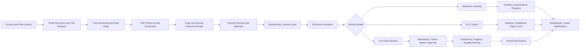
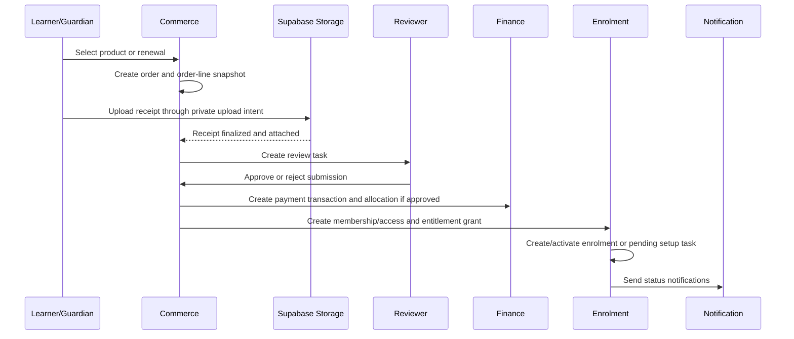
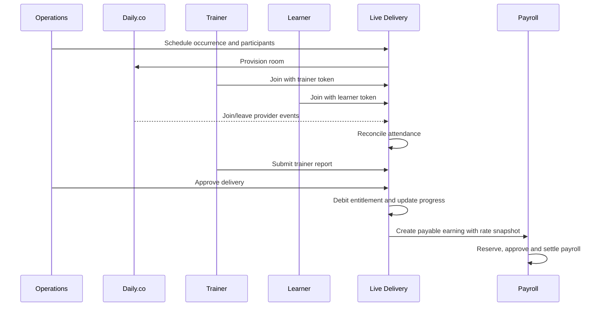

# Innovator Huzsam LMS & Operations System - System Flows Specification

**Version:** 1.2

**Format:** Markdown

**Scope:** LMS + Operations System only. Public website, SEO, landing pages, public marketing CMS, public About/Founder/Team/Contact pages, website analytics and website administration are excluded.

**Confirmed technology context:** Next.js full-stack application, Supabase Auth/PostgreSQL/RLS/Storage/Realtime/queues, Daily.co for live meetings and attendance telemetry, Resend for operational email, and manual receipt-based payments at launch.

---

## 1. Purpose

This document defines the main end-to-end system flows for the Innovator Huzsam LMS & Operations System. It is intended for product planning, UI/UX sequencing, backend service design, QA scenario writing, and implementation planning. Each flow shows the actors, modules, records, start trigger, success condition, alternate paths, state transitions, rules, outputs and acceptance checklist.

The document should be read together with the Functional Requirements Specification and the Module/Entity Relationship Model. The flows below assume the approved domain separation: identity, catalogue, commerce, enrolment, live delivery, learning, communication, finance, payroll, HR, business administration and audit.

## 2. Flow Principles
- Identity, learner relationship, enrolment, membership, payment, delivery and payroll are separate records. They reference each other but do not overwrite each other.
- Every high-value state transition must have actor, timestamp, reason where applicable, and audit event.
- Manual payment receipt upload never grants access by itself; approval creates confirmed financial and entitlement records.
- A learner can have many enrolments, memberships, schedules, resources, assessments, payments and progress records under one person/account.
- Group classes and K-12 sections use occurrence participants and rosters rather than a single learner field.
- Daily.co events, Resend delivery events, payment approvals, entitlement debits, progress updates and payroll generation must be idempotent.
- Published course, price, membership, wage, assessment and grading rules must be versioned or snapshotted before use.
- Dashboards must be drillable to authorized source records, not disconnected summary numbers.
- Corrections use reversals, adjustments, superseding versions or archive states instead of destructive edits.

## 3. Module Codes
| Code | Module |
| --- | --- |
| FND | Application Foundation |
| IAM | Identity, Authentication and Authorization |
| PORT | Learner Portal Catalogue and Free Users |
| CAT | Catalogue, Content Authoring, Products and Pricing |
| COM | Commerce, Manual Payments and Memberships |
| ENR | Enrolment and Learner Relationships |
| LIVE | Live Classes and Trial Delivery |
| MILE | Milestone-Based Self-Paced Learning |
| K12 | K-12 Tuition |
| ASM | Assessments, Submissions and Gradebook |
| RES | Resources and Learning Assets |
| MSG | Communication, Cases and Notifications |
| DSH | Role Dashboards and Analytics |
| FIN | Finance |
| PAY | Payroll and Compensation |
| HR | HR Profiles, Documents and Letters |
| CSR | CSR Enrolments and Commission |
| ADM | Business Administration and Operational Governance |
| AUD | Audit, Events and Compliance |

## 4. End-to-End System Overview

## 5. Flow Inventory
| Flow ID | Flow | Modules |
| --- | --- | --- |
| FLOW-001 | Self-Service Learner Registration, Verification and Free Profile Creation | IAM, PORT, COM, MSG, AUD |
| FLOW-002 | Login, Session Establishment, Route Authorization and Account Recovery | IAM, ADM, AUD, MSG |
| FLOW-003 | Staff Invitation, Employment Profile Activation and Permission Assignment | IAM, HR, ADM, MSG, AUD |
| FLOW-004 | Role, Permission and Scope Administration | IAM, ADM, AUD |
| FLOW-005 | Learner Portal Course Discovery, Free Resource Access and Preview Progress | PORT, CAT, RES, MILE, COM, MSG, AUD |
| FLOW-006 | Trial Request Intake, CSR Qualification and Scheduling Preparation | PORT, CSR, LIVE, ENR, MSG, AUD |
| FLOW-007 | Trial Class Scheduling, Daily Room Provisioning and Reminder Setup | LIVE, CSR, ENR, IAM, MSG, ADM, AUD |
| FLOW-008 | Trial Attendance, Trainer Report, CSR Follow-Up and Conversion Decision | LIVE, CSR, MSG, ENR, COM, AUD |
| FLOW-009 | Course, Programme and Version Authoring Lifecycle | CAT, MILE, K12, ASM, RES, AUD |
| FLOW-010 | Product, Price, Bundle and Membership Package Configuration | CAT, COM, ENR, K12, PAY, AUD |
| FLOW-011 | Manual Membership Purchase or Renewal with Receipt Upload | COM, FIN, RES, ENR, MSG, AUD |
| FLOW-012 | Manual Payment Review, Approval, Rejection and Correction | COM, FIN, ENR, CSR, MSG, AUD |
| FLOW-013 | Membership Allocation, Enrolment Creation and Multi-Course Activation | ENR, COM, CAT, LIVE, MILE, K12, MSG, AUD |
| FLOW-014 | Live Class Scheduling, Participant Assignment and Daily Room Setup | LIVE, ENR, COM, PAY, MSG, ADM, AUD |
| FLOW-015 | Live Class Join, Attendance Telemetry and Presence Reconciliation | LIVE, MSG, AUD, ADM |
| FLOW-016 | Trainer Post-Class Report, Operations Approval and Rejection Loop | LIVE, ENR, MILE, ASM, COM, PAY, MSG, AUD |
| FLOW-017 | Class Reschedule, Cancellation, Makeup and Entitlement Adjustment | LIVE, COM, ENR, MSG, PAY, AUD |
| FLOW-018 | Milestone-Based Self-Paced Learning Progression | MILE, CAT, ASM, RES, ENR, MSG, AUD |
| FLOW-019 | Quiz Attempt, Auto-Marking and Grade Publication | ASM, MILE, K12, ENR, MSG, AUD |
| FLOW-020 | Assignment, Homework, Voice Activity Submission and Rubric Grading | ASM, RES, MILE, K12, LIVE, MSG, AUD |
| FLOW-021 | K-12 Subject, Bundle, Academic Term and Report Card Lifecycle | K12, CAT, COM, ENR, LIVE, ASM, MSG, AUD |
| FLOW-022 | Resource Upload, Review, Assignment, Secure Delivery and Archive | RES, CAT, LIVE, MILE, K12, ASM, MSG, AUD |
| FLOW-023 | Contextual Chat, Teacher/Operations Communication and Moderated Messaging | MSG, ENR, LIVE, CSR, HR, AUD |
| FLOW-024 | Support Case, Complaint, Suggestion and Technical Issue Resolution | MSG, CSR, LIVE, COM, FIN, HR, AUD |
| FLOW-025 | Notification, Reminder and Transactional Email Processing | MSG, IAM, LIVE, COM, RES, ASM, PAY, ADM, AUD |
| FLOW-026 | Dashboard Drilldown, Operational Analytics and Action Queues | DSH, LIVE, COM, ENR, CSR, FIN, PAY, HR, MSG, AUD |
| FLOW-027 | Finance Reconciliation, Expense, Refund and Correction Lifecycle | FIN, COM, PAY, RES, MSG, AUD |
| FLOW-028 | Payroll Earning Generation, Payroll Run Approval and Settlement | PAY, LIVE, HR, FIN, MSG, AUD |
| FLOW-029 | HR Profile, Employee Detail, Official Letter and Certificate Lifecycle | HR, IAM, PAY, RES, MSG, AUD |
| FLOW-030 | Staff Offboarding, Access Revocation and Final Settlement | HR, IAM, PAY, FIN, ADM, MSG, AUD |
| FLOW-031 | Lead, CSR Enrolment Attribution and Commission Qualification | CSR, PORT, COM, ENR, PAY, MSG, AUD |
| FLOW-032 | Business Administration, Reference Data and Operational Governance | ADM, IAM, COM, LIVE, CSR, MSG, AUD |
| FLOW-033 | Audit Trail, Data Export, Archive and Retention Operations | AUD, ADM, IAM, COM, FIN, PAY, HR, RES, MSG |
| FLOW-032 | Learner Profile Update, Verification and History Event Flow | IAM, ENR, CSR, MSG, AUD |
| FLOW-033 | Guardian Relationship, Consent and Learner Oversight Flow | IAM, ENR, K12, COM, MSG, AUD |
| FLOW-034 | Renewal Reminder, Low Entitlement and Expiry Prevention Flow | COM, ENR, LIVE, MSG, CSR, DSH |
| FLOW-035 | Course Run, Cohort and Roster Management Flow | ENR, LIVE, K12, MSG, AUD |
| FLOW-036 | Import, Migration, Reconciliation and Cutover Support Flow | ADM, FND, IAM, CAT, COM, ENR, FIN, PAY, AUD |

# Part II - Detailed Flows

## FLOW-001 - Self-Service Learner Registration, Verification and Free Profile Creation

**Purpose.** This flow describes the complete start-to-end behavior for **Self-Service Learner Registration, Verification and Free Profile Creation** across the IAM, PORT, COM, MSG, AUD modules. It must be implemented as a controlled workflow with server-side authorization, explicit state transitions, clear user feedback, reliable side effects, and an audit trail for sensitive actions.

| Field | Details |
| --- | --- |
| Primary actors | Prospective learner, Guardian or payer, Supabase Auth, System |
| Modules involved | IAM, PORT, COM, MSG, AUD |
| Trigger | User selects Register, email/password, magic link, or Google login from the portal |
| Completion condition | Verified Account, Person Profile, Learner Profile and Free Access Grant exist; no paid membership or payment exists |
| Principal records/entities | Account, Authentication Identity, Person Profile, Learner Profile, Contact Method, Consent Record, Free Access Grant, Audit Event |

### Preconditions
- The initiating actor has an authenticated session or is using an allowed unauthenticated entry point for registration/trial intake.
- The actor has the required permission, ownership relationship, or invitation context for the requested action.
- Required configuration, templates, states, and validation rules for the involved modules are active.
- Any external integration used by the flow has an enabled configuration or a controlled fallback state.
- The system can write audit/domain events and create notification jobs where required.

### Main success flow
1. Prospective learner initiates the flow by performing the trigger action: User selects Register, email/password, magic link, or Google login from the portal
2. The system loads the current actor, role assignments, permission scopes, related profile and relevant business context.
3. The system validates required input, ownership, status, duplicate records, timing rules, file requirements, financial constraints and module-specific policies before making changes.
4. The system creates or updates the principal records for this flow: Account, Authentication Identity, Person Profile, Learner Profile, Contact Method, Consent Record, Free Access Grant, Audit Event.
5. If the flow crosses module boundaries, the initiating module stores the authoritative command result and emits domain events or queued jobs for downstream side effects.
6. The system transitions the primary object through the allowed lifecycle states and records actor, timestamp, source and reason where applicable.
7. The system updates dashboards, task queues, summaries, read models, notifications and integration logs as required by the flow.
8. The flow completes when: Verified Account, Person Profile, Learner Profile and Free Access Grant exist; no paid membership or payment exists

### Alternate paths and exception handling
- **Duplicate identity:** The system must show a clear state-specific message, avoid partial unsafe completion, retain evidence where relevant, and create a task, correction route, retry, rejection, or escalation path.
- **unverified email:** The system must show a clear state-specific message, avoid partial unsafe completion, retain evidence where relevant, and create a task, correction route, retry, rejection, or escalation path.
- **minor learner guardian consent:** The system must show a clear state-specific message, avoid partial unsafe completion, retain evidence where relevant, and create a task, correction route, retry, rejection, or escalation path.
- **OAuth failure:** The system must show a clear state-specific message, avoid partial unsafe completion, retain evidence where relevant, and create a task, correction route, retry, rejection, or escalation path.
- **Permission denied:** The system blocks the operation server-side, does not reveal unauthorized data, and records a security/audit event where the action is sensitive.
- **Concurrent update:** The system uses locking, unique constraints, optimistic concurrency, or idempotency keys so that duplicate approvals, double payments, duplicate earning items, duplicate reminders and stale overwrites cannot occur.
- **Provider or service failure:** The system stores the local state safely, marks the business exception, and allows retry or controlled manual fallback where the business policy permits it.

### State transitions
| Object | Allowed transition |
| --- | --- |
| Account | New -> Verification Pending -> Active |
| Contact Method | Unverified -> Verified |
| Learner Profile | Draft -> Free Active |

### Business rules and constraints
- The flow must preserve domain separation: identity, enrolment, membership, payment, class delivery, learning progress and payroll are linked but not merged into one mutable record.
- All sensitive changes must be auditable with actor, timestamp, old/new state or domain event reference, and reason when required.
- State transitions must be validated against the current state, not just requested by the UI.
- Historic records should be archived, superseded, reversed or adjusted rather than destructively edited or deleted.
- Every file or evidence item must use private storage, ownership metadata, validation and signed access where applicable.
- Every notification, provider event and background job must be idempotent and retry-safe.
- Dashboards and read models must be derived from source records and must allow authorized drilldown to underlying records.
- Receipts and payment submissions are evidence only; confirmed payment, allocation and entitlement are created only by authorized approval or future processor event.
- Route visibility is not authorization; server-side permission checks and Supabase RLS/service checks remain mandatory.

### Notifications, audit and outputs
- In-app notifications are created for affected users when the result requires user awareness or action.
- Operational dashboards and action queues are updated or queued for recalculation.
- Audit events are written for approvals, rejections, permission changes, financial changes, grade changes, HR changes, exports and sensitive record access.
- If external services are involved, integration request/response identifiers and retry status are retained.
- If a user action is required next, the system creates a visible task, CTA, queue item or correction route.

### QA / acceptance checklist
- [ ] Happy-path completion creates/updates exactly the expected records.
- [ ] Every listed alternate path is testable and leaves the system in a safe state.
- [ ] Unauthorized actors cannot perform the action through UI, API route, server action or direct database policy.
- [ ] The primary state transition cannot be skipped or repeated incorrectly.
- [ ] Notifications and background jobs are not duplicated on retry.
- [ ] Audit trail is sufficient to reconstruct who did what, when, why and to which record.
- [ ] Dashboard/read-model data matches source records after the flow completes.

---

## FLOW-002 - Login, Session Establishment, Route Authorization and Account Recovery

**Purpose.** This flow describes the complete start-to-end behavior for **Login, Session Establishment, Route Authorization and Account Recovery** across the IAM, ADM, AUD, MSG modules. It must be implemented as a controlled workflow with server-side authorization, explicit state transitions, clear user feedback, reliable side effects, and an audit trail for sensitive actions.

| Field | Details |
| --- | --- |
| Primary actors | Any user, Supabase Auth, Next.js middleware/server actions, System |
| Modules involved | IAM, ADM, AUD, MSG |
| Trigger | User submits credentials, OAuth response, magic link or recovery token |
| Completion condition | Authenticated user reaches correct authorized workspace or is blocked with reason |
| Principal records/entities | Session, Authentication Identity, Account, Role Assignment, Permission, Security Event, Audit Event |

### Preconditions
- The initiating actor has an authenticated session or is using an allowed unauthenticated entry point for registration/trial intake.
- The actor has the required permission, ownership relationship, or invitation context for the requested action.
- Required configuration, templates, states, and validation rules for the involved modules are active.
- Any external integration used by the flow has an enabled configuration or a controlled fallback state.
- The system can write audit/domain events and create notification jobs where required.

### Main success flow
1. Any user initiates the flow by performing the trigger action: User submits credentials, OAuth response, magic link or recovery token
2. The system loads the current actor, role assignments, permission scopes, related profile and relevant business context.
3. The system validates required input, ownership, status, duplicate records, timing rules, file requirements, financial constraints and module-specific policies before making changes.
4. The system creates or updates the principal records for this flow: Session, Authentication Identity, Account, Role Assignment, Permission, Security Event, Audit Event.
5. If the flow crosses module boundaries, the initiating module stores the authoritative command result and emits domain events or queued jobs for downstream side effects.
6. The system transitions the primary object through the allowed lifecycle states and records actor, timestamp, source and reason where applicable.
7. The system updates dashboards, task queues, summaries, read models, notifications and integration logs as required by the flow.
8. The flow completes when: Authenticated user reaches correct authorized workspace or is blocked with reason

### Alternate paths and exception handling
- **MFA required:** The system must show a clear state-specific message, avoid partial unsafe completion, retain evidence where relevant, and create a task, correction route, retry, rejection, or escalation path.
- **suspended account:** The system must show a clear state-specific message, avoid partial unsafe completion, retain evidence where relevant, and create a task, correction route, retry, rejection, or escalation path.
- **expired invitation:** The system must show a clear state-specific message, avoid partial unsafe completion, retain evidence where relevant, and create a task, correction route, retry, rejection, or escalation path.
- **permission missing:** The system must show a clear state-specific message, avoid partial unsafe completion, retain evidence where relevant, and create a task, correction route, retry, rejection, or escalation path.
- **Permission denied:** The system blocks the operation server-side, does not reveal unauthorized data, and records a security/audit event where the action is sensitive.
- **Concurrent update:** The system uses locking, unique constraints, optimistic concurrency, or idempotency keys so that duplicate approvals, double payments, duplicate earning items, duplicate reminders and stale overwrites cannot occur.
- **Provider or service failure:** The system stores the local state safely, marks the business exception, and allows retry or controlled manual fallback where the business policy permits it.

### State transitions
| Object | Allowed transition |
| --- | --- |
| Session | None/Expired -> Active -> Revoked/Expired |
| Account | Active -> Locked/Suspended/Disabled |

### Business rules and constraints
- The flow must preserve domain separation: identity, enrolment, membership, payment, class delivery, learning progress and payroll are linked but not merged into one mutable record.
- All sensitive changes must be auditable with actor, timestamp, old/new state or domain event reference, and reason when required.
- State transitions must be validated against the current state, not just requested by the UI.
- Historic records should be archived, superseded, reversed or adjusted rather than destructively edited or deleted.
- Every file or evidence item must use private storage, ownership metadata, validation and signed access where applicable.
- Every notification, provider event and background job must be idempotent and retry-safe.
- Dashboards and read models must be derived from source records and must allow authorized drilldown to underlying records.
- Route visibility is not authorization; server-side permission checks and Supabase RLS/service checks remain mandatory.

### Notifications, audit and outputs
- In-app notifications are created for affected users when the result requires user awareness or action.
- Operational dashboards and action queues are updated or queued for recalculation.
- Audit events are written for approvals, rejections, permission changes, financial changes, grade changes, HR changes, exports and sensitive record access.
- If external services are involved, integration request/response identifiers and retry status are retained.
- If a user action is required next, the system creates a visible task, CTA, queue item or correction route.

### QA / acceptance checklist
- [ ] Happy-path completion creates/updates exactly the expected records.
- [ ] Every listed alternate path is testable and leaves the system in a safe state.
- [ ] Unauthorized actors cannot perform the action through UI, API route, server action or direct database policy.
- [ ] The primary state transition cannot be skipped or repeated incorrectly.
- [ ] Notifications and background jobs are not duplicated on retry.
- [ ] Audit trail is sufficient to reconstruct who did what, when, why and to which record.
- [ ] Dashboard/read-model data matches source records after the flow completes.

---

## FLOW-003 - Staff Invitation, Employment Profile Activation and Permission Assignment

**Purpose.** This flow describes the complete start-to-end behavior for **Staff Invitation, Employment Profile Activation and Permission Assignment** across the IAM, HR, ADM, MSG, AUD modules. It must be implemented as a controlled workflow with server-side authorization, explicit state transitions, clear user feedback, reliable side effects, and an audit trail for sensitive actions.

| Field | Details |
| --- | --- |
| Primary actors | Admin, COO, Operations Manager, HR, New staff member, System |
| Modules involved | IAM, HR, ADM, MSG, AUD |
| Trigger | Authorized staff creates/invites employee or trainer |
| Completion condition | Staff accepts invitation, completes onboarding, and receives active scoped permissions |
| Principal records/entities | Person Profile, Staff Employment Profile, Staff Invitation, Role Assignment, Permission Scope, Policy Acknowledgement, Staff Document |

### Preconditions
- The initiating actor has an authenticated session or is using an allowed unauthenticated entry point for registration/trial intake.
- The actor has the required permission, ownership relationship, or invitation context for the requested action.
- Required configuration, templates, states, and validation rules for the involved modules are active.
- Any external integration used by the flow has an enabled configuration or a controlled fallback state.
- The system can write audit/domain events and create notification jobs where required.

### Main success flow
1. Admin initiates the flow by performing the trigger action: Authorized staff creates/invites employee or trainer
2. The system loads the current actor, role assignments, permission scopes, related profile and relevant business context.
3. The system validates required input, ownership, status, duplicate records, timing rules, file requirements, financial constraints and module-specific policies before making changes.
4. The system creates or updates the principal records for this flow: Person Profile, Staff Employment Profile, Staff Invitation, Role Assignment, Permission Scope, Policy Acknowledgement, Staff Document.
5. If the flow crosses module boundaries, the initiating module stores the authoritative command result and emits domain events or queued jobs for downstream side effects.
6. The system transitions the primary object through the allowed lifecycle states and records actor, timestamp, source and reason where applicable.
7. The system updates dashboards, task queues, summaries, read models, notifications and integration logs as required by the flow.
8. The flow completes when: Staff accepts invitation, completes onboarding, and receives active scoped permissions

### Alternate paths and exception handling
- **Existing learner account:** The system must show a clear state-specific message, avoid partial unsafe completion, retain evidence where relevant, and create a task, correction route, retry, rejection, or escalation path.
- **missing document:** The system must show a clear state-specific message, avoid partial unsafe completion, retain evidence where relevant, and create a task, correction route, retry, rejection, or escalation path.
- **role change:** The system must show a clear state-specific message, avoid partial unsafe completion, retain evidence where relevant, and create a task, correction route, retry, rejection, or escalation path.
- **invitation revoked or expired:** The system must show a clear state-specific message, avoid partial unsafe completion, retain evidence where relevant, and create a task, correction route, retry, rejection, or escalation path.
- **Permission denied:** The system blocks the operation server-side, does not reveal unauthorized data, and records a security/audit event where the action is sensitive.
- **Concurrent update:** The system uses locking, unique constraints, optimistic concurrency, or idempotency keys so that duplicate approvals, double payments, duplicate earning items, duplicate reminders and stale overwrites cannot occur.
- **Provider or service failure:** The system stores the local state safely, marks the business exception, and allows retry or controlled manual fallback where the business policy permits it.

### State transitions
| Object | Allowed transition |
| --- | --- |
| Invitation | Draft -> Sent -> Accepted/Expired/Revoked |
| Employment Profile | Pending Invitation -> Onboarding -> Active |

### Business rules and constraints
- The flow must preserve domain separation: identity, enrolment, membership, payment, class delivery, learning progress and payroll are linked but not merged into one mutable record.
- All sensitive changes must be auditable with actor, timestamp, old/new state or domain event reference, and reason when required.
- State transitions must be validated against the current state, not just requested by the UI.
- Historic records should be archived, superseded, reversed or adjusted rather than destructively edited or deleted.
- Every file or evidence item must use private storage, ownership metadata, validation and signed access where applicable.
- Every notification, provider event and background job must be idempotent and retry-safe.
- Dashboards and read models must be derived from source records and must allow authorized drilldown to underlying records.
- Route visibility is not authorization; server-side permission checks and Supabase RLS/service checks remain mandatory.

### Notifications, audit and outputs
- In-app notifications are created for affected users when the result requires user awareness or action.
- Operational dashboards and action queues are updated or queued for recalculation.
- Audit events are written for approvals, rejections, permission changes, financial changes, grade changes, HR changes, exports and sensitive record access.
- If external services are involved, integration request/response identifiers and retry status are retained.
- If a user action is required next, the system creates a visible task, CTA, queue item or correction route.

### QA / acceptance checklist
- [ ] Happy-path completion creates/updates exactly the expected records.
- [ ] Every listed alternate path is testable and leaves the system in a safe state.
- [ ] Unauthorized actors cannot perform the action through UI, API route, server action or direct database policy.
- [ ] The primary state transition cannot be skipped or repeated incorrectly.
- [ ] Notifications and background jobs are not duplicated on retry.
- [ ] Audit trail is sufficient to reconstruct who did what, when, why and to which record.
- [ ] Dashboard/read-model data matches source records after the flow completes.

---

## FLOW-004 - Role, Permission and Scope Administration

**Purpose.** This flow describes the complete start-to-end behavior for **Role, Permission and Scope Administration** across the IAM, ADM, AUD modules. It must be implemented as a controlled workflow with server-side authorization, explicit state transitions, clear user feedback, reliable side effects, and an audit trail for sensitive actions.

| Field | Details |
| --- | --- |
| Primary actors | Admin, COO, Security administrator, System |
| Modules involved | IAM, ADM, AUD |
| Trigger | New role, permission template, staff responsibility or scoped assignment is needed |
| Completion condition | Permission changes are active, auditable and enforced by route guards, services and RLS |
| Principal records/entities | Role Template, Permission, Permission Scope, Role Assignment, Approval Decision, Audit Event |

### Preconditions
- The initiating actor has an authenticated session or is using an allowed unauthenticated entry point for registration/trial intake.
- The actor has the required permission, ownership relationship, or invitation context for the requested action.
- Required configuration, templates, states, and validation rules for the involved modules are active.
- Any external integration used by the flow has an enabled configuration or a controlled fallback state.
- The system can write audit/domain events and create notification jobs where required.

### Main success flow
1. Admin initiates the flow by performing the trigger action: New role, permission template, staff responsibility or scoped assignment is needed
2. The system loads the current actor, role assignments, permission scopes, related profile and relevant business context.
3. The system validates required input, ownership, status, duplicate records, timing rules, file requirements, financial constraints and module-specific policies before making changes.
4. The system creates or updates the principal records for this flow: Role Template, Permission, Permission Scope, Role Assignment, Approval Decision, Audit Event.
5. If the flow crosses module boundaries, the initiating module stores the authoritative command result and emits domain events or queued jobs for downstream side effects.
6. The system transitions the primary object through the allowed lifecycle states and records actor, timestamp, source and reason where applicable.
7. The system updates dashboards, task queues, summaries, read models, notifications and integration logs as required by the flow.
8. The flow completes when: Permission changes are active, auditable and enforced by route guards, services and RLS

### Alternate paths and exception handling
- **Emergency access:** The system must show a clear state-specific message, avoid partial unsafe completion, retain evidence where relevant, and create a task, correction route, retry, rejection, or escalation path.
- **conflicting permissions:** The system must show a clear state-specific message, avoid partial unsafe completion, retain evidence where relevant, and create a task, correction route, retry, rejection, or escalation path.
- **expired assignment:** The system must show a clear state-specific message, avoid partial unsafe completion, retain evidence where relevant, and create a task, correction route, retry, rejection, or escalation path.
- **high-risk approval denied:** The system must show a clear state-specific message, avoid partial unsafe completion, retain evidence where relevant, and create a task, correction route, retry, rejection, or escalation path.
- **Permission denied:** The system blocks the operation server-side, does not reveal unauthorized data, and records a security/audit event where the action is sensitive.
- **Concurrent update:** The system uses locking, unique constraints, optimistic concurrency, or idempotency keys so that duplicate approvals, double payments, duplicate earning items, duplicate reminders and stale overwrites cannot occur.
- **Provider or service failure:** The system stores the local state safely, marks the business exception, and allows retry or controlled manual fallback where the business policy permits it.

### State transitions
| Object | Allowed transition |
| --- | --- |
| Role Template | Draft -> Active -> Deprecated |
| Role Assignment | Pending -> Active -> Expired/Revoked |

### Business rules and constraints
- The flow must preserve domain separation: identity, enrolment, membership, payment, class delivery, learning progress and payroll are linked but not merged into one mutable record.
- All sensitive changes must be auditable with actor, timestamp, old/new state or domain event reference, and reason when required.
- State transitions must be validated against the current state, not just requested by the UI.
- Historic records should be archived, superseded, reversed or adjusted rather than destructively edited or deleted.
- Every file or evidence item must use private storage, ownership metadata, validation and signed access where applicable.
- Every notification, provider event and background job must be idempotent and retry-safe.
- Dashboards and read models must be derived from source records and must allow authorized drilldown to underlying records.
- Route visibility is not authorization; server-side permission checks and Supabase RLS/service checks remain mandatory.

### Notifications, audit and outputs
- In-app notifications are created for affected users when the result requires user awareness or action.
- Operational dashboards and action queues are updated or queued for recalculation.
- Audit events are written for approvals, rejections, permission changes, financial changes, grade changes, HR changes, exports and sensitive record access.
- If external services are involved, integration request/response identifiers and retry status are retained.
- If a user action is required next, the system creates a visible task, CTA, queue item or correction route.

### QA / acceptance checklist
- [ ] Happy-path completion creates/updates exactly the expected records.
- [ ] Every listed alternate path is testable and leaves the system in a safe state.
- [ ] Unauthorized actors cannot perform the action through UI, API route, server action or direct database policy.
- [ ] The primary state transition cannot be skipped or repeated incorrectly.
- [ ] Notifications and background jobs are not duplicated on retry.
- [ ] Audit trail is sufficient to reconstruct who did what, when, why and to which record.
- [ ] Dashboard/read-model data matches source records after the flow completes.

---

## FLOW-005 - Learner Portal Course Discovery, Free Resource Access and Preview Progress

**Purpose.** This flow describes the complete start-to-end behavior for **Learner Portal Course Discovery, Free Resource Access and Preview Progress** across the PORT, CAT, RES, MILE, COM, MSG, AUD modules. It must be implemented as a controlled workflow with server-side authorization, explicit state transitions, clear user feedback, reliable side effects, and an audit trail for sensitive actions.

| Field | Details |
| --- | --- |
| Primary actors | Free learner, Guardian, System |
| Modules involved | PORT, CAT, RES, MILE, COM, MSG, AUD |
| Trigger | Learner opens portal catalogue, free resource area or preview content |
| Completion condition | Learner views approved free/preview content and may request trial or start membership flow |
| Principal records/entities | Course, Course Version, Preview Rule, Resource, Resource Access Grant, Progress Event, Trial Request, Order Draft |

### Preconditions
- The initiating actor has an authenticated session or is using an allowed unauthenticated entry point for registration/trial intake.
- The actor has the required permission, ownership relationship, or invitation context for the requested action.
- Required configuration, templates, states, and validation rules for the involved modules are active.
- Any external integration used by the flow has an enabled configuration or a controlled fallback state.
- The system can write audit/domain events and create notification jobs where required.

### Main success flow
1. Free learner initiates the flow by performing the trigger action: Learner opens portal catalogue, free resource area or preview content
2. The system loads the current actor, role assignments, permission scopes, related profile and relevant business context.
3. The system validates required input, ownership, status, duplicate records, timing rules, file requirements, financial constraints and module-specific policies before making changes.
4. The system creates or updates the principal records for this flow: Course, Course Version, Preview Rule, Resource, Resource Access Grant, Progress Event, Trial Request, Order Draft.
5. If the flow crosses module boundaries, the initiating module stores the authoritative command result and emits domain events or queued jobs for downstream side effects.
6. The system transitions the primary object through the allowed lifecycle states and records actor, timestamp, source and reason where applicable.
7. The system updates dashboards, task queues, summaries, read models, notifications and integration logs as required by the flow.
8. The flow completes when: Learner views approved free/preview content and may request trial or start membership flow

### Alternate paths and exception handling
- **Content unpublished:** The system must show a clear state-specific message, avoid partial unsafe completion, retain evidence where relevant, and create a task, correction route, retry, rejection, or escalation path.
- **access denied:** The system must show a clear state-specific message, avoid partial unsafe completion, retain evidence where relevant, and create a task, correction route, retry, rejection, or escalation path.
- **guardian viewing restrictions:** The system must show a clear state-specific message, avoid partial unsafe completion, retain evidence where relevant, and create a task, correction route, retry, rejection, or escalation path.
- **file delivery error:** The system must show a clear state-specific message, avoid partial unsafe completion, retain evidence where relevant, and create a task, correction route, retry, rejection, or escalation path.
- **Permission denied:** The system blocks the operation server-side, does not reveal unauthorized data, and records a security/audit event where the action is sensitive.
- **Concurrent update:** The system uses locking, unique constraints, optimistic concurrency, or idempotency keys so that duplicate approvals, double payments, duplicate earning items, duplicate reminders and stale overwrites cannot occur.
- **Provider or service failure:** The system stores the local state safely, marks the business exception, and allows retry or controlled manual fallback where the business policy permits it.

### State transitions
| Object | Allowed transition |
| --- | --- |
| Preview Access | Available -> Opened -> Completed/Expired |
| Saved Course | Saved -> Converted/Removed |

### Business rules and constraints
- The flow must preserve domain separation: identity, enrolment, membership, payment, class delivery, learning progress and payroll are linked but not merged into one mutable record.
- All sensitive changes must be auditable with actor, timestamp, old/new state or domain event reference, and reason when required.
- State transitions must be validated against the current state, not just requested by the UI.
- Historic records should be archived, superseded, reversed or adjusted rather than destructively edited or deleted.
- Every file or evidence item must use private storage, ownership metadata, validation and signed access where applicable.
- Every notification, provider event and background job must be idempotent and retry-safe.
- Dashboards and read models must be derived from source records and must allow authorized drilldown to underlying records.
- Receipts and payment submissions are evidence only; confirmed payment, allocation and entitlement are created only by authorized approval or future processor event.

### Notifications, audit and outputs
- In-app notifications are created for affected users when the result requires user awareness or action.
- Operational dashboards and action queues are updated or queued for recalculation.
- Audit events are written for approvals, rejections, permission changes, financial changes, grade changes, HR changes, exports and sensitive record access.
- If external services are involved, integration request/response identifiers and retry status are retained.
- If a user action is required next, the system creates a visible task, CTA, queue item or correction route.

### QA / acceptance checklist
- [ ] Happy-path completion creates/updates exactly the expected records.
- [ ] Every listed alternate path is testable and leaves the system in a safe state.
- [ ] Unauthorized actors cannot perform the action through UI, API route, server action or direct database policy.
- [ ] The primary state transition cannot be skipped or repeated incorrectly.
- [ ] Notifications and background jobs are not duplicated on retry.
- [ ] Audit trail is sufficient to reconstruct who did what, when, why and to which record.
- [ ] Dashboard/read-model data matches source records after the flow completes.

---

## FLOW-006 - Trial Request Intake, CSR Qualification and Scheduling Preparation

**Purpose.** This flow describes the complete start-to-end behavior for **Trial Request Intake, CSR Qualification and Scheduling Preparation** across the PORT, CSR, LIVE, ENR, MSG, AUD modules. It must be implemented as a controlled workflow with server-side authorization, explicit state transitions, clear user feedback, reliable side effects, and an audit trail for sensitive actions.

| Field | Details |
| --- | --- |
| Primary actors | Free learner, Guardian, CSR, COO, Operations Manager, System |
| Modules involved | PORT, CSR, LIVE, ENR, MSG, AUD |
| Trigger | Learner submits trial request or CSR records trial interest |
| Completion condition | Trial Request is qualified and ready for scheduling or closed with reason |
| Principal records/entities | Trial Request, Lead, Follow-Up Task, Learner Profile, Placement Answers, Availability Preference, CSR Assignment |

### Preconditions
- The initiating actor has an authenticated session or is using an allowed unauthenticated entry point for registration/trial intake.
- The actor has the required permission, ownership relationship, or invitation context for the requested action.
- Required configuration, templates, states, and validation rules for the involved modules are active.
- Any external integration used by the flow has an enabled configuration or a controlled fallback state.
- The system can write audit/domain events and create notification jobs where required.

### Main success flow
1. Free learner initiates the flow by performing the trigger action: Learner submits trial request or CSR records trial interest
2. The system loads the current actor, role assignments, permission scopes, related profile and relevant business context.
3. The system validates required input, ownership, status, duplicate records, timing rules, file requirements, financial constraints and module-specific policies before making changes.
4. The system creates or updates the principal records for this flow: Trial Request, Lead, Follow-Up Task, Learner Profile, Placement Answers, Availability Preference, CSR Assignment.
5. If the flow crosses module boundaries, the initiating module stores the authoritative command result and emits domain events or queued jobs for downstream side effects.
6. The system transitions the primary object through the allowed lifecycle states and records actor, timestamp, source and reason where applicable.
7. The system updates dashboards, task queues, summaries, read models, notifications and integration logs as required by the flow.
8. The flow completes when: Trial Request is qualified and ready for scheduling or closed with reason

### Alternate paths and exception handling
- **Duplicate request:** The system must show a clear state-specific message, avoid partial unsafe completion, retain evidence where relevant, and create a task, correction route, retry, rejection, or escalation path.
- **not eligible:** The system must show a clear state-specific message, avoid partial unsafe completion, retain evidence where relevant, and create a task, correction route, retry, rejection, or escalation path.
- **missing guardian consent:** The system must show a clear state-specific message, avoid partial unsafe completion, retain evidence where relevant, and create a task, correction route, retry, rejection, or escalation path.
- **manual staff-created lead:** The system must show a clear state-specific message, avoid partial unsafe completion, retain evidence where relevant, and create a task, correction route, retry, rejection, or escalation path.
- **Permission denied:** The system blocks the operation server-side, does not reveal unauthorized data, and records a security/audit event where the action is sensitive.
- **Concurrent update:** The system uses locking, unique constraints, optimistic concurrency, or idempotency keys so that duplicate approvals, double payments, duplicate earning items, duplicate reminders and stale overwrites cannot occur.
- **Provider or service failure:** The system stores the local state safely, marks the business exception, and allows retry or controlled manual fallback where the business policy permits it.

### State transitions
| Object | Allowed transition |
| --- | --- |
| Trial Request | Draft -> Submitted -> Qualified/Waiting Info/Closed -> Ready for Scheduling |
| Lead | New -> Contacted -> Qualified/Converted/Lost |

### Business rules and constraints
- The flow must preserve domain separation: identity, enrolment, membership, payment, class delivery, learning progress and payroll are linked but not merged into one mutable record.
- All sensitive changes must be auditable with actor, timestamp, old/new state or domain event reference, and reason when required.
- State transitions must be validated against the current state, not just requested by the UI.
- Historic records should be archived, superseded, reversed or adjusted rather than destructively edited or deleted.
- Every file or evidence item must use private storage, ownership metadata, validation and signed access where applicable.
- Every notification, provider event and background job must be idempotent and retry-safe.
- Dashboards and read models must be derived from source records and must allow authorized drilldown to underlying records.
- Scheduled class occurrence, participant attendance, trainer report, delivery approval, entitlement debit and payroll earning are separate but linked records.

### Notifications, audit and outputs
- In-app notifications are created for affected users when the result requires user awareness or action.
- Operational dashboards and action queues are updated or queued for recalculation.
- Audit events are written for approvals, rejections, permission changes, financial changes, grade changes, HR changes, exports and sensitive record access.
- If external services are involved, integration request/response identifiers and retry status are retained.
- If a user action is required next, the system creates a visible task, CTA, queue item or correction route.

### QA / acceptance checklist
- [ ] Happy-path completion creates/updates exactly the expected records.
- [ ] Every listed alternate path is testable and leaves the system in a safe state.
- [ ] Unauthorized actors cannot perform the action through UI, API route, server action or direct database policy.
- [ ] The primary state transition cannot be skipped or repeated incorrectly.
- [ ] Notifications and background jobs are not duplicated on retry.
- [ ] Audit trail is sufficient to reconstruct who did what, when, why and to which record.
- [ ] Dashboard/read-model data matches source records after the flow completes.

---

## FLOW-007 - Trial Class Scheduling, Daily Room Provisioning and Reminder Setup

**Purpose.** This flow describes the complete start-to-end behavior for **Trial Class Scheduling, Daily Room Provisioning and Reminder Setup** across the LIVE, CSR, ENR, IAM, MSG, ADM, AUD modules. It must be implemented as a controlled workflow with server-side authorization, explicit state transitions, clear user feedback, reliable side effects, and an audit trail for sensitive actions.

| Field | Details |
| --- | --- |
| Primary actors | CSR, COO, Operations Manager, Trainer, Learner, Daily.co, Resend, System |
| Modules involved | LIVE, CSR, ENR, IAM, MSG, ADM, AUD |
| Trigger | Qualified Trial Request is scheduled |
| Completion condition | Trial occurrence is scheduled, Daily room is provisioned and reminders are queued |
| Principal records/entities | Trial Request, Scheduled Occurrence, Class Participant, Trainer Assignment, Daily Room, Meeting Token Rule, Notification Event |

### Preconditions
- The initiating actor has an authenticated session or is using an allowed unauthenticated entry point for registration/trial intake.
- The actor has the required permission, ownership relationship, or invitation context for the requested action.
- Required configuration, templates, states, and validation rules for the involved modules are active.
- Any external integration used by the flow has an enabled configuration or a controlled fallback state.
- The system can write audit/domain events and create notification jobs where required.

### Main success flow
1. CSR initiates the flow by performing the trigger action: Qualified Trial Request is scheduled
2. The system loads the current actor, role assignments, permission scopes, related profile and relevant business context.
3. The system validates required input, ownership, status, duplicate records, timing rules, file requirements, financial constraints and module-specific policies before making changes.
4. The system creates or updates the principal records for this flow: Trial Request, Scheduled Occurrence, Class Participant, Trainer Assignment, Daily Room, Meeting Token Rule, Notification Event.
5. If the flow crosses module boundaries, the initiating module stores the authoritative command result and emits domain events or queued jobs for downstream side effects.
6. The system transitions the primary object through the allowed lifecycle states and records actor, timestamp, source and reason where applicable.
7. The system updates dashboards, task queues, summaries, read models, notifications and integration logs as required by the flow.
8. The flow completes when: Trial occurrence is scheduled, Daily room is provisioned and reminders are queued

### Alternate paths and exception handling
- **Daily unavailable:** The system must show a clear state-specific message, avoid partial unsafe completion, retain evidence where relevant, and create a task, correction route, retry, rejection, or escalation path.
- **trainer conflict:** The system must show a clear state-specific message, avoid partial unsafe completion, retain evidence where relevant, and create a task, correction route, retry, rejection, or escalation path.
- **learner reschedule request:** The system must show a clear state-specific message, avoid partial unsafe completion, retain evidence where relevant, and create a task, correction route, retry, rejection, or escalation path.
- **cancellation:** The system must show a clear state-specific message, avoid partial unsafe completion, retain evidence where relevant, and create a task, correction route, retry, rejection, or escalation path.
- **Permission denied:** The system blocks the operation server-side, does not reveal unauthorized data, and records a security/audit event where the action is sensitive.
- **Concurrent update:** The system uses locking, unique constraints, optimistic concurrency, or idempotency keys so that duplicate approvals, double payments, duplicate earning items, duplicate reminders and stale overwrites cannot occur.
- **Provider or service failure:** The system stores the local state safely, marks the business exception, and allows retry or controlled manual fallback where the business policy permits it.

### State transitions
| Object | Allowed transition |
| --- | --- |
| Trial Request | Ready for Scheduling -> Scheduled |
| Scheduled Occurrence | Draft -> Scheduled -> Room Provisioned |

### Business rules and constraints
- The flow must preserve domain separation: identity, enrolment, membership, payment, class delivery, learning progress and payroll are linked but not merged into one mutable record.
- All sensitive changes must be auditable with actor, timestamp, old/new state or domain event reference, and reason when required.
- State transitions must be validated against the current state, not just requested by the UI.
- Historic records should be archived, superseded, reversed or adjusted rather than destructively edited or deleted.
- Every file or evidence item must use private storage, ownership metadata, validation and signed access where applicable.
- Every notification, provider event and background job must be idempotent and retry-safe.
- Dashboards and read models must be derived from source records and must allow authorized drilldown to underlying records.
- Scheduled class occurrence, participant attendance, trainer report, delivery approval, entitlement debit and payroll earning are separate but linked records.
- Route visibility is not authorization; server-side permission checks and Supabase RLS/service checks remain mandatory.

### Notifications, audit and outputs
- In-app notifications are created for affected users when the result requires user awareness or action.
- Operational dashboards and action queues are updated or queued for recalculation.
- Audit events are written for approvals, rejections, permission changes, financial changes, grade changes, HR changes, exports and sensitive record access.
- If external services are involved, integration request/response identifiers and retry status are retained.
- If a user action is required next, the system creates a visible task, CTA, queue item or correction route.

### QA / acceptance checklist
- [ ] Happy-path completion creates/updates exactly the expected records.
- [ ] Every listed alternate path is testable and leaves the system in a safe state.
- [ ] Unauthorized actors cannot perform the action through UI, API route, server action or direct database policy.
- [ ] The primary state transition cannot be skipped or repeated incorrectly.
- [ ] Notifications and background jobs are not duplicated on retry.
- [ ] Audit trail is sufficient to reconstruct who did what, when, why and to which record.
- [ ] Dashboard/read-model data matches source records after the flow completes.

---

## FLOW-008 - Trial Attendance, Trainer Report, CSR Follow-Up and Conversion Decision

**Purpose.** This flow describes the complete start-to-end behavior for **Trial Attendance, Trainer Report, CSR Follow-Up and Conversion Decision** across the LIVE, CSR, MSG, ENR, COM, AUD modules. It must be implemented as a controlled workflow with server-side authorization, explicit state transitions, clear user feedback, reliable side effects, and an audit trail for sensitive actions.

| Field | Details |
| --- | --- |
| Primary actors | Learner, Trainer, CSR, Operations Manager, Daily.co, System |
| Modules involved | LIVE, CSR, MSG, ENR, COM, AUD |
| Trigger | Trial join window opens and participants join through portal |
| Completion condition | Trial is completed/no-show/exception and follow-up/conversion path is recorded |
| Principal records/entities | Meeting Provider Event, Attendance Event, Class Participant, Trainer Report, Delivery Review, Trial Outcome, Follow-Up Task |

### Preconditions
- The initiating actor has an authenticated session or is using an allowed unauthenticated entry point for registration/trial intake.
- The actor has the required permission, ownership relationship, or invitation context for the requested action.
- Required configuration, templates, states, and validation rules for the involved modules are active.
- Any external integration used by the flow has an enabled configuration or a controlled fallback state.
- The system can write audit/domain events and create notification jobs where required.

### Main success flow
1. Learner initiates the flow by performing the trigger action: Trial join window opens and participants join through portal
2. The system loads the current actor, role assignments, permission scopes, related profile and relevant business context.
3. The system validates required input, ownership, status, duplicate records, timing rules, file requirements, financial constraints and module-specific policies before making changes.
4. The system creates or updates the principal records for this flow: Meeting Provider Event, Attendance Event, Class Participant, Trainer Report, Delivery Review, Trial Outcome, Follow-Up Task.
5. If the flow crosses module boundaries, the initiating module stores the authoritative command result and emits domain events or queued jobs for downstream side effects.
6. The system transitions the primary object through the allowed lifecycle states and records actor, timestamp, source and reason where applicable.
7. The system updates dashboards, task queues, summaries, read models, notifications and integration logs as required by the flow.
8. The flow completes when: Trial is completed/no-show/exception and follow-up/conversion path is recorded

### Alternate paths and exception handling
- **Learner no-show:** The system must show a clear state-specific message, avoid partial unsafe completion, retain evidence where relevant, and create a task, correction route, retry, rejection, or escalation path.
- **trainer no-show:** The system must show a clear state-specific message, avoid partial unsafe completion, retain evidence where relevant, and create a task, correction route, retry, rejection, or escalation path.
- **provider event delay:** The system must show a clear state-specific message, avoid partial unsafe completion, retain evidence where relevant, and create a task, correction route, retry, rejection, or escalation path.
- **technical failure:** The system must show a clear state-specific message, avoid partial unsafe completion, retain evidence where relevant, and create a task, correction route, retry, rejection, or escalation path.
- **Permission denied:** The system blocks the operation server-side, does not reveal unauthorized data, and records a security/audit event where the action is sensitive.
- **Concurrent update:** The system uses locking, unique constraints, optimistic concurrency, or idempotency keys so that duplicate approvals, double payments, duplicate earning items, duplicate reminders and stale overwrites cannot occur.
- **Provider or service failure:** The system stores the local state safely, marks the business exception, and allows retry or controlled manual fallback where the business policy permits it.

### State transitions
| Object | Allowed transition |
| --- | --- |
| Occurrence | Live Window -> Attendance Pending -> Report Pending -> Completed/Exception |
| Follow-Up | Created -> Contacted -> Converted/Lost |

### Business rules and constraints
- The flow must preserve domain separation: identity, enrolment, membership, payment, class delivery, learning progress and payroll are linked but not merged into one mutable record.
- All sensitive changes must be auditable with actor, timestamp, old/new state or domain event reference, and reason when required.
- State transitions must be validated against the current state, not just requested by the UI.
- Historic records should be archived, superseded, reversed or adjusted rather than destructively edited or deleted.
- Every file or evidence item must use private storage, ownership metadata, validation and signed access where applicable.
- Every notification, provider event and background job must be idempotent and retry-safe.
- Dashboards and read models must be derived from source records and must allow authorized drilldown to underlying records.
- Receipts and payment submissions are evidence only; confirmed payment, allocation and entitlement are created only by authorized approval or future processor event.
- Scheduled class occurrence, participant attendance, trainer report, delivery approval, entitlement debit and payroll earning are separate but linked records.

### Notifications, audit and outputs
- In-app notifications are created for affected users when the result requires user awareness or action.
- Operational dashboards and action queues are updated or queued for recalculation.
- Audit events are written for approvals, rejections, permission changes, financial changes, grade changes, HR changes, exports and sensitive record access.
- If external services are involved, integration request/response identifiers and retry status are retained.
- If a user action is required next, the system creates a visible task, CTA, queue item or correction route.

### QA / acceptance checklist
- [ ] Happy-path completion creates/updates exactly the expected records.
- [ ] Every listed alternate path is testable and leaves the system in a safe state.
- [ ] Unauthorized actors cannot perform the action through UI, API route, server action or direct database policy.
- [ ] The primary state transition cannot be skipped or repeated incorrectly.
- [ ] Notifications and background jobs are not duplicated on retry.
- [ ] Audit trail is sufficient to reconstruct who did what, when, why and to which record.
- [ ] Dashboard/read-model data matches source records after the flow completes.

---

## FLOW-009 - Course, Programme and Version Authoring Lifecycle

**Purpose.** This flow describes the complete start-to-end behavior for **Course, Programme and Version Authoring Lifecycle** across the CAT, MILE, K12, ASM, RES, AUD modules. It must be implemented as a controlled workflow with server-side authorization, explicit state transitions, clear user feedback, reliable side effects, and an audit trail for sensitive actions.

| Field | Details |
| --- | --- |
| Primary actors | Course Creator, Trainer, Academic Reviewer, COO, Operations Manager, System |
| Modules involved | CAT, MILE, K12, ASM, RES, AUD |
| Trigger | Authorized creator starts new course/programme or version |
| Completion condition | Course version is published, archived or returned for revision |
| Principal records/entities | Course, Course Version, Delivery Model, Syllabus, Level, Milestone, Module, Lesson, Activity, Resource Link, Assessment Link |

### Preconditions
- The initiating actor has an authenticated session or is using an allowed unauthenticated entry point for registration/trial intake.
- The actor has the required permission, ownership relationship, or invitation context for the requested action.
- Required configuration, templates, states, and validation rules for the involved modules are active.
- Any external integration used by the flow has an enabled configuration or a controlled fallback state.
- The system can write audit/domain events and create notification jobs where required.

### Main success flow
1. Course Creator initiates the flow by performing the trigger action: Authorized creator starts new course/programme or version
2. The system loads the current actor, role assignments, permission scopes, related profile and relevant business context.
3. The system validates required input, ownership, status, duplicate records, timing rules, file requirements, financial constraints and module-specific policies before making changes.
4. The system creates or updates the principal records for this flow: Course, Course Version, Delivery Model, Syllabus, Level, Milestone, Module, Lesson, Activity, Resource Link, Assessment Link.
5. If the flow crosses module boundaries, the initiating module stores the authoritative command result and emits domain events or queued jobs for downstream side effects.
6. The system transitions the primary object through the allowed lifecycle states and records actor, timestamp, source and reason where applicable.
7. The system updates dashboards, task queues, summaries, read models, notifications and integration logs as required by the flow.
8. The flow completes when: Course version is published, archived or returned for revision

### Alternate paths and exception handling
- **Minor correction:** The system must show a clear state-specific message, avoid partial unsafe completion, retain evidence where relevant, and create a task, correction route, retry, rejection, or escalation path.
- **breaking change:** The system must show a clear state-specific message, avoid partial unsafe completion, retain evidence where relevant, and create a task, correction route, retry, rejection, or escalation path.
- **review rejection:** The system must show a clear state-specific message, avoid partial unsafe completion, retain evidence where relevant, and create a task, correction route, retry, rejection, or escalation path.
- **missing resource:** The system must show a clear state-specific message, avoid partial unsafe completion, retain evidence where relevant, and create a task, correction route, retry, rejection, or escalation path.
- **Permission denied:** The system blocks the operation server-side, does not reveal unauthorized data, and records a security/audit event where the action is sensitive.
- **Concurrent update:** The system uses locking, unique constraints, optimistic concurrency, or idempotency keys so that duplicate approvals, double payments, duplicate earning items, duplicate reminders and stale overwrites cannot occur.
- **Provider or service failure:** The system stores the local state safely, marks the business exception, and allows retry or controlled manual fallback where the business policy permits it.

### State transitions
| Object | Allowed transition |
| --- | --- |
| Course Version | Draft -> In Review -> Approved -> Published -> Archived |

### Business rules and constraints
- The flow must preserve domain separation: identity, enrolment, membership, payment, class delivery, learning progress and payroll are linked but not merged into one mutable record.
- All sensitive changes must be auditable with actor, timestamp, old/new state or domain event reference, and reason when required.
- State transitions must be validated against the current state, not just requested by the UI.
- Historic records should be archived, superseded, reversed or adjusted rather than destructively edited or deleted.
- Every file or evidence item must use private storage, ownership metadata, validation and signed access where applicable.
- Every notification, provider event and background job must be idempotent and retry-safe.
- Dashboards and read models must be derived from source records and must allow authorized drilldown to underlying records.

### Notifications, audit and outputs
- In-app notifications are created for affected users when the result requires user awareness or action.
- Operational dashboards and action queues are updated or queued for recalculation.
- Audit events are written for approvals, rejections, permission changes, financial changes, grade changes, HR changes, exports and sensitive record access.
- If external services are involved, integration request/response identifiers and retry status are retained.
- If a user action is required next, the system creates a visible task, CTA, queue item or correction route.

### QA / acceptance checklist
- [ ] Happy-path completion creates/updates exactly the expected records.
- [ ] Every listed alternate path is testable and leaves the system in a safe state.
- [ ] Unauthorized actors cannot perform the action through UI, API route, server action or direct database policy.
- [ ] The primary state transition cannot be skipped or repeated incorrectly.
- [ ] Notifications and background jobs are not duplicated on retry.
- [ ] Audit trail is sufficient to reconstruct who did what, when, why and to which record.
- [ ] Dashboard/read-model data matches source records after the flow completes.

---

## FLOW-010 - Product, Price, Bundle and Membership Package Configuration

**Purpose.** This flow describes the complete start-to-end behavior for **Product, Price, Bundle and Membership Package Configuration** across the CAT, COM, ENR, K12, PAY, AUD modules. It must be implemented as a controlled workflow with server-side authorization, explicit state transitions, clear user feedback, reliable side effects, and an audit trail for sensitive actions.

| Field | Details |
| --- | --- |
| Primary actors | COO, Operations Manager, Course Creator, Finance Admin, System |
| Modules involved | CAT, COM, ENR, K12, PAY, AUD |
| Trigger | Published course/version or bundle must become sellable |
| Completion condition | Product and active price/package become available for order/renewal flow |
| Principal records/entities | Product, Product Variant, Price, Bundle, Bundle Item, Membership Template, Entitlement Rule, Wage Rule Template |

### Preconditions
- The initiating actor has an authenticated session or is using an allowed unauthenticated entry point for registration/trial intake.
- The actor has the required permission, ownership relationship, or invitation context for the requested action.
- Required configuration, templates, states, and validation rules for the involved modules are active.
- Any external integration used by the flow has an enabled configuration or a controlled fallback state.
- The system can write audit/domain events and create notification jobs where required.

### Main success flow
1. COO initiates the flow by performing the trigger action: Published course/version or bundle must become sellable
2. The system loads the current actor, role assignments, permission scopes, related profile and relevant business context.
3. The system validates required input, ownership, status, duplicate records, timing rules, file requirements, financial constraints and module-specific policies before making changes.
4. The system creates or updates the principal records for this flow: Product, Product Variant, Price, Bundle, Bundle Item, Membership Template, Entitlement Rule, Wage Rule Template.
5. If the flow crosses module boundaries, the initiating module stores the authoritative command result and emits domain events or queued jobs for downstream side effects.
6. The system transitions the primary object through the allowed lifecycle states and records actor, timestamp, source and reason where applicable.
7. The system updates dashboards, task queues, summaries, read models, notifications and integration logs as required by the flow.
8. The flow completes when: Product and active price/package become available for order/renewal flow

### Alternate paths and exception handling
- **Price change:** The system must show a clear state-specific message, avoid partial unsafe completion, retain evidence where relevant, and create a task, correction route, retry, rejection, or escalation path.
- **bundle item change:** The system must show a clear state-specific message, avoid partial unsafe completion, retain evidence where relevant, and create a task, correction route, retry, rejection, or escalation path.
- **wage override:** The system must show a clear state-specific message, avoid partial unsafe completion, retain evidence where relevant, and create a task, correction route, retry, rejection, or escalation path.
- **product retired:** The system must show a clear state-specific message, avoid partial unsafe completion, retain evidence where relevant, and create a task, correction route, retry, rejection, or escalation path.
- **Permission denied:** The system blocks the operation server-side, does not reveal unauthorized data, and records a security/audit event where the action is sensitive.
- **Concurrent update:** The system uses locking, unique constraints, optimistic concurrency, or idempotency keys so that duplicate approvals, double payments, duplicate earning items, duplicate reminders and stale overwrites cannot occur.
- **Provider or service failure:** The system stores the local state safely, marks the business exception, and allows retry or controlled manual fallback where the business policy permits it.

### State transitions
| Object | Allowed transition |
| --- | --- |
| Product | Draft -> Active -> Retired/Archived |
| Price | Draft -> Active -> Superseded/Expired |

### Business rules and constraints
- The flow must preserve domain separation: identity, enrolment, membership, payment, class delivery, learning progress and payroll are linked but not merged into one mutable record.
- All sensitive changes must be auditable with actor, timestamp, old/new state or domain event reference, and reason when required.
- State transitions must be validated against the current state, not just requested by the UI.
- Historic records should be archived, superseded, reversed or adjusted rather than destructively edited or deleted.
- Every file or evidence item must use private storage, ownership metadata, validation and signed access where applicable.
- Every notification, provider event and background job must be idempotent and retry-safe.
- Dashboards and read models must be derived from source records and must allow authorized drilldown to underlying records.
- Receipts and payment submissions are evidence only; confirmed payment, allocation and entitlement are created only by authorized approval or future processor event.
- Payable earnings must have a globally unique source reference and must be reserved into payroll atomically before settlement.

### Notifications, audit and outputs
- In-app notifications are created for affected users when the result requires user awareness or action.
- Operational dashboards and action queues are updated or queued for recalculation.
- Audit events are written for approvals, rejections, permission changes, financial changes, grade changes, HR changes, exports and sensitive record access.
- If external services are involved, integration request/response identifiers and retry status are retained.
- If a user action is required next, the system creates a visible task, CTA, queue item or correction route.

### QA / acceptance checklist
- [ ] Happy-path completion creates/updates exactly the expected records.
- [ ] Every listed alternate path is testable and leaves the system in a safe state.
- [ ] Unauthorized actors cannot perform the action through UI, API route, server action or direct database policy.
- [ ] The primary state transition cannot be skipped or repeated incorrectly.
- [ ] Notifications and background jobs are not duplicated on retry.
- [ ] Audit trail is sufficient to reconstruct who did what, when, why and to which record.
- [ ] Dashboard/read-model data matches source records after the flow completes.

---

## FLOW-011 - Manual Membership Purchase or Renewal with Receipt Upload

**Purpose.** This flow describes the complete start-to-end behavior for **Manual Membership Purchase or Renewal with Receipt Upload** across the COM, FIN, RES, ENR, MSG, AUD modules. It must be implemented as a controlled workflow with server-side authorization, explicit state transitions, clear user feedback, reliable side effects, and an audit trail for sensitive actions.

| Field | Details |
| --- | --- |
| Primary actors | Learner, Guardian/Payer, CSR, COO, Operations Manager, System |
| Modules involved | COM, FIN, RES, ENR, MSG, AUD |
| Trigger | Learner, guardian or staff starts membership purchase or renewal |
| Completion condition | Payment Submission is Awaiting Review; no access is granted yet |
| Principal records/entities | Order, Order Line, Payment Request, Payment Submission, Receipt File, Storage Object, Payment Review Task |

### Preconditions
- The initiating actor has an authenticated session or is using an allowed unauthenticated entry point for registration/trial intake.
- The actor has the required permission, ownership relationship, or invitation context for the requested action.
- Required configuration, templates, states, and validation rules for the involved modules are active.
- Any external integration used by the flow has an enabled configuration or a controlled fallback state.
- The system can write audit/domain events and create notification jobs where required.

### Main success flow
1. Learner initiates the flow by performing the trigger action: Learner, guardian or staff starts membership purchase or renewal
2. The system loads the current actor, role assignments, permission scopes, related profile and relevant business context.
3. The system validates required input, ownership, status, duplicate records, timing rules, file requirements, financial constraints and module-specific policies before making changes.
4. The system creates or updates the principal records for this flow: Order, Order Line, Payment Request, Payment Submission, Receipt File, Storage Object, Payment Review Task.
5. If the flow crosses module boundaries, the initiating module stores the authoritative command result and emits domain events or queued jobs for downstream side effects.
6. The system transitions the primary object through the allowed lifecycle states and records actor, timestamp, source and reason where applicable.
7. The system updates dashboards, task queues, summaries, read models, notifications and integration logs as required by the flow.
8. The flow completes when: Payment Submission is Awaiting Review; no access is granted yet

### Alternate paths and exception handling
- **Incomplete upload:** The system must show a clear state-specific message, avoid partial unsafe completion, retain evidence where relevant, and create a task, correction route, retry, rejection, or escalation path.
- **wrong amount/currency:** The system must show a clear state-specific message, avoid partial unsafe completion, retain evidence where relevant, and create a task, correction route, retry, rejection, or escalation path.
- **duplicate reference/checksum:** The system must show a clear state-specific message, avoid partial unsafe completion, retain evidence where relevant, and create a task, correction route, retry, rejection, or escalation path.
- **staff-assisted submission:** The system must show a clear state-specific message, avoid partial unsafe completion, retain evidence where relevant, and create a task, correction route, retry, rejection, or escalation path.
- **Permission denied:** The system blocks the operation server-side, does not reveal unauthorized data, and records a security/audit event where the action is sensitive.
- **Concurrent update:** The system uses locking, unique constraints, optimistic concurrency, or idempotency keys so that duplicate approvals, double payments, duplicate earning items, duplicate reminders and stale overwrites cannot occur.
- **Provider or service failure:** The system stores the local state safely, marks the business exception, and allows retry or controlled manual fallback where the business policy permits it.

### State transitions
| Object | Allowed transition |
| --- | --- |
| Order | Draft -> Submitted -> Awaiting Payment Review |
| Payment Submission | Draft -> Awaiting Review |

### Business rules and constraints
- The flow must preserve domain separation: identity, enrolment, membership, payment, class delivery, learning progress and payroll are linked but not merged into one mutable record.
- All sensitive changes must be auditable with actor, timestamp, old/new state or domain event reference, and reason when required.
- State transitions must be validated against the current state, not just requested by the UI.
- Historic records should be archived, superseded, reversed or adjusted rather than destructively edited or deleted.
- Every file or evidence item must use private storage, ownership metadata, validation and signed access where applicable.
- Every notification, provider event and background job must be idempotent and retry-safe.
- Dashboards and read models must be derived from source records and must allow authorized drilldown to underlying records.
- Receipts and payment submissions are evidence only; confirmed payment, allocation and entitlement are created only by authorized approval or future processor event.

### Notifications, audit and outputs
- In-app notifications are created for affected users when the result requires user awareness or action.
- Operational dashboards and action queues are updated or queued for recalculation.
- Audit events are written for approvals, rejections, permission changes, financial changes, grade changes, HR changes, exports and sensitive record access.
- If external services are involved, integration request/response identifiers and retry status are retained.
- If a user action is required next, the system creates a visible task, CTA, queue item or correction route.

### QA / acceptance checklist
- [ ] Happy-path completion creates/updates exactly the expected records.
- [ ] Every listed alternate path is testable and leaves the system in a safe state.
- [ ] Unauthorized actors cannot perform the action through UI, API route, server action or direct database policy.
- [ ] The primary state transition cannot be skipped or repeated incorrectly.
- [ ] Notifications and background jobs are not duplicated on retry.
- [ ] Audit trail is sufficient to reconstruct who did what, when, why and to which record.
- [ ] Dashboard/read-model data matches source records after the flow completes.

---

## FLOW-012 - Manual Payment Review, Approval, Rejection and Correction

**Purpose.** This flow describes the complete start-to-end behavior for **Manual Payment Review, Approval, Rejection and Correction** across the COM, FIN, ENR, CSR, MSG, AUD modules. It must be implemented as a controlled workflow with server-side authorization, explicit state transitions, clear user feedback, reliable side effects, and an audit trail for sensitive actions.

| Field | Details |
| --- | --- |
| Primary actors | COO, Operations Manager, Permissioned CSR, Finance Admin, Learner/Payer, System |
| Modules involved | COM, FIN, ENR, CSR, MSG, AUD |
| Trigger | Reviewer opens pending Payment Submission |
| Completion condition | Approved payment atomically creates transaction/allocation/membership/access/entitlement; rejection preserves reason |
| Principal records/entities | Payment Submission, Payment Review Decision, Payment Transaction, Payment Allocation, Official Receipt, Membership Term, Access Grant, Entitlement Ledger Entry |

### Preconditions
- The initiating actor has an authenticated session or is using an allowed unauthenticated entry point for registration/trial intake.
- The actor has the required permission, ownership relationship, or invitation context for the requested action.
- Required configuration, templates, states, and validation rules for the involved modules are active.
- Any external integration used by the flow has an enabled configuration or a controlled fallback state.
- The system can write audit/domain events and create notification jobs where required.

### Main success flow
1. COO initiates the flow by performing the trigger action: Reviewer opens pending Payment Submission
2. The system loads the current actor, role assignments, permission scopes, related profile and relevant business context.
3. The system validates required input, ownership, status, duplicate records, timing rules, file requirements, financial constraints and module-specific policies before making changes.
4. The system creates or updates the principal records for this flow: Payment Submission, Payment Review Decision, Payment Transaction, Payment Allocation, Official Receipt, Membership Term, Access Grant, Entitlement Ledger Entry.
5. If the flow crosses module boundaries, the initiating module stores the authoritative command result and emits domain events or queued jobs for downstream side effects.
6. The system transitions the primary object through the allowed lifecycle states and records actor, timestamp, source and reason where applicable.
7. The system updates dashboards, task queues, summaries, read models, notifications and integration logs as required by the flow.
8. The flow completes when: Approved payment atomically creates transaction/allocation/membership/access/entitlement; rejection preserves reason

### Alternate paths and exception handling
- **Concurrent approval:** The system must show a clear state-specific message, avoid partial unsafe completion, retain evidence where relevant, and create a task, correction route, retry, rejection, or escalation path.
- **CSR conflict:** The system must show a clear state-specific message, avoid partial unsafe completion, retain evidence where relevant, and create a task, correction route, retry, rejection, or escalation path.
- **partial payment:** The system must show a clear state-specific message, avoid partial unsafe completion, retain evidence where relevant, and create a task, correction route, retry, rejection, or escalation path.
- **correction submitted:** The system must show a clear state-specific message, avoid partial unsafe completion, retain evidence where relevant, and create a task, correction route, retry, rejection, or escalation path.
- **Permission denied:** The system blocks the operation server-side, does not reveal unauthorized data, and records a security/audit event where the action is sensitive.
- **Concurrent update:** The system uses locking, unique constraints, optimistic concurrency, or idempotency keys so that duplicate approvals, double payments, duplicate earning items, duplicate reminders and stale overwrites cannot occur.
- **Provider or service failure:** The system stores the local state safely, marks the business exception, and allows retry or controlled manual fallback where the business policy permits it.

### State transitions
| Object | Allowed transition |
| --- | --- |
| Payment Submission | Awaiting Review -> Approved/Rejected/Correction Requested |
| Membership Term | None/Pending Setup -> Pending Activation/Active |

### Business rules and constraints
- The flow must preserve domain separation: identity, enrolment, membership, payment, class delivery, learning progress and payroll are linked but not merged into one mutable record.
- All sensitive changes must be auditable with actor, timestamp, old/new state or domain event reference, and reason when required.
- State transitions must be validated against the current state, not just requested by the UI.
- Historic records should be archived, superseded, reversed or adjusted rather than destructively edited or deleted.
- Every file or evidence item must use private storage, ownership metadata, validation and signed access where applicable.
- Every notification, provider event and background job must be idempotent and retry-safe.
- Dashboards and read models must be derived from source records and must allow authorized drilldown to underlying records.
- Receipts and payment submissions are evidence only; confirmed payment, allocation and entitlement are created only by authorized approval or future processor event.

### Notifications, audit and outputs
- In-app notifications are created for affected users when the result requires user awareness or action.
- Operational dashboards and action queues are updated or queued for recalculation.
- Audit events are written for approvals, rejections, permission changes, financial changes, grade changes, HR changes, exports and sensitive record access.
- If external services are involved, integration request/response identifiers and retry status are retained.
- If a user action is required next, the system creates a visible task, CTA, queue item or correction route.

### QA / acceptance checklist
- [ ] Happy-path completion creates/updates exactly the expected records.
- [ ] Every listed alternate path is testable and leaves the system in a safe state.
- [ ] Unauthorized actors cannot perform the action through UI, API route, server action or direct database policy.
- [ ] The primary state transition cannot be skipped or repeated incorrectly.
- [ ] Notifications and background jobs are not duplicated on retry.
- [ ] Audit trail is sufficient to reconstruct who did what, when, why and to which record.
- [ ] Dashboard/read-model data matches source records after the flow completes.

---

## FLOW-013 - Membership Allocation, Enrolment Creation and Multi-Course Activation

**Purpose.** This flow describes the complete start-to-end behavior for **Membership Allocation, Enrolment Creation and Multi-Course Activation** across the ENR, COM, CAT, LIVE, MILE, K12, MSG, AUD modules. It must be implemented as a controlled workflow with server-side authorization, explicit state transitions, clear user feedback, reliable side effects, and an audit trail for sensitive actions.

| Field | Details |
| --- | --- |
| Primary actors | Operations Manager, COO, CSR, Learner, Trainer, System |
| Modules involved | ENR, COM, CAT, LIVE, MILE, K12, MSG, AUD |
| Trigger | Payment approval or access grant requires enrolment activation |
| Completion condition | Learner has one or more active enrolments with course-specific context |
| Principal records/entities | Learner Profile, Enrolment, Course Version Assignment, Membership Allocation, Trainer Assignment, Schedule Plan, Access Grant, Entitlement Ledger |

### Preconditions
- The initiating actor has an authenticated session or is using an allowed unauthenticated entry point for registration/trial intake.
- The actor has the required permission, ownership relationship, or invitation context for the requested action.
- Required configuration, templates, states, and validation rules for the involved modules are active.
- Any external integration used by the flow has an enabled configuration or a controlled fallback state.
- The system can write audit/domain events and create notification jobs where required.

### Main success flow
1. Operations Manager initiates the flow by performing the trigger action: Payment approval or access grant requires enrolment activation
2. The system loads the current actor, role assignments, permission scopes, related profile and relevant business context.
3. The system validates required input, ownership, status, duplicate records, timing rules, file requirements, financial constraints and module-specific policies before making changes.
4. The system creates or updates the principal records for this flow: Learner Profile, Enrolment, Course Version Assignment, Membership Allocation, Trainer Assignment, Schedule Plan, Access Grant, Entitlement Ledger.
5. If the flow crosses module boundaries, the initiating module stores the authoritative command result and emits domain events or queued jobs for downstream side effects.
6. The system transitions the primary object through the allowed lifecycle states and records actor, timestamp, source and reason where applicable.
7. The system updates dashboards, task queues, summaries, read models, notifications and integration logs as required by the flow.
8. The flow completes when: Learner has one or more active enrolments with course-specific context

### Alternate paths and exception handling
- **Bundle purchase:** The system must show a clear state-specific message, avoid partial unsafe completion, retain evidence where relevant, and create a task, correction route, retry, rejection, or escalation path.
- **missing trainer:** The system must show a clear state-specific message, avoid partial unsafe completion, retain evidence where relevant, and create a task, correction route, retry, rejection, or escalation path.
- **superseded course version:** The system must show a clear state-specific message, avoid partial unsafe completion, retain evidence where relevant, and create a task, correction route, retry, rejection, or escalation path.
- **duplicate active enrolment:** The system must show a clear state-specific message, avoid partial unsafe completion, retain evidence where relevant, and create a task, correction route, retry, rejection, or escalation path.
- **Permission denied:** The system blocks the operation server-side, does not reveal unauthorized data, and records a security/audit event where the action is sensitive.
- **Concurrent update:** The system uses locking, unique constraints, optimistic concurrency, or idempotency keys so that duplicate approvals, double payments, duplicate earning items, duplicate reminders and stale overwrites cannot occur.
- **Provider or service failure:** The system stores the local state safely, marks the business exception, and allows retry or controlled manual fallback where the business policy permits it.

### State transitions
| Object | Allowed transition |
| --- | --- |
| Enrolment | Pending Setup -> Active -> Paused/Completed/Cancelled/Archived |
| Membership Allocation | Pending -> Allocated |

### Business rules and constraints
- The flow must preserve domain separation: identity, enrolment, membership, payment, class delivery, learning progress and payroll are linked but not merged into one mutable record.
- All sensitive changes must be auditable with actor, timestamp, old/new state or domain event reference, and reason when required.
- State transitions must be validated against the current state, not just requested by the UI.
- Historic records should be archived, superseded, reversed or adjusted rather than destructively edited or deleted.
- Every file or evidence item must use private storage, ownership metadata, validation and signed access where applicable.
- Every notification, provider event and background job must be idempotent and retry-safe.
- Dashboards and read models must be derived from source records and must allow authorized drilldown to underlying records.
- Receipts and payment submissions are evidence only; confirmed payment, allocation and entitlement are created only by authorized approval or future processor event.
- Scheduled class occurrence, participant attendance, trainer report, delivery approval, entitlement debit and payroll earning are separate but linked records.

### Notifications, audit and outputs
- In-app notifications are created for affected users when the result requires user awareness or action.
- Operational dashboards and action queues are updated or queued for recalculation.
- Audit events are written for approvals, rejections, permission changes, financial changes, grade changes, HR changes, exports and sensitive record access.
- If external services are involved, integration request/response identifiers and retry status are retained.
- If a user action is required next, the system creates a visible task, CTA, queue item or correction route.

### QA / acceptance checklist
- [ ] Happy-path completion creates/updates exactly the expected records.
- [ ] Every listed alternate path is testable and leaves the system in a safe state.
- [ ] Unauthorized actors cannot perform the action through UI, API route, server action or direct database policy.
- [ ] The primary state transition cannot be skipped or repeated incorrectly.
- [ ] Notifications and background jobs are not duplicated on retry.
- [ ] Audit trail is sufficient to reconstruct who did what, when, why and to which record.
- [ ] Dashboard/read-model data matches source records after the flow completes.

---

## FLOW-014 - Live Class Scheduling, Participant Assignment and Daily Room Setup

**Purpose.** This flow describes the complete start-to-end behavior for **Live Class Scheduling, Participant Assignment and Daily Room Setup** across the LIVE, ENR, COM, PAY, MSG, ADM, AUD modules. It must be implemented as a controlled workflow with server-side authorization, explicit state transitions, clear user feedback, reliable side effects, and an audit trail for sensitive actions.

| Field | Details |
| --- | --- |
| Primary actors | Operations Manager, COO, Trainer, Learner, Guardian, Daily.co, System |
| Modules involved | LIVE, ENR, COM, PAY, MSG, ADM, AUD |
| Trigger | Operations schedules class manually, from schedule plan or recurring generation |
| Completion condition | Scheduled Occurrence is ready for join with participants and provider setup |
| Principal records/entities | Course Run, Cohort, Class Template, Scheduled Occurrence, Class Participant, Trainer Assignment, Schedule Plan, Daily Room |

### Preconditions
- The initiating actor has an authenticated session or is using an allowed unauthenticated entry point for registration/trial intake.
- The actor has the required permission, ownership relationship, or invitation context for the requested action.
- Required configuration, templates, states, and validation rules for the involved modules are active.
- Any external integration used by the flow has an enabled configuration or a controlled fallback state.
- The system can write audit/domain events and create notification jobs where required.

### Main success flow
1. Operations Manager initiates the flow by performing the trigger action: Operations schedules class manually, from schedule plan or recurring generation
2. The system loads the current actor, role assignments, permission scopes, related profile and relevant business context.
3. The system validates required input, ownership, status, duplicate records, timing rules, file requirements, financial constraints and module-specific policies before making changes.
4. The system creates or updates the principal records for this flow: Course Run, Cohort, Class Template, Scheduled Occurrence, Class Participant, Trainer Assignment, Schedule Plan, Daily Room.
5. If the flow crosses module boundaries, the initiating module stores the authoritative command result and emits domain events or queued jobs for downstream side effects.
6. The system transitions the primary object through the allowed lifecycle states and records actor, timestamp, source and reason where applicable.
7. The system updates dashboards, task queues, summaries, read models, notifications and integration logs as required by the flow.
8. The flow completes when: Scheduled Occurrence is ready for join with participants and provider setup

### Alternate paths and exception handling
- **Insufficient entitlement:** The system must show a clear state-specific message, avoid partial unsafe completion, retain evidence where relevant, and create a task, correction route, retry, rejection, or escalation path.
- **group participant issue:** The system must show a clear state-specific message, avoid partial unsafe completion, retain evidence where relevant, and create a task, correction route, retry, rejection, or escalation path.
- **reschedule:** The system must show a clear state-specific message, avoid partial unsafe completion, retain evidence where relevant, and create a task, correction route, retry, rejection, or escalation path.
- **Daily failure:** The system must show a clear state-specific message, avoid partial unsafe completion, retain evidence where relevant, and create a task, correction route, retry, rejection, or escalation path.
- **Permission denied:** The system blocks the operation server-side, does not reveal unauthorized data, and records a security/audit event where the action is sensitive.
- **Concurrent update:** The system uses locking, unique constraints, optimistic concurrency, or idempotency keys so that duplicate approvals, double payments, duplicate earning items, duplicate reminders and stale overwrites cannot occur.
- **Provider or service failure:** The system stores the local state safely, marks the business exception, and allows retry or controlled manual fallback where the business policy permits it.

### State transitions
| Object | Allowed transition |
| --- | --- |
| Scheduled Occurrence | Draft -> Scheduled -> Room Provisioned -> Join Window Open |
| Participant | Scheduled -> Eligible |

### Business rules and constraints
- The flow must preserve domain separation: identity, enrolment, membership, payment, class delivery, learning progress and payroll are linked but not merged into one mutable record.
- All sensitive changes must be auditable with actor, timestamp, old/new state or domain event reference, and reason when required.
- State transitions must be validated against the current state, not just requested by the UI.
- Historic records should be archived, superseded, reversed or adjusted rather than destructively edited or deleted.
- Every file or evidence item must use private storage, ownership metadata, validation and signed access where applicable.
- Every notification, provider event and background job must be idempotent and retry-safe.
- Dashboards and read models must be derived from source records and must allow authorized drilldown to underlying records.
- Receipts and payment submissions are evidence only; confirmed payment, allocation and entitlement are created only by authorized approval or future processor event.
- Scheduled class occurrence, participant attendance, trainer report, delivery approval, entitlement debit and payroll earning are separate but linked records.
- Payable earnings must have a globally unique source reference and must be reserved into payroll atomically before settlement.

### Notifications, audit and outputs
- In-app notifications are created for affected users when the result requires user awareness or action.
- Operational dashboards and action queues are updated or queued for recalculation.
- Audit events are written for approvals, rejections, permission changes, financial changes, grade changes, HR changes, exports and sensitive record access.
- If external services are involved, integration request/response identifiers and retry status are retained.
- If a user action is required next, the system creates a visible task, CTA, queue item or correction route.

### QA / acceptance checklist
- [ ] Happy-path completion creates/updates exactly the expected records.
- [ ] Every listed alternate path is testable and leaves the system in a safe state.
- [ ] Unauthorized actors cannot perform the action through UI, API route, server action or direct database policy.
- [ ] The primary state transition cannot be skipped or repeated incorrectly.
- [ ] Notifications and background jobs are not duplicated on retry.
- [ ] Audit trail is sufficient to reconstruct who did what, when, why and to which record.
- [ ] Dashboard/read-model data matches source records after the flow completes.

---

## FLOW-015 - Live Class Join, Attendance Telemetry and Presence Reconciliation

**Purpose.** This flow describes the complete start-to-end behavior for **Live Class Join, Attendance Telemetry and Presence Reconciliation** across the LIVE, MSG, AUD, ADM modules. It must be implemented as a controlled workflow with server-side authorization, explicit state transitions, clear user feedback, reliable side effects, and an audit trail for sensitive actions.

| Field | Details |
| --- | --- |
| Primary actors | Trainer, Learner, Guardian/Observer, Daily.co, System |
| Modules involved | LIVE, MSG, AUD, ADM |
| Trigger | Participant clicks Join or Daily provider event sends event |
| Completion condition | Attendance is reconciled and ready for trainer report and approval |
| Principal records/entities | Join Action, Meeting Token, Meeting Provider Event, Attendance Event, Class Participant, Scheduled Occurrence, Integration Log |

### Preconditions
- The initiating actor has an authenticated session or is using an allowed unauthenticated entry point for registration/trial intake.
- The actor has the required permission, ownership relationship, or invitation context for the requested action.
- Required configuration, templates, states, and validation rules for the involved modules are active.
- Any external integration used by the flow has an enabled configuration or a controlled fallback state.
- The system can write audit/domain events and create notification jobs where required.

### Main success flow
1. Trainer initiates the flow by performing the trigger action: Participant clicks Join or Daily provider event sends event
2. The system loads the current actor, role assignments, permission scopes, related profile and relevant business context.
3. The system validates required input, ownership, status, duplicate records, timing rules, file requirements, financial constraints and module-specific policies before making changes.
4. The system creates or updates the principal records for this flow: Join Action, Meeting Token, Meeting Provider Event, Attendance Event, Class Participant, Scheduled Occurrence, Integration Log.
5. If the flow crosses module boundaries, the initiating module stores the authoritative command result and emits domain events or queued jobs for downstream side effects.
6. The system transitions the primary object through the allowed lifecycle states and records actor, timestamp, source and reason where applicable.
7. The system updates dashboards, task queues, summaries, read models, notifications and integration logs as required by the flow.
8. The flow completes when: Attendance is reconciled and ready for trainer report and approval

### Alternate paths and exception handling
- **Late join:** The system must show a clear state-specific message, avoid partial unsafe completion, retain evidence where relevant, and create a task, correction route, retry, rejection, or escalation path.
- **reconnects:** The system must show a clear state-specific message, avoid partial unsafe completion, retain evidence where relevant, and create a task, correction route, retry, rejection, or escalation path.
- **duplicate provider event:** The system must show a clear state-specific message, avoid partial unsafe completion, retain evidence where relevant, and create a task, correction route, retry, rejection, or escalation path.
- **manual fallback:** The system must show a clear state-specific message, avoid partial unsafe completion, retain evidence where relevant, and create a task, correction route, retry, rejection, or escalation path.
- **Permission denied:** The system blocks the operation server-side, does not reveal unauthorized data, and records a security/audit event where the action is sensitive.
- **Concurrent update:** The system uses locking, unique constraints, optimistic concurrency, or idempotency keys so that duplicate approvals, double payments, duplicate earning items, duplicate reminders and stale overwrites cannot occur.
- **Provider or service failure:** The system stores the local state safely, marks the business exception, and allows retry or controlled manual fallback where the business policy permits it.

### State transitions
| Object | Allowed transition |
| --- | --- |
| Class Participant | Scheduled -> Joined -> Left -> Reconciled/Exception |
| Provider Event | Received -> Stored -> Reconciled |

### Business rules and constraints
- The flow must preserve domain separation: identity, enrolment, membership, payment, class delivery, learning progress and payroll are linked but not merged into one mutable record.
- All sensitive changes must be auditable with actor, timestamp, old/new state or domain event reference, and reason when required.
- State transitions must be validated against the current state, not just requested by the UI.
- Historic records should be archived, superseded, reversed or adjusted rather than destructively edited or deleted.
- Every file or evidence item must use private storage, ownership metadata, validation and signed access where applicable.
- Every notification, provider event and background job must be idempotent and retry-safe.
- Dashboards and read models must be derived from source records and must allow authorized drilldown to underlying records.
- Scheduled class occurrence, participant attendance, trainer report, delivery approval, entitlement debit and payroll earning are separate but linked records.

### Notifications, audit and outputs
- In-app notifications are created for affected users when the result requires user awareness or action.
- Operational dashboards and action queues are updated or queued for recalculation.
- Audit events are written for approvals, rejections, permission changes, financial changes, grade changes, HR changes, exports and sensitive record access.
- If external services are involved, integration request/response identifiers and retry status are retained.
- If a user action is required next, the system creates a visible task, CTA, queue item or correction route.

### QA / acceptance checklist
- [ ] Happy-path completion creates/updates exactly the expected records.
- [ ] Every listed alternate path is testable and leaves the system in a safe state.
- [ ] Unauthorized actors cannot perform the action through UI, API route, server action or direct database policy.
- [ ] The primary state transition cannot be skipped or repeated incorrectly.
- [ ] Notifications and background jobs are not duplicated on retry.
- [ ] Audit trail is sufficient to reconstruct who did what, when, why and to which record.
- [ ] Dashboard/read-model data matches source records after the flow completes.

---

## FLOW-016 - Trainer Post-Class Report, Operations Approval and Rejection Loop

**Purpose.** This flow describes the complete start-to-end behavior for **Trainer Post-Class Report, Operations Approval and Rejection Loop** across the LIVE, ENR, MILE, ASM, COM, PAY, MSG, AUD modules. It must be implemented as a controlled workflow with server-side authorization, explicit state transitions, clear user feedback, reliable side effects, and an audit trail for sensitive actions.

| Field | Details |
| --- | --- |
| Primary actors | Trainer, Operations Manager, COO, System |
| Modules involved | LIVE, ENR, MILE, ASM, COM, PAY, MSG, AUD |
| Trigger | Class has ended or attendance is reconciled |
| Completion condition | Approved delivery emits entitlement debit/progress/payable earning or rejection/correction is recorded |
| Principal records/entities | Trainer Report, Covered Syllabus Item, Homework Assignment, Learner Feedback, Delivery Review, Approval Decision, Entitlement Ledger Entry, Payable Earning Item |

### Preconditions
- The initiating actor has an authenticated session or is using an allowed unauthenticated entry point for registration/trial intake.
- The actor has the required permission, ownership relationship, or invitation context for the requested action.
- Required configuration, templates, states, and validation rules for the involved modules are active.
- Any external integration used by the flow has an enabled configuration or a controlled fallback state.
- The system can write audit/domain events and create notification jobs where required.

### Main success flow
1. Trainer initiates the flow by performing the trigger action: Class has ended or attendance is reconciled
2. The system loads the current actor, role assignments, permission scopes, related profile and relevant business context.
3. The system validates required input, ownership, status, duplicate records, timing rules, file requirements, financial constraints and module-specific policies before making changes.
4. The system creates or updates the principal records for this flow: Trainer Report, Covered Syllabus Item, Homework Assignment, Learner Feedback, Delivery Review, Approval Decision, Entitlement Ledger Entry, Payable Earning Item.
5. If the flow crosses module boundaries, the initiating module stores the authoritative command result and emits domain events or queued jobs for downstream side effects.
6. The system transitions the primary object through the allowed lifecycle states and records actor, timestamp, source and reason where applicable.
7. The system updates dashboards, task queues, summaries, read models, notifications and integration logs as required by the flow.
8. The flow completes when: Approved delivery emits entitlement debit/progress/payable earning or rejection/correction is recorded

### Alternate paths and exception handling
- **Missing report:** The system must show a clear state-specific message, avoid partial unsafe completion, retain evidence where relevant, and create a task, correction route, retry, rejection, or escalation path.
- **attendance mismatch:** The system must show a clear state-specific message, avoid partial unsafe completion, retain evidence where relevant, and create a task, correction route, retry, rejection, or escalation path.
- **partial group attendance:** The system must show a clear state-specific message, avoid partial unsafe completion, retain evidence where relevant, and create a task, correction route, retry, rejection, or escalation path.
- **post-approval correction:** The system must show a clear state-specific message, avoid partial unsafe completion, retain evidence where relevant, and create a task, correction route, retry, rejection, or escalation path.
- **Permission denied:** The system blocks the operation server-side, does not reveal unauthorized data, and records a security/audit event where the action is sensitive.
- **Concurrent update:** The system uses locking, unique constraints, optimistic concurrency, or idempotency keys so that duplicate approvals, double payments, duplicate earning items, duplicate reminders and stale overwrites cannot occur.
- **Provider or service failure:** The system stores the local state safely, marks the business exception, and allows retry or controlled manual fallback where the business policy permits it.

### State transitions
| Object | Allowed transition |
| --- | --- |
| Trainer Report | Draft -> Submitted -> Correction Requested/Accepted |
| Delivery Review | Pending -> Approved/Rejected/Correction Requested |

### Business rules and constraints
- The flow must preserve domain separation: identity, enrolment, membership, payment, class delivery, learning progress and payroll are linked but not merged into one mutable record.
- All sensitive changes must be auditable with actor, timestamp, old/new state or domain event reference, and reason when required.
- State transitions must be validated against the current state, not just requested by the UI.
- Historic records should be archived, superseded, reversed or adjusted rather than destructively edited or deleted.
- Every file or evidence item must use private storage, ownership metadata, validation and signed access where applicable.
- Every notification, provider event and background job must be idempotent and retry-safe.
- Dashboards and read models must be derived from source records and must allow authorized drilldown to underlying records.
- Receipts and payment submissions are evidence only; confirmed payment, allocation and entitlement are created only by authorized approval or future processor event.
- Scheduled class occurrence, participant attendance, trainer report, delivery approval, entitlement debit and payroll earning are separate but linked records.
- Payable earnings must have a globally unique source reference and must be reserved into payroll atomically before settlement.

### Notifications, audit and outputs
- In-app notifications are created for affected users when the result requires user awareness or action.
- Operational dashboards and action queues are updated or queued for recalculation.
- Audit events are written for approvals, rejections, permission changes, financial changes, grade changes, HR changes, exports and sensitive record access.
- If external services are involved, integration request/response identifiers and retry status are retained.
- If a user action is required next, the system creates a visible task, CTA, queue item or correction route.

### QA / acceptance checklist
- [ ] Happy-path completion creates/updates exactly the expected records.
- [ ] Every listed alternate path is testable and leaves the system in a safe state.
- [ ] Unauthorized actors cannot perform the action through UI, API route, server action or direct database policy.
- [ ] The primary state transition cannot be skipped or repeated incorrectly.
- [ ] Notifications and background jobs are not duplicated on retry.
- [ ] Audit trail is sufficient to reconstruct who did what, when, why and to which record.
- [ ] Dashboard/read-model data matches source records after the flow completes.

---

## FLOW-017 - Class Reschedule, Cancellation, Makeup and Entitlement Adjustment

**Purpose.** This flow describes the complete start-to-end behavior for **Class Reschedule, Cancellation, Makeup and Entitlement Adjustment** across the LIVE, COM, ENR, MSG, PAY, AUD modules. It must be implemented as a controlled workflow with server-side authorization, explicit state transitions, clear user feedback, reliable side effects, and an audit trail for sensitive actions.

| Field | Details |
| --- | --- |
| Primary actors | Operations Manager, COO, Trainer, Learner, Guardian, System |
| Modules involved | LIVE, COM, ENR, MSG, PAY, AUD |
| Trigger | Scheduled class must be cancelled, rescheduled, marked makeup or adjusted |
| Completion condition | Original occurrence has final disruption state and linked replacement/adjustment if needed |
| Principal records/entities | Scheduled Occurrence, Reschedule Request, Cancellation Record, Makeup Occurrence, Entitlement Ledger Entry, Notification Event |

### Preconditions
- The initiating actor has an authenticated session or is using an allowed unauthenticated entry point for registration/trial intake.
- The actor has the required permission, ownership relationship, or invitation context for the requested action.
- Required configuration, templates, states, and validation rules for the involved modules are active.
- Any external integration used by the flow has an enabled configuration or a controlled fallback state.
- The system can write audit/domain events and create notification jobs where required.

### Main success flow
1. Operations Manager initiates the flow by performing the trigger action: Scheduled class must be cancelled, rescheduled, marked makeup or adjusted
2. The system loads the current actor, role assignments, permission scopes, related profile and relevant business context.
3. The system validates required input, ownership, status, duplicate records, timing rules, file requirements, financial constraints and module-specific policies before making changes.
4. The system creates or updates the principal records for this flow: Scheduled Occurrence, Reschedule Request, Cancellation Record, Makeup Occurrence, Entitlement Ledger Entry, Notification Event.
5. If the flow crosses module boundaries, the initiating module stores the authoritative command result and emits domain events or queued jobs for downstream side effects.
6. The system transitions the primary object through the allowed lifecycle states and records actor, timestamp, source and reason where applicable.
7. The system updates dashboards, task queues, summaries, read models, notifications and integration logs as required by the flow.
8. The flow completes when: Original occurrence has final disruption state and linked replacement/adjustment if needed

### Alternate paths and exception handling
- **Late cancellation:** The system must show a clear state-specific message, avoid partial unsafe completion, retain evidence where relevant, and create a task, correction route, retry, rejection, or escalation path.
- **trainer absence:** The system must show a clear state-specific message, avoid partial unsafe completion, retain evidence where relevant, and create a task, correction route, retry, rejection, or escalation path.
- **learner technical issue:** The system must show a clear state-specific message, avoid partial unsafe completion, retain evidence where relevant, and create a task, correction route, retry, rejection, or escalation path.
- **group class change:** The system must show a clear state-specific message, avoid partial unsafe completion, retain evidence where relevant, and create a task, correction route, retry, rejection, or escalation path.
- **Permission denied:** The system blocks the operation server-side, does not reveal unauthorized data, and records a security/audit event where the action is sensitive.
- **Concurrent update:** The system uses locking, unique constraints, optimistic concurrency, or idempotency keys so that duplicate approvals, double payments, duplicate earning items, duplicate reminders and stale overwrites cannot occur.
- **Provider or service failure:** The system stores the local state safely, marks the business exception, and allows retry or controlled manual fallback where the business policy permits it.

### State transitions
| Object | Allowed transition |
| --- | --- |
| Scheduled Occurrence | Scheduled -> Cancelled/Rescheduled/Makeup Required |
| Entitlement Ledger | Reserved -> Released/Debited/Adjusted |

### Business rules and constraints
- The flow must preserve domain separation: identity, enrolment, membership, payment, class delivery, learning progress and payroll are linked but not merged into one mutable record.
- All sensitive changes must be auditable with actor, timestamp, old/new state or domain event reference, and reason when required.
- State transitions must be validated against the current state, not just requested by the UI.
- Historic records should be archived, superseded, reversed or adjusted rather than destructively edited or deleted.
- Every file or evidence item must use private storage, ownership metadata, validation and signed access where applicable.
- Every notification, provider event and background job must be idempotent and retry-safe.
- Dashboards and read models must be derived from source records and must allow authorized drilldown to underlying records.
- Receipts and payment submissions are evidence only; confirmed payment, allocation and entitlement are created only by authorized approval or future processor event.
- Scheduled class occurrence, participant attendance, trainer report, delivery approval, entitlement debit and payroll earning are separate but linked records.
- Payable earnings must have a globally unique source reference and must be reserved into payroll atomically before settlement.

### Notifications, audit and outputs
- In-app notifications are created for affected users when the result requires user awareness or action.
- Operational dashboards and action queues are updated or queued for recalculation.
- Audit events are written for approvals, rejections, permission changes, financial changes, grade changes, HR changes, exports and sensitive record access.
- If external services are involved, integration request/response identifiers and retry status are retained.
- If a user action is required next, the system creates a visible task, CTA, queue item or correction route.

### QA / acceptance checklist
- [ ] Happy-path completion creates/updates exactly the expected records.
- [ ] Every listed alternate path is testable and leaves the system in a safe state.
- [ ] Unauthorized actors cannot perform the action through UI, API route, server action or direct database policy.
- [ ] The primary state transition cannot be skipped or repeated incorrectly.
- [ ] Notifications and background jobs are not duplicated on retry.
- [ ] Audit trail is sufficient to reconstruct who did what, when, why and to which record.
- [ ] Dashboard/read-model data matches source records after the flow completes.

---

## FLOW-018 - Milestone-Based Self-Paced Learning Progression

**Purpose.** This flow describes the complete start-to-end behavior for **Milestone-Based Self-Paced Learning Progression** across the MILE, CAT, ASM, RES, ENR, MSG, AUD modules. It must be implemented as a controlled workflow with server-side authorization, explicit state transitions, clear user feedback, reliable side effects, and an audit trail for sensitive actions.

| Field | Details |
| --- | --- |
| Primary actors | Learner, Trainer/Reviewer, System |
| Modules involved | MILE, CAT, ASM, RES, ENR, MSG, AUD |
| Trigger | Learner opens milestone course workspace or completes activity |
| Completion condition | Learner progresses, unlocks next content, waits for review or completes milestone/course |
| Principal records/entities | Enrolment, Course Version, Level, Milestone, Lesson, Activity, Progress Event, Completion Rule, Progress Summary, Submission |

### Preconditions
- The initiating actor has an authenticated session or is using an allowed unauthenticated entry point for registration/trial intake.
- The actor has the required permission, ownership relationship, or invitation context for the requested action.
- Required configuration, templates, states, and validation rules for the involved modules are active.
- Any external integration used by the flow has an enabled configuration or a controlled fallback state.
- The system can write audit/domain events and create notification jobs where required.

### Main success flow
1. Learner initiates the flow by performing the trigger action: Learner opens milestone course workspace or completes activity
2. The system loads the current actor, role assignments, permission scopes, related profile and relevant business context.
3. The system validates required input, ownership, status, duplicate records, timing rules, file requirements, financial constraints and module-specific policies before making changes.
4. The system creates or updates the principal records for this flow: Enrolment, Course Version, Level, Milestone, Lesson, Activity, Progress Event, Completion Rule, Progress Summary, Submission.
5. If the flow crosses module boundaries, the initiating module stores the authoritative command result and emits domain events or queued jobs for downstream side effects.
6. The system transitions the primary object through the allowed lifecycle states and records actor, timestamp, source and reason where applicable.
7. The system updates dashboards, task queues, summaries, read models, notifications and integration logs as required by the flow.
8. The flow completes when: Learner progresses, unlocks next content, waits for review or completes milestone/course

### Alternate paths and exception handling
- **Failed quiz:** The system must show a clear state-specific message, avoid partial unsafe completion, retain evidence where relevant, and create a task, correction route, retry, rejection, or escalation path.
- **manual review required:** The system must show a clear state-specific message, avoid partial unsafe completion, retain evidence where relevant, and create a task, correction route, retry, rejection, or escalation path.
- **expired access:** The system must show a clear state-specific message, avoid partial unsafe completion, retain evidence where relevant, and create a task, correction route, retry, rejection, or escalation path.
- **content version update:** The system must show a clear state-specific message, avoid partial unsafe completion, retain evidence where relevant, and create a task, correction route, retry, rejection, or escalation path.
- **Permission denied:** The system blocks the operation server-side, does not reveal unauthorized data, and records a security/audit event where the action is sensitive.
- **Concurrent update:** The system uses locking, unique constraints, optimistic concurrency, or idempotency keys so that duplicate approvals, double payments, duplicate earning items, duplicate reminders and stale overwrites cannot occur.
- **Provider or service failure:** The system stores the local state safely, marks the business exception, and allows retry or controlled manual fallback where the business policy permits it.

### State transitions
| Object | Allowed transition |
| --- | --- |
| Activity Progress | Locked -> Available -> Started -> Completed/Submitted/Passed/Failed |
| Milestone | Locked -> Active -> Completed |

### Business rules and constraints
- The flow must preserve domain separation: identity, enrolment, membership, payment, class delivery, learning progress and payroll are linked but not merged into one mutable record.
- All sensitive changes must be auditable with actor, timestamp, old/new state or domain event reference, and reason when required.
- State transitions must be validated against the current state, not just requested by the UI.
- Historic records should be archived, superseded, reversed or adjusted rather than destructively edited or deleted.
- Every file or evidence item must use private storage, ownership metadata, validation and signed access where applicable.
- Every notification, provider event and background job must be idempotent and retry-safe.
- Dashboards and read models must be derived from source records and must allow authorized drilldown to underlying records.

### Notifications, audit and outputs
- In-app notifications are created for affected users when the result requires user awareness or action.
- Operational dashboards and action queues are updated or queued for recalculation.
- Audit events are written for approvals, rejections, permission changes, financial changes, grade changes, HR changes, exports and sensitive record access.
- If external services are involved, integration request/response identifiers and retry status are retained.
- If a user action is required next, the system creates a visible task, CTA, queue item or correction route.

### QA / acceptance checklist
- [ ] Happy-path completion creates/updates exactly the expected records.
- [ ] Every listed alternate path is testable and leaves the system in a safe state.
- [ ] Unauthorized actors cannot perform the action through UI, API route, server action or direct database policy.
- [ ] The primary state transition cannot be skipped or repeated incorrectly.
- [ ] Notifications and background jobs are not duplicated on retry.
- [ ] Audit trail is sufficient to reconstruct who did what, when, why and to which record.
- [ ] Dashboard/read-model data matches source records after the flow completes.

---

## FLOW-019 - Quiz Attempt, Auto-Marking and Grade Publication

**Purpose.** This flow describes the complete start-to-end behavior for **Quiz Attempt, Auto-Marking and Grade Publication** across the ASM, MILE, K12, ENR, MSG, AUD modules. It must be implemented as a controlled workflow with server-side authorization, explicit state transitions, clear user feedback, reliable side effects, and an audit trail for sensitive actions.

| Field | Details |
| --- | --- |
| Primary actors | Learner, Trainer/Reviewer, System |
| Modules involved | ASM, MILE, K12, ENR, MSG, AUD |
| Trigger | Learner starts quiz activity |
| Completion condition | Attempt is submitted, scored and published or queued for manual review |
| Principal records/entities | Quiz, Question Bank, Question Version, Attempt, Attempt Item Response, Score, Grade, Gradebook Entry, Progress Event |

### Preconditions
- The initiating actor has an authenticated session or is using an allowed unauthenticated entry point for registration/trial intake.
- The actor has the required permission, ownership relationship, or invitation context for the requested action.
- Required configuration, templates, states, and validation rules for the involved modules are active.
- Any external integration used by the flow has an enabled configuration or a controlled fallback state.
- The system can write audit/domain events and create notification jobs where required.

### Main success flow
1. Learner initiates the flow by performing the trigger action: Learner starts quiz activity
2. The system loads the current actor, role assignments, permission scopes, related profile and relevant business context.
3. The system validates required input, ownership, status, duplicate records, timing rules, file requirements, financial constraints and module-specific policies before making changes.
4. The system creates or updates the principal records for this flow: Quiz, Question Bank, Question Version, Attempt, Attempt Item Response, Score, Grade, Gradebook Entry, Progress Event.
5. If the flow crosses module boundaries, the initiating module stores the authoritative command result and emits domain events or queued jobs for downstream side effects.
6. The system transitions the primary object through the allowed lifecycle states and records actor, timestamp, source and reason where applicable.
7. The system updates dashboards, task queues, summaries, read models, notifications and integration logs as required by the flow.
8. The flow completes when: Attempt is submitted, scored and published or queued for manual review

### Alternate paths and exception handling
- **Network failure:** The system must show a clear state-specific message, avoid partial unsafe completion, retain evidence where relevant, and create a task, correction route, retry, rejection, or escalation path.
- **attempt limit reached:** The system must show a clear state-specific message, avoid partial unsafe completion, retain evidence where relevant, and create a task, correction route, retry, rejection, or escalation path.
- **integrity flag:** The system must show a clear state-specific message, avoid partial unsafe completion, retain evidence where relevant, and create a task, correction route, retry, rejection, or escalation path.
- **retake allowed:** The system must show a clear state-specific message, avoid partial unsafe completion, retain evidence where relevant, and create a task, correction route, retry, rejection, or escalation path.
- **Permission denied:** The system blocks the operation server-side, does not reveal unauthorized data, and records a security/audit event where the action is sensitive.
- **Concurrent update:** The system uses locking, unique constraints, optimistic concurrency, or idempotency keys so that duplicate approvals, double payments, duplicate earning items, duplicate reminders and stale overwrites cannot occur.
- **Provider or service failure:** The system stores the local state safely, marks the business exception, and allows retry or controlled manual fallback where the business policy permits it.

### State transitions
| Object | Allowed transition |
| --- | --- |
| Attempt | Not Started -> In Progress -> Submitted -> Scored/Under Review -> Published |
| Gradebook Entry | Draft -> Published -> Corrected |

### Business rules and constraints
- The flow must preserve domain separation: identity, enrolment, membership, payment, class delivery, learning progress and payroll are linked but not merged into one mutable record.
- All sensitive changes must be auditable with actor, timestamp, old/new state or domain event reference, and reason when required.
- State transitions must be validated against the current state, not just requested by the UI.
- Historic records should be archived, superseded, reversed or adjusted rather than destructively edited or deleted.
- Every file or evidence item must use private storage, ownership metadata, validation and signed access where applicable.
- Every notification, provider event and background job must be idempotent and retry-safe.
- Dashboards and read models must be derived from source records and must allow authorized drilldown to underlying records.

### Notifications, audit and outputs
- In-app notifications are created for affected users when the result requires user awareness or action.
- Operational dashboards and action queues are updated or queued for recalculation.
- Audit events are written for approvals, rejections, permission changes, financial changes, grade changes, HR changes, exports and sensitive record access.
- If external services are involved, integration request/response identifiers and retry status are retained.
- If a user action is required next, the system creates a visible task, CTA, queue item or correction route.

### QA / acceptance checklist
- [ ] Happy-path completion creates/updates exactly the expected records.
- [ ] Every listed alternate path is testable and leaves the system in a safe state.
- [ ] Unauthorized actors cannot perform the action through UI, API route, server action or direct database policy.
- [ ] The primary state transition cannot be skipped or repeated incorrectly.
- [ ] Notifications and background jobs are not duplicated on retry.
- [ ] Audit trail is sufficient to reconstruct who did what, when, why and to which record.
- [ ] Dashboard/read-model data matches source records after the flow completes.

---

## FLOW-020 - Assignment, Homework, Voice Activity Submission and Rubric Grading

**Purpose.** This flow describes the complete start-to-end behavior for **Assignment, Homework, Voice Activity Submission and Rubric Grading** across the ASM, RES, MILE, K12, LIVE, MSG, AUD modules. It must be implemented as a controlled workflow with server-side authorization, explicit state transitions, clear user feedback, reliable side effects, and an audit trail for sensitive actions.

| Field | Details |
| --- | --- |
| Primary actors | Learner, Trainer, Academic Reviewer, System |
| Modules involved | ASM, RES, MILE, K12, LIVE, MSG, AUD |
| Trigger | Learner opens assignment/homework/speaking activity or trainer assigns homework |
| Completion condition | Submission is graded, returned for revision, accepted or closed |
| Principal records/entities | Assignment, Submission, Submission Attachment, Voice Recording, Rubric, Grade, Feedback, Revision Request, Progress Event |

### Preconditions
- The initiating actor has an authenticated session or is using an allowed unauthenticated entry point for registration/trial intake.
- The actor has the required permission, ownership relationship, or invitation context for the requested action.
- Required configuration, templates, states, and validation rules for the involved modules are active.
- Any external integration used by the flow has an enabled configuration or a controlled fallback state.
- The system can write audit/domain events and create notification jobs where required.

### Main success flow
1. Learner initiates the flow by performing the trigger action: Learner opens assignment/homework/speaking activity or trainer assigns homework
2. The system loads the current actor, role assignments, permission scopes, related profile and relevant business context.
3. The system validates required input, ownership, status, duplicate records, timing rules, file requirements, financial constraints and module-specific policies before making changes.
4. The system creates or updates the principal records for this flow: Assignment, Submission, Submission Attachment, Voice Recording, Rubric, Grade, Feedback, Revision Request, Progress Event.
5. If the flow crosses module boundaries, the initiating module stores the authoritative command result and emits domain events or queued jobs for downstream side effects.
6. The system transitions the primary object through the allowed lifecycle states and records actor, timestamp, source and reason where applicable.
7. The system updates dashboards, task queues, summaries, read models, notifications and integration logs as required by the flow.
8. The flow completes when: Submission is graded, returned for revision, accepted or closed

### Alternate paths and exception handling
- **Late submission:** The system must show a clear state-specific message, avoid partial unsafe completion, retain evidence where relevant, and create a task, correction route, retry, rejection, or escalation path.
- **upload scan failure:** The system must show a clear state-specific message, avoid partial unsafe completion, retain evidence where relevant, and create a task, correction route, retry, rejection, or escalation path.
- **multiple reviewers:** The system must show a clear state-specific message, avoid partial unsafe completion, retain evidence where relevant, and create a task, correction route, retry, rejection, or escalation path.
- **grade correction:** The system must show a clear state-specific message, avoid partial unsafe completion, retain evidence where relevant, and create a task, correction route, retry, rejection, or escalation path.
- **Permission denied:** The system blocks the operation server-side, does not reveal unauthorized data, and records a security/audit event where the action is sensitive.
- **Concurrent update:** The system uses locking, unique constraints, optimistic concurrency, or idempotency keys so that duplicate approvals, double payments, duplicate earning items, duplicate reminders and stale overwrites cannot occur.
- **Provider or service failure:** The system stores the local state safely, marks the business exception, and allows retry or controlled manual fallback where the business policy permits it.

### State transitions
| Object | Allowed transition |
| --- | --- |
| Submission | Draft -> Submitted -> Under Review -> Accepted/Revision Requested/Rejected/Published |
| Grade | Draft -> Published -> Corrected |

### Business rules and constraints
- The flow must preserve domain separation: identity, enrolment, membership, payment, class delivery, learning progress and payroll are linked but not merged into one mutable record.
- All sensitive changes must be auditable with actor, timestamp, old/new state or domain event reference, and reason when required.
- State transitions must be validated against the current state, not just requested by the UI.
- Historic records should be archived, superseded, reversed or adjusted rather than destructively edited or deleted.
- Every file or evidence item must use private storage, ownership metadata, validation and signed access where applicable.
- Every notification, provider event and background job must be idempotent and retry-safe.
- Dashboards and read models must be derived from source records and must allow authorized drilldown to underlying records.
- Scheduled class occurrence, participant attendance, trainer report, delivery approval, entitlement debit and payroll earning are separate but linked records.

### Notifications, audit and outputs
- In-app notifications are created for affected users when the result requires user awareness or action.
- Operational dashboards and action queues are updated or queued for recalculation.
- Audit events are written for approvals, rejections, permission changes, financial changes, grade changes, HR changes, exports and sensitive record access.
- If external services are involved, integration request/response identifiers and retry status are retained.
- If a user action is required next, the system creates a visible task, CTA, queue item or correction route.

### QA / acceptance checklist
- [ ] Happy-path completion creates/updates exactly the expected records.
- [ ] Every listed alternate path is testable and leaves the system in a safe state.
- [ ] Unauthorized actors cannot perform the action through UI, API route, server action or direct database policy.
- [ ] The primary state transition cannot be skipped or repeated incorrectly.
- [ ] Notifications and background jobs are not duplicated on retry.
- [ ] Audit trail is sufficient to reconstruct who did what, when, why and to which record.
- [ ] Dashboard/read-model data matches source records after the flow completes.

---

## FLOW-021 - K-12 Subject, Bundle, Academic Term and Report Card Lifecycle

**Purpose.** This flow describes the complete start-to-end behavior for **K-12 Subject, Bundle, Academic Term and Report Card Lifecycle** across the K12, CAT, COM, ENR, LIVE, ASM, MSG, AUD modules. It must be implemented as a controlled workflow with server-side authorization, explicit state transitions, clear user feedback, reliable side effects, and an audit trail for sensitive actions.

| Field | Details |
| --- | --- |
| Primary actors | Learner, Guardian, K-12 Teacher, Course Creator, Operations Manager, COO, System |
| Modules involved | K12, CAT, COM, ENR, LIVE, ASM, MSG, AUD |
| Trigger | K-12 subject/bundle is purchased/activated or reporting cycle starts |
| Completion condition | Learner is enrolled in subject(s), learns/attends, receives grades and report card |
| Principal records/entities | Academic Year, Grade Level, Subject Course, Syllabus Version, K12 Bundle, Subject Enrolment, Academic Term, Gradebook, Report Card |

### Preconditions
- The initiating actor has an authenticated session or is using an allowed unauthenticated entry point for registration/trial intake.
- The actor has the required permission, ownership relationship, or invitation context for the requested action.
- Required configuration, templates, states, and validation rules for the involved modules are active.
- Any external integration used by the flow has an enabled configuration or a controlled fallback state.
- The system can write audit/domain events and create notification jobs where required.

### Main success flow
1. Learner initiates the flow by performing the trigger action: K-12 subject/bundle is purchased/activated or reporting cycle starts
2. The system loads the current actor, role assignments, permission scopes, related profile and relevant business context.
3. The system validates required input, ownership, status, duplicate records, timing rules, file requirements, financial constraints and module-specific policies before making changes.
4. The system creates or updates the principal records for this flow: Academic Year, Grade Level, Subject Course, Syllabus Version, K12 Bundle, Subject Enrolment, Academic Term, Gradebook, Report Card.
5. If the flow crosses module boundaries, the initiating module stores the authoritative command result and emits domain events or queued jobs for downstream side effects.
6. The system transitions the primary object through the allowed lifecycle states and records actor, timestamp, source and reason where applicable.
7. The system updates dashboards, task queues, summaries, read models, notifications and integration logs as required by the flow.
8. The flow completes when: Learner is enrolled in subject(s), learns/attends, receives grades and report card

### Alternate paths and exception handling
- **Bundle change:** The system must show a clear state-specific message, avoid partial unsafe completion, retain evidence where relevant, and create a task, correction route, retry, rejection, or escalation path.
- **guardian dispute:** The system must show a clear state-specific message, avoid partial unsafe completion, retain evidence where relevant, and create a task, correction route, retry, rejection, or escalation path.
- **subject teacher change:** The system must show a clear state-specific message, avoid partial unsafe completion, retain evidence where relevant, and create a task, correction route, retry, rejection, or escalation path.
- **academic year rollover:** The system must show a clear state-specific message, avoid partial unsafe completion, retain evidence where relevant, and create a task, correction route, retry, rejection, or escalation path.
- **Permission denied:** The system blocks the operation server-side, does not reveal unauthorized data, and records a security/audit event where the action is sensitive.
- **Concurrent update:** The system uses locking, unique constraints, optimistic concurrency, or idempotency keys so that duplicate approvals, double payments, duplicate earning items, duplicate reminders and stale overwrites cannot occur.
- **Provider or service failure:** The system stores the local state safely, marks the business exception, and allows retry or controlled manual fallback where the business policy permits it.

### State transitions
| Object | Allowed transition |
| --- | --- |
| Subject Enrolment | Pending -> Active -> Completed/Paused/Cancelled |
| Report Card | Draft -> In Review -> Published -> Corrected/Archived |

### Business rules and constraints
- The flow must preserve domain separation: identity, enrolment, membership, payment, class delivery, learning progress and payroll are linked but not merged into one mutable record.
- All sensitive changes must be auditable with actor, timestamp, old/new state or domain event reference, and reason when required.
- State transitions must be validated against the current state, not just requested by the UI.
- Historic records should be archived, superseded, reversed or adjusted rather than destructively edited or deleted.
- Every file or evidence item must use private storage, ownership metadata, validation and signed access where applicable.
- Every notification, provider event and background job must be idempotent and retry-safe.
- Dashboards and read models must be derived from source records and must allow authorized drilldown to underlying records.
- Receipts and payment submissions are evidence only; confirmed payment, allocation and entitlement are created only by authorized approval or future processor event.
- Scheduled class occurrence, participant attendance, trainer report, delivery approval, entitlement debit and payroll earning are separate but linked records.

### Notifications, audit and outputs
- In-app notifications are created for affected users when the result requires user awareness or action.
- Operational dashboards and action queues are updated or queued for recalculation.
- Audit events are written for approvals, rejections, permission changes, financial changes, grade changes, HR changes, exports and sensitive record access.
- If external services are involved, integration request/response identifiers and retry status are retained.
- If a user action is required next, the system creates a visible task, CTA, queue item or correction route.

### QA / acceptance checklist
- [ ] Happy-path completion creates/updates exactly the expected records.
- [ ] Every listed alternate path is testable and leaves the system in a safe state.
- [ ] Unauthorized actors cannot perform the action through UI, API route, server action or direct database policy.
- [ ] The primary state transition cannot be skipped or repeated incorrectly.
- [ ] Notifications and background jobs are not duplicated on retry.
- [ ] Audit trail is sufficient to reconstruct who did what, when, why and to which record.
- [ ] Dashboard/read-model data matches source records after the flow completes.

---

## FLOW-022 - Resource Upload, Review, Assignment, Secure Delivery and Archive

**Purpose.** This flow describes the complete start-to-end behavior for **Resource Upload, Review, Assignment, Secure Delivery and Archive** across the RES, CAT, LIVE, MILE, K12, ASM, MSG, AUD modules. It must be implemented as a controlled workflow with server-side authorization, explicit state transitions, clear user feedback, reliable side effects, and an audit trail for sensitive actions.

| Field | Details |
| --- | --- |
| Primary actors | Trainer, Course Creator, Operations Manager, Learner, Guardian, System |
| Modules involved | RES, CAT, LIVE, MILE, K12, ASM, MSG, AUD |
| Trigger | Authorized user uploads/links resource or learner requests resource |
| Completion condition | Resource is published/assigned/archived and accessible only to authorized users |
| Principal records/entities | Resource, Resource Version, Storage Object, Resource Assignment, Access Grant, Resource Access Log, Archive Record |

### Preconditions
- The initiating actor has an authenticated session or is using an allowed unauthenticated entry point for registration/trial intake.
- The actor has the required permission, ownership relationship, or invitation context for the requested action.
- Required configuration, templates, states, and validation rules for the involved modules are active.
- Any external integration used by the flow has an enabled configuration or a controlled fallback state.
- The system can write audit/domain events and create notification jobs where required.

### Main success flow
1. Trainer initiates the flow by performing the trigger action: Authorized user uploads/links resource or learner requests resource
2. The system loads the current actor, role assignments, permission scopes, related profile and relevant business context.
3. The system validates required input, ownership, status, duplicate records, timing rules, file requirements, financial constraints and module-specific policies before making changes.
4. The system creates or updates the principal records for this flow: Resource, Resource Version, Storage Object, Resource Assignment, Access Grant, Resource Access Log, Archive Record.
5. If the flow crosses module boundaries, the initiating module stores the authoritative command result and emits domain events or queued jobs for downstream side effects.
6. The system transitions the primary object through the allowed lifecycle states and records actor, timestamp, source and reason where applicable.
7. The system updates dashboards, task queues, summaries, read models, notifications and integration logs as required by the flow.
8. The flow completes when: Resource is published/assigned/archived and accessible only to authorized users

### Alternate paths and exception handling
- **Upload failure:** The system must show a clear state-specific message, avoid partial unsafe completion, retain evidence where relevant, and create a task, correction route, retry, rejection, or escalation path.
- **missing object:** The system must show a clear state-specific message, avoid partial unsafe completion, retain evidence where relevant, and create a task, correction route, retry, rejection, or escalation path.
- **unauthorized target:** The system must show a clear state-specific message, avoid partial unsafe completion, retain evidence where relevant, and create a task, correction route, retry, rejection, or escalation path.
- **malware/scan fail:** The system must show a clear state-specific message, avoid partial unsafe completion, retain evidence where relevant, and create a task, correction route, retry, rejection, or escalation path.
- **Permission denied:** The system blocks the operation server-side, does not reveal unauthorized data, and records a security/audit event where the action is sensitive.
- **Concurrent update:** The system uses locking, unique constraints, optimistic concurrency, or idempotency keys so that duplicate approvals, double payments, duplicate earning items, duplicate reminders and stale overwrites cannot occur.
- **Provider or service failure:** The system stores the local state safely, marks the business exception, and allows retry or controlled manual fallback where the business policy permits it.

### State transitions
| Object | Allowed transition |
| --- | --- |
| Resource | Draft -> Uploaded -> In Review -> Published -> Archived/Quarantined |
| Assignment | Pending -> Active -> Expired/Revoked |

### Business rules and constraints
- The flow must preserve domain separation: identity, enrolment, membership, payment, class delivery, learning progress and payroll are linked but not merged into one mutable record.
- All sensitive changes must be auditable with actor, timestamp, old/new state or domain event reference, and reason when required.
- State transitions must be validated against the current state, not just requested by the UI.
- Historic records should be archived, superseded, reversed or adjusted rather than destructively edited or deleted.
- Every file or evidence item must use private storage, ownership metadata, validation and signed access where applicable.
- Every notification, provider event and background job must be idempotent and retry-safe.
- Dashboards and read models must be derived from source records and must allow authorized drilldown to underlying records.
- Scheduled class occurrence, participant attendance, trainer report, delivery approval, entitlement debit and payroll earning are separate but linked records.

### Notifications, audit and outputs
- In-app notifications are created for affected users when the result requires user awareness or action.
- Operational dashboards and action queues are updated or queued for recalculation.
- Audit events are written for approvals, rejections, permission changes, financial changes, grade changes, HR changes, exports and sensitive record access.
- If external services are involved, integration request/response identifiers and retry status are retained.
- If a user action is required next, the system creates a visible task, CTA, queue item or correction route.

### QA / acceptance checklist
- [ ] Happy-path completion creates/updates exactly the expected records.
- [ ] Every listed alternate path is testable and leaves the system in a safe state.
- [ ] Unauthorized actors cannot perform the action through UI, API route, server action or direct database policy.
- [ ] The primary state transition cannot be skipped or repeated incorrectly.
- [ ] Notifications and background jobs are not duplicated on retry.
- [ ] Audit trail is sufficient to reconstruct who did what, when, why and to which record.
- [ ] Dashboard/read-model data matches source records after the flow completes.

---

## FLOW-023 - Contextual Chat, Teacher/Operations Communication and Moderated Messaging

**Purpose.** This flow describes the complete start-to-end behavior for **Contextual Chat, Teacher/Operations Communication and Moderated Messaging** across the MSG, ENR, LIVE, CSR, HR, AUD modules. It must be implemented as a controlled workflow with server-side authorization, explicit state transitions, clear user feedback, reliable side effects, and an audit trail for sensitive actions.

| Field | Details |
| --- | --- |
| Primary actors | Learner, Guardian, Trainer, CSR, Operations, Department Staff, System |
| Modules involved | MSG, ENR, LIVE, CSR, HR, AUD |
| Trigger | User starts permitted conversation or sends message |
| Completion condition | Message is delivered, retained, moderated or blocked according to policy |
| Principal records/entities | Conversation, Conversation Participant, Message, Message Attachment, Moderation Event, Notification Event |

### Preconditions
- The initiating actor has an authenticated session or is using an allowed unauthenticated entry point for registration/trial intake.
- The actor has the required permission, ownership relationship, or invitation context for the requested action.
- Required configuration, templates, states, and validation rules for the involved modules are active.
- Any external integration used by the flow has an enabled configuration or a controlled fallback state.
- The system can write audit/domain events and create notification jobs where required.

### Main success flow
1. Learner initiates the flow by performing the trigger action: User starts permitted conversation or sends message
2. The system loads the current actor, role assignments, permission scopes, related profile and relevant business context.
3. The system validates required input, ownership, status, duplicate records, timing rules, file requirements, financial constraints and module-specific policies before making changes.
4. The system creates or updates the principal records for this flow: Conversation, Conversation Participant, Message, Message Attachment, Moderation Event, Notification Event.
5. If the flow crosses module boundaries, the initiating module stores the authoritative command result and emits domain events or queued jobs for downstream side effects.
6. The system transitions the primary object through the allowed lifecycle states and records actor, timestamp, source and reason where applicable.
7. The system updates dashboards, task queues, summaries, read models, notifications and integration logs as required by the flow.
8. The flow completes when: Message is delivered, retained, moderated or blocked according to policy

### Alternate paths and exception handling
- **Blocked participant:** The system must show a clear state-specific message, avoid partial unsafe completion, retain evidence where relevant, and create a task, correction route, retry, rejection, or escalation path.
- **sensitive complaint:** The system must show a clear state-specific message, avoid partial unsafe completion, retain evidence where relevant, and create a task, correction route, retry, rejection, or escalation path.
- **attachment denied:** The system must show a clear state-specific message, avoid partial unsafe completion, retain evidence where relevant, and create a task, correction route, retry, rejection, or escalation path.
- **moderation flag:** The system must show a clear state-specific message, avoid partial unsafe completion, retain evidence where relevant, and create a task, correction route, retry, rejection, or escalation path.
- **Permission denied:** The system blocks the operation server-side, does not reveal unauthorized data, and records a security/audit event where the action is sensitive.
- **Concurrent update:** The system uses locking, unique constraints, optimistic concurrency, or idempotency keys so that duplicate approvals, double payments, duplicate earning items, duplicate reminders and stale overwrites cannot occur.
- **Provider or service failure:** The system stores the local state safely, marks the business exception, and allows retry or controlled manual fallback where the business policy permits it.

### State transitions
| Object | Allowed transition |
| --- | --- |
| Conversation | Open -> Muted/Locked -> Closed/Archived |
| Message | Sent -> Delivered/Read -> Flagged/Hidden |

### Business rules and constraints
- The flow must preserve domain separation: identity, enrolment, membership, payment, class delivery, learning progress and payroll are linked but not merged into one mutable record.
- All sensitive changes must be auditable with actor, timestamp, old/new state or domain event reference, and reason when required.
- State transitions must be validated against the current state, not just requested by the UI.
- Historic records should be archived, superseded, reversed or adjusted rather than destructively edited or deleted.
- Every file or evidence item must use private storage, ownership metadata, validation and signed access where applicable.
- Every notification, provider event and background job must be idempotent and retry-safe.
- Dashboards and read models must be derived from source records and must allow authorized drilldown to underlying records.
- Scheduled class occurrence, participant attendance, trainer report, delivery approval, entitlement debit and payroll earning are separate but linked records.

### Notifications, audit and outputs
- In-app notifications are created for affected users when the result requires user awareness or action.
- Operational dashboards and action queues are updated or queued for recalculation.
- Audit events are written for approvals, rejections, permission changes, financial changes, grade changes, HR changes, exports and sensitive record access.
- If external services are involved, integration request/response identifiers and retry status are retained.
- If a user action is required next, the system creates a visible task, CTA, queue item or correction route.

### QA / acceptance checklist
- [ ] Happy-path completion creates/updates exactly the expected records.
- [ ] Every listed alternate path is testable and leaves the system in a safe state.
- [ ] Unauthorized actors cannot perform the action through UI, API route, server action or direct database policy.
- [ ] The primary state transition cannot be skipped or repeated incorrectly.
- [ ] Notifications and background jobs are not duplicated on retry.
- [ ] Audit trail is sufficient to reconstruct who did what, when, why and to which record.
- [ ] Dashboard/read-model data matches source records after the flow completes.

---

## FLOW-024 - Support Case, Complaint, Suggestion and Technical Issue Resolution

**Purpose.** This flow describes the complete start-to-end behavior for **Support Case, Complaint, Suggestion and Technical Issue Resolution** across the MSG, CSR, LIVE, COM, FIN, HR, AUD modules. It must be implemented as a controlled workflow with server-side authorization, explicit state transitions, clear user feedback, reliable side effects, and an audit trail for sensitive actions.

| Field | Details |
| --- | --- |
| Primary actors | Learner, Guardian, Trainer, CSR, Operations, Support Agent, Department Lead, System |
| Modules involved | MSG, CSR, LIVE, COM, FIN, HR, AUD |
| Trigger | User submits case or staff converts incident/message into case |
| Completion condition | Case is resolved/closed with outcome, owner and audit history |
| Principal records/entities | Case, Case Category, Case Participant, Case Message, Case Attachment, Case Assignment, SLA Timer, Resolution Record |

### Preconditions
- The initiating actor has an authenticated session or is using an allowed unauthenticated entry point for registration/trial intake.
- The actor has the required permission, ownership relationship, or invitation context for the requested action.
- Required configuration, templates, states, and validation rules for the involved modules are active.
- Any external integration used by the flow has an enabled configuration or a controlled fallback state.
- The system can write audit/domain events and create notification jobs where required.

### Main success flow
1. Learner initiates the flow by performing the trigger action: User submits case or staff converts incident/message into case
2. The system loads the current actor, role assignments, permission scopes, related profile and relevant business context.
3. The system validates required input, ownership, status, duplicate records, timing rules, file requirements, financial constraints and module-specific policies before making changes.
4. The system creates or updates the principal records for this flow: Case, Case Category, Case Participant, Case Message, Case Attachment, Case Assignment, SLA Timer, Resolution Record.
5. If the flow crosses module boundaries, the initiating module stores the authoritative command result and emits domain events or queued jobs for downstream side effects.
6. The system transitions the primary object through the allowed lifecycle states and records actor, timestamp, source and reason where applicable.
7. The system updates dashboards, task queues, summaries, read models, notifications and integration logs as required by the flow.
8. The flow completes when: Case is resolved/closed with outcome, owner and audit history

### Alternate paths and exception handling
- **Urgent safeguarding/HR case:** The system must show a clear state-specific message, avoid partial unsafe completion, retain evidence where relevant, and create a task, correction route, retry, rejection, or escalation path.
- **payment dispute:** The system must show a clear state-specific message, avoid partial unsafe completion, retain evidence where relevant, and create a task, correction route, retry, rejection, or escalation path.
- **class issue:** The system must show a clear state-specific message, avoid partial unsafe completion, retain evidence where relevant, and create a task, correction route, retry, rejection, or escalation path.
- **user non-response:** The system must show a clear state-specific message, avoid partial unsafe completion, retain evidence where relevant, and create a task, correction route, retry, rejection, or escalation path.
- **Permission denied:** The system blocks the operation server-side, does not reveal unauthorized data, and records a security/audit event where the action is sensitive.
- **Concurrent update:** The system uses locking, unique constraints, optimistic concurrency, or idempotency keys so that duplicate approvals, double payments, duplicate earning items, duplicate reminders and stale overwrites cannot occur.
- **Provider or service failure:** The system stores the local state safely, marks the business exception, and allows retry or controlled manual fallback where the business policy permits it.

### State transitions
| Object | Allowed transition |
| --- | --- |
| Case | Open -> In Review -> Waiting -> Resolved -> Closed/Reopened |
| SLA | Running -> Paused -> Breached/Met |

### Business rules and constraints
- The flow must preserve domain separation: identity, enrolment, membership, payment, class delivery, learning progress and payroll are linked but not merged into one mutable record.
- All sensitive changes must be auditable with actor, timestamp, old/new state or domain event reference, and reason when required.
- State transitions must be validated against the current state, not just requested by the UI.
- Historic records should be archived, superseded, reversed or adjusted rather than destructively edited or deleted.
- Every file or evidence item must use private storage, ownership metadata, validation and signed access where applicable.
- Every notification, provider event and background job must be idempotent and retry-safe.
- Dashboards and read models must be derived from source records and must allow authorized drilldown to underlying records.
- Receipts and payment submissions are evidence only; confirmed payment, allocation and entitlement are created only by authorized approval or future processor event.
- Scheduled class occurrence, participant attendance, trainer report, delivery approval, entitlement debit and payroll earning are separate but linked records.

### Notifications, audit and outputs
- In-app notifications are created for affected users when the result requires user awareness or action.
- Operational dashboards and action queues are updated or queued for recalculation.
- Audit events are written for approvals, rejections, permission changes, financial changes, grade changes, HR changes, exports and sensitive record access.
- If external services are involved, integration request/response identifiers and retry status are retained.
- If a user action is required next, the system creates a visible task, CTA, queue item or correction route.

### QA / acceptance checklist
- [ ] Happy-path completion creates/updates exactly the expected records.
- [ ] Every listed alternate path is testable and leaves the system in a safe state.
- [ ] Unauthorized actors cannot perform the action through UI, API route, server action or direct database policy.
- [ ] The primary state transition cannot be skipped or repeated incorrectly.
- [ ] Notifications and background jobs are not duplicated on retry.
- [ ] Audit trail is sufficient to reconstruct who did what, when, why and to which record.
- [ ] Dashboard/read-model data matches source records after the flow completes.

---

## FLOW-025 - Notification, Reminder and Transactional Email Processing

**Purpose.** This flow describes the complete start-to-end behavior for **Notification, Reminder and Transactional Email Processing** across the MSG, IAM, LIVE, COM, RES, ASM, PAY, ADM, AUD modules. It must be implemented as a controlled workflow with server-side authorization, explicit state transitions, clear user feedback, reliable side effects, and an audit trail for sensitive actions.

| Field | Details |
| --- | --- |
| Primary actors | System, Resend, Supabase Auth, Any user |
| Modules involved | MSG, IAM, LIVE, COM, RES, ASM, PAY, ADM, AUD |
| Trigger | Domain event requests notification or scheduled reminder becomes due |
| Completion condition | Notification is delivered, failed, suppressed, retried or dead-lettered |
| Principal records/entities | Notification Event, Notification Preference, Template, Delivery Attempt, Email Event, Queue Job, Dead Letter Item |

### Preconditions
- The initiating actor has an authenticated session or is using an allowed unauthenticated entry point for registration/trial intake.
- The actor has the required permission, ownership relationship, or invitation context for the requested action.
- Required configuration, templates, states, and validation rules for the involved modules are active.
- Any external integration used by the flow has an enabled configuration or a controlled fallback state.
- The system can write audit/domain events and create notification jobs where required.

### Main success flow
1. System initiates the flow by performing the trigger action: Domain event requests notification or scheduled reminder becomes due
2. The system loads the current actor, role assignments, permission scopes, related profile and relevant business context.
3. The system validates required input, ownership, status, duplicate records, timing rules, file requirements, financial constraints and module-specific policies before making changes.
4. The system creates or updates the principal records for this flow: Notification Event, Notification Preference, Template, Delivery Attempt, Email Event, Queue Job, Dead Letter Item.
5. If the flow crosses module boundaries, the initiating module stores the authoritative command result and emits domain events or queued jobs for downstream side effects.
6. The system transitions the primary object through the allowed lifecycle states and records actor, timestamp, source and reason where applicable.
7. The system updates dashboards, task queues, summaries, read models, notifications and integration logs as required by the flow.
8. The flow completes when: Notification is delivered, failed, suppressed, retried or dead-lettered

### Alternate paths and exception handling
- **Duplicate event:** The system must show a clear state-specific message, avoid partial unsafe completion, retain evidence where relevant, and create a task, correction route, retry, rejection, or escalation path.
- **invalid template variable:** The system must show a clear state-specific message, avoid partial unsafe completion, retain evidence where relevant, and create a task, correction route, retry, rejection, or escalation path.
- **email bounce:** The system must show a clear state-specific message, avoid partial unsafe completion, retain evidence where relevant, and create a task, correction route, retry, rejection, or escalation path.
- **preference opt-out:** The system must show a clear state-specific message, avoid partial unsafe completion, retain evidence where relevant, and create a task, correction route, retry, rejection, or escalation path.
- **Permission denied:** The system blocks the operation server-side, does not reveal unauthorized data, and records a security/audit event where the action is sensitive.
- **Concurrent update:** The system uses locking, unique constraints, optimistic concurrency, or idempotency keys so that duplicate approvals, double payments, duplicate earning items, duplicate reminders and stale overwrites cannot occur.
- **Provider or service failure:** The system stores the local state safely, marks the business exception, and allows retry or controlled manual fallback where the business policy permits it.

### State transitions
| Object | Allowed transition |
| --- | --- |
| Notification Event | Created -> Queued -> Sent/Failed/Suppressed |
| Delivery Attempt | Pending -> Delivered/Bounced/Failed |

### Business rules and constraints
- The flow must preserve domain separation: identity, enrolment, membership, payment, class delivery, learning progress and payroll are linked but not merged into one mutable record.
- All sensitive changes must be auditable with actor, timestamp, old/new state or domain event reference, and reason when required.
- State transitions must be validated against the current state, not just requested by the UI.
- Historic records should be archived, superseded, reversed or adjusted rather than destructively edited or deleted.
- Every file or evidence item must use private storage, ownership metadata, validation and signed access where applicable.
- Every notification, provider event and background job must be idempotent and retry-safe.
- Dashboards and read models must be derived from source records and must allow authorized drilldown to underlying records.
- Receipts and payment submissions are evidence only; confirmed payment, allocation and entitlement are created only by authorized approval or future processor event.
- Scheduled class occurrence, participant attendance, trainer report, delivery approval, entitlement debit and payroll earning are separate but linked records.
- Payable earnings must have a globally unique source reference and must be reserved into payroll atomically before settlement.
- Route visibility is not authorization; server-side permission checks and Supabase RLS/service checks remain mandatory.

### Notifications, audit and outputs
- In-app notifications are created for affected users when the result requires user awareness or action.
- Operational dashboards and action queues are updated or queued for recalculation.
- Audit events are written for approvals, rejections, permission changes, financial changes, grade changes, HR changes, exports and sensitive record access.
- If external services are involved, integration request/response identifiers and retry status are retained.
- If a user action is required next, the system creates a visible task, CTA, queue item or correction route.

### QA / acceptance checklist
- [ ] Happy-path completion creates/updates exactly the expected records.
- [ ] Every listed alternate path is testable and leaves the system in a safe state.
- [ ] Unauthorized actors cannot perform the action through UI, API route, server action or direct database policy.
- [ ] The primary state transition cannot be skipped or repeated incorrectly.
- [ ] Notifications and background jobs are not duplicated on retry.
- [ ] Audit trail is sufficient to reconstruct who did what, when, why and to which record.
- [ ] Dashboard/read-model data matches source records after the flow completes.

---

## FLOW-026 - Dashboard Drilldown, Operational Analytics and Action Queues

**Purpose.** This flow describes the complete start-to-end behavior for **Dashboard Drilldown, Operational Analytics and Action Queues** across the DSH, LIVE, COM, ENR, CSR, FIN, PAY, HR, MSG, AUD modules. It must be implemented as a controlled workflow with server-side authorization, explicit state transitions, clear user feedback, reliable side effects, and an audit trail for sensitive actions.

| Field | Details |
| --- | --- |
| Primary actors | Admin, COO, Operations Manager, CSR, Trainer, Learner, Finance, HR, System |
| Modules involved | DSH, LIVE, COM, ENR, CSR, FIN, PAY, HR, MSG, AUD |
| Trigger | User opens dashboard or clicks metric/widget |
| Completion condition | User views summary, opens filtered records and performs allowed action |
| Principal records/entities | Dashboard View, Dashboard Widget, Metric Snapshot, Analytics Event, Saved Filter, Task Queue Item |

### Preconditions
- The initiating actor has an authenticated session or is using an allowed unauthenticated entry point for registration/trial intake.
- The actor has the required permission, ownership relationship, or invitation context for the requested action.
- Required configuration, templates, states, and validation rules for the involved modules are active.
- Any external integration used by the flow has an enabled configuration or a controlled fallback state.
- The system can write audit/domain events and create notification jobs where required.

### Main success flow
1. Admin initiates the flow by performing the trigger action: User opens dashboard or clicks metric/widget
2. The system loads the current actor, role assignments, permission scopes, related profile and relevant business context.
3. The system validates required input, ownership, status, duplicate records, timing rules, file requirements, financial constraints and module-specific policies before making changes.
4. The system creates or updates the principal records for this flow: Dashboard View, Dashboard Widget, Metric Snapshot, Analytics Event, Saved Filter, Task Queue Item.
5. If the flow crosses module boundaries, the initiating module stores the authoritative command result and emits domain events or queued jobs for downstream side effects.
6. The system transitions the primary object through the allowed lifecycle states and records actor, timestamp, source and reason where applicable.
7. The system updates dashboards, task queues, summaries, read models, notifications and integration logs as required by the flow.
8. The flow completes when: User views summary, opens filtered records and performs allowed action

### Alternate paths and exception handling
- **Read model stale:** The system must show a clear state-specific message, avoid partial unsafe completion, retain evidence where relevant, and create a task, correction route, retry, rejection, or escalation path.
- **permission change:** The system must show a clear state-specific message, avoid partial unsafe completion, retain evidence where relevant, and create a task, correction route, retry, rejection, or escalation path.
- **no records:** The system must show a clear state-specific message, avoid partial unsafe completion, retain evidence where relevant, and create a task, correction route, retry, rejection, or escalation path.
- **large dataset/export:** The system must show a clear state-specific message, avoid partial unsafe completion, retain evidence where relevant, and create a task, correction route, retry, rejection, or escalation path.
- **Permission denied:** The system blocks the operation server-side, does not reveal unauthorized data, and records a security/audit event where the action is sensitive.
- **Concurrent update:** The system uses locking, unique constraints, optimistic concurrency, or idempotency keys so that duplicate approvals, double payments, duplicate earning items, duplicate reminders and stale overwrites cannot occur.
- **Provider or service failure:** The system stores the local state safely, marks the business exception, and allows retry or controlled manual fallback where the business policy permits it.

### State transitions
| Object | Allowed transition |
| --- | --- |
| Metric Snapshot | Fresh -> Stale -> Recomputed |
| Task Queue Item | Open -> Claimed/In Progress -> Completed/Closed |

### Business rules and constraints
- The flow must preserve domain separation: identity, enrolment, membership, payment, class delivery, learning progress and payroll are linked but not merged into one mutable record.
- All sensitive changes must be auditable with actor, timestamp, old/new state or domain event reference, and reason when required.
- State transitions must be validated against the current state, not just requested by the UI.
- Historic records should be archived, superseded, reversed or adjusted rather than destructively edited or deleted.
- Every file or evidence item must use private storage, ownership metadata, validation and signed access where applicable.
- Every notification, provider event and background job must be idempotent and retry-safe.
- Dashboards and read models must be derived from source records and must allow authorized drilldown to underlying records.
- Receipts and payment submissions are evidence only; confirmed payment, allocation and entitlement are created only by authorized approval or future processor event.
- Scheduled class occurrence, participant attendance, trainer report, delivery approval, entitlement debit and payroll earning are separate but linked records.
- Payable earnings must have a globally unique source reference and must be reserved into payroll atomically before settlement.

### Notifications, audit and outputs
- In-app notifications are created for affected users when the result requires user awareness or action.
- Operational dashboards and action queues are updated or queued for recalculation.
- Audit events are written for approvals, rejections, permission changes, financial changes, grade changes, HR changes, exports and sensitive record access.
- If external services are involved, integration request/response identifiers and retry status are retained.
- If a user action is required next, the system creates a visible task, CTA, queue item or correction route.

### QA / acceptance checklist
- [ ] Happy-path completion creates/updates exactly the expected records.
- [ ] Every listed alternate path is testable and leaves the system in a safe state.
- [ ] Unauthorized actors cannot perform the action through UI, API route, server action or direct database policy.
- [ ] The primary state transition cannot be skipped or repeated incorrectly.
- [ ] Notifications and background jobs are not duplicated on retry.
- [ ] Audit trail is sufficient to reconstruct who did what, when, why and to which record.
- [ ] Dashboard/read-model data matches source records after the flow completes.

---

## FLOW-027 - Finance Reconciliation, Expense, Refund and Correction Lifecycle

**Purpose.** This flow describes the complete start-to-end behavior for **Finance Reconciliation, Expense, Refund and Correction Lifecycle** across the FIN, COM, PAY, RES, MSG, AUD modules. It must be implemented as a controlled workflow with server-side authorization, explicit state transitions, clear user feedback, reliable side effects, and an audit trail for sensitive actions.

| Field | Details |
| --- | --- |
| Primary actors | Finance Admin, COO, Operations Manager, Permissioned CSR, System |
| Modules involved | FIN, COM, PAY, RES, MSG, AUD |
| Trigger | Finance reconciles payment, records expense, or handles refund/correction |
| Completion condition | Financial record is reconciled, corrected, refunded, posted or closed with audit |
| Principal records/entities | Payment Transaction, Payment Allocation, Official Receipt, Finance Ledger Posting, Expense, Expense Evidence, Refund Request, Credit Note, Correction/Reversal Record |

### Preconditions
- The initiating actor has an authenticated session or is using an allowed unauthenticated entry point for registration/trial intake.
- The actor has the required permission, ownership relationship, or invitation context for the requested action.
- Required configuration, templates, states, and validation rules for the involved modules are active.
- Any external integration used by the flow has an enabled configuration or a controlled fallback state.
- The system can write audit/domain events and create notification jobs where required.

### Main success flow
1. Finance Admin initiates the flow by performing the trigger action: Finance reconciles payment, records expense, or handles refund/correction
2. The system loads the current actor, role assignments, permission scopes, related profile and relevant business context.
3. The system validates required input, ownership, status, duplicate records, timing rules, file requirements, financial constraints and module-specific policies before making changes.
4. The system creates or updates the principal records for this flow: Payment Transaction, Payment Allocation, Official Receipt, Finance Ledger Posting, Expense, Expense Evidence, Refund Request, Credit Note, Correction/Reversal Record.
5. If the flow crosses module boundaries, the initiating module stores the authoritative command result and emits domain events or queued jobs for downstream side effects.
6. The system transitions the primary object through the allowed lifecycle states and records actor, timestamp, source and reason where applicable.
7. The system updates dashboards, task queues, summaries, read models, notifications and integration logs as required by the flow.
8. The flow completes when: Financial record is reconciled, corrected, refunded, posted or closed with audit

### Alternate paths and exception handling
- **Period locked:** The system must show a clear state-specific message, avoid partial unsafe completion, retain evidence where relevant, and create a task, correction route, retry, rejection, or escalation path.
- **missing evidence:** The system must show a clear state-specific message, avoid partial unsafe completion, retain evidence where relevant, and create a task, correction route, retry, rejection, or escalation path.
- **partial refund:** The system must show a clear state-specific message, avoid partial unsafe completion, retain evidence where relevant, and create a task, correction route, retry, rejection, or escalation path.
- **currency mismatch:** The system must show a clear state-specific message, avoid partial unsafe completion, retain evidence where relevant, and create a task, correction route, retry, rejection, or escalation path.
- **Permission denied:** The system blocks the operation server-side, does not reveal unauthorized data, and records a security/audit event where the action is sensitive.
- **Concurrent update:** The system uses locking, unique constraints, optimistic concurrency, or idempotency keys so that duplicate approvals, double payments, duplicate earning items, duplicate reminders and stale overwrites cannot occur.
- **Provider or service failure:** The system stores the local state safely, marks the business exception, and allows retry or controlled manual fallback where the business policy permits it.

### State transitions
| Object | Allowed transition |
| --- | --- |
| Payment Transaction | Confirmed -> Reconciled -> Reversed/Partially Refunded |
| Expense | Draft -> Submitted -> Approved/Rejected -> Posted |

### Business rules and constraints
- The flow must preserve domain separation: identity, enrolment, membership, payment, class delivery, learning progress and payroll are linked but not merged into one mutable record.
- All sensitive changes must be auditable with actor, timestamp, old/new state or domain event reference, and reason when required.
- State transitions must be validated against the current state, not just requested by the UI.
- Historic records should be archived, superseded, reversed or adjusted rather than destructively edited or deleted.
- Every file or evidence item must use private storage, ownership metadata, validation and signed access where applicable.
- Every notification, provider event and background job must be idempotent and retry-safe.
- Dashboards and read models must be derived from source records and must allow authorized drilldown to underlying records.
- Receipts and payment submissions are evidence only; confirmed payment, allocation and entitlement are created only by authorized approval or future processor event.
- Payable earnings must have a globally unique source reference and must be reserved into payroll atomically before settlement.

### Notifications, audit and outputs
- In-app notifications are created for affected users when the result requires user awareness or action.
- Operational dashboards and action queues are updated or queued for recalculation.
- Audit events are written for approvals, rejections, permission changes, financial changes, grade changes, HR changes, exports and sensitive record access.
- If external services are involved, integration request/response identifiers and retry status are retained.
- If a user action is required next, the system creates a visible task, CTA, queue item or correction route.

### QA / acceptance checklist
- [ ] Happy-path completion creates/updates exactly the expected records.
- [ ] Every listed alternate path is testable and leaves the system in a safe state.
- [ ] Unauthorized actors cannot perform the action through UI, API route, server action or direct database policy.
- [ ] The primary state transition cannot be skipped or repeated incorrectly.
- [ ] Notifications and background jobs are not duplicated on retry.
- [ ] Audit trail is sufficient to reconstruct who did what, when, why and to which record.
- [ ] Dashboard/read-model data matches source records after the flow completes.

---

## FLOW-028 - Payroll Earning Generation, Payroll Run Approval and Settlement

**Purpose.** This flow describes the complete start-to-end behavior for **Payroll Earning Generation, Payroll Run Approval and Settlement** across the PAY, LIVE, HR, FIN, MSG, AUD modules. It must be implemented as a controlled workflow with server-side authorization, explicit state transitions, clear user feedback, reliable side effects, and an audit trail for sensitive actions.

| Field | Details |
| --- | --- |
| Primary actors | Trainer, CSR/employee, COO, Finance Admin, HR, System |
| Modules involved | PAY, LIVE, HR, FIN, MSG, AUD |
| Trigger | Approved teaching work, verified CSR commission, salary adjustment or payroll period is processed |
| Completion condition | Payroll is settled and finance posting is created |
| Principal records/entities | Pay Agreement, Rate Rule, Payable Earning Item, Payroll Period, Payroll Run, Payroll Line Item, Adjustment, Settlement, Finance Expense Posting |

### Preconditions
- The initiating actor has an authenticated session or is using an allowed unauthenticated entry point for registration/trial intake.
- The actor has the required permission, ownership relationship, or invitation context for the requested action.
- Required configuration, templates, states, and validation rules for the involved modules are active.
- Any external integration used by the flow has an enabled configuration or a controlled fallback state.
- The system can write audit/domain events and create notification jobs where required.

### Main success flow
1. Trainer initiates the flow by performing the trigger action: Approved teaching work, verified CSR commission, salary adjustment or payroll period is processed
2. The system loads the current actor, role assignments, permission scopes, related profile and relevant business context.
3. The system validates required input, ownership, status, duplicate records, timing rules, file requirements, financial constraints and module-specific policies before making changes.
4. The system creates or updates the principal records for this flow: Pay Agreement, Rate Rule, Payable Earning Item, Payroll Period, Payroll Run, Payroll Line Item, Adjustment, Settlement, Finance Expense Posting.
5. If the flow crosses module boundaries, the initiating module stores the authoritative command result and emits domain events or queued jobs for downstream side effects.
6. The system transitions the primary object through the allowed lifecycle states and records actor, timestamp, source and reason where applicable.
7. The system updates dashboards, task queues, summaries, read models, notifications and integration logs as required by the flow.
8. The flow completes when: Payroll is settled and finance posting is created

### Alternate paths and exception handling
- **Duplicate earning source:** The system must show a clear state-specific message, avoid partial unsafe completion, retain evidence where relevant, and create a task, correction route, retry, rejection, or escalation path.
- **disputed earning:** The system must show a clear state-specific message, avoid partial unsafe completion, retain evidence where relevant, and create a task, correction route, retry, rejection, or escalation path.
- **payroll rejected:** The system must show a clear state-specific message, avoid partial unsafe completion, retain evidence where relevant, and create a task, correction route, retry, rejection, or escalation path.
- **final settlement:** The system must show a clear state-specific message, avoid partial unsafe completion, retain evidence where relevant, and create a task, correction route, retry, rejection, or escalation path.
- **Permission denied:** The system blocks the operation server-side, does not reveal unauthorized data, and records a security/audit event where the action is sensitive.
- **Concurrent update:** The system uses locking, unique constraints, optimistic concurrency, or idempotency keys so that duplicate approvals, double payments, duplicate earning items, duplicate reminders and stale overwrites cannot occur.
- **Provider or service failure:** The system stores the local state safely, marks the business exception, and allows retry or controlled manual fallback where the business policy permits it.

### State transitions
| Object | Allowed transition |
| --- | --- |
| Payable Earning Item | Generated -> Reserved -> Approved in Run -> Settled/Reversed |
| Payroll Run | Draft -> Submitted -> Approved -> Settled/Cancelled |

### Business rules and constraints
- The flow must preserve domain separation: identity, enrolment, membership, payment, class delivery, learning progress and payroll are linked but not merged into one mutable record.
- All sensitive changes must be auditable with actor, timestamp, old/new state or domain event reference, and reason when required.
- State transitions must be validated against the current state, not just requested by the UI.
- Historic records should be archived, superseded, reversed or adjusted rather than destructively edited or deleted.
- Every file or evidence item must use private storage, ownership metadata, validation and signed access where applicable.
- Every notification, provider event and background job must be idempotent and retry-safe.
- Dashboards and read models must be derived from source records and must allow authorized drilldown to underlying records.
- Receipts and payment submissions are evidence only; confirmed payment, allocation and entitlement are created only by authorized approval or future processor event.
- Scheduled class occurrence, participant attendance, trainer report, delivery approval, entitlement debit and payroll earning are separate but linked records.
- Payable earnings must have a globally unique source reference and must be reserved into payroll atomically before settlement.

### Notifications, audit and outputs
- In-app notifications are created for affected users when the result requires user awareness or action.
- Operational dashboards and action queues are updated or queued for recalculation.
- Audit events are written for approvals, rejections, permission changes, financial changes, grade changes, HR changes, exports and sensitive record access.
- If external services are involved, integration request/response identifiers and retry status are retained.
- If a user action is required next, the system creates a visible task, CTA, queue item or correction route.

### QA / acceptance checklist
- [ ] Happy-path completion creates/updates exactly the expected records.
- [ ] Every listed alternate path is testable and leaves the system in a safe state.
- [ ] Unauthorized actors cannot perform the action through UI, API route, server action or direct database policy.
- [ ] The primary state transition cannot be skipped or repeated incorrectly.
- [ ] Notifications and background jobs are not duplicated on retry.
- [ ] Audit trail is sufficient to reconstruct who did what, when, why and to which record.
- [ ] Dashboard/read-model data matches source records after the flow completes.

---

## FLOW-029 - HR Profile, Employee Detail, Official Letter and Certificate Lifecycle

**Purpose.** This flow describes the complete start-to-end behavior for **HR Profile, Employee Detail, Official Letter and Certificate Lifecycle** across the HR, IAM, PAY, RES, MSG, AUD modules. It must be implemented as a controlled workflow with server-side authorization, explicit state transitions, clear user feedback, reliable side effects, and an audit trail for sensitive actions.

| Field | Details |
| --- | --- |
| Primary actors | HR, Admin, COO, Employee, System |
| Modules involved | HR, IAM, PAY, RES, MSG, AUD |
| Trigger | Employee joins, updates profile, needs letter/certificate or event is recorded |
| Completion condition | Profile/event/document is stored, issued, approved or archived |
| Principal records/entities | Staff Employment Profile, Employee Detail, Emergency Contact, Family Detail, Verification Record, Employment Event, Letter Template, Generated Document |

### Preconditions
- The initiating actor has an authenticated session or is using an allowed unauthenticated entry point for registration/trial intake.
- The actor has the required permission, ownership relationship, or invitation context for the requested action.
- Required configuration, templates, states, and validation rules for the involved modules are active.
- Any external integration used by the flow has an enabled configuration or a controlled fallback state.
- The system can write audit/domain events and create notification jobs where required.

### Main success flow
1. HR initiates the flow by performing the trigger action: Employee joins, updates profile, needs letter/certificate or event is recorded
2. The system loads the current actor, role assignments, permission scopes, related profile and relevant business context.
3. The system validates required input, ownership, status, duplicate records, timing rules, file requirements, financial constraints and module-specific policies before making changes.
4. The system creates or updates the principal records for this flow: Staff Employment Profile, Employee Detail, Emergency Contact, Family Detail, Verification Record, Employment Event, Letter Template, Generated Document.
5. If the flow crosses module boundaries, the initiating module stores the authoritative command result and emits domain events or queued jobs for downstream side effects.
6. The system transitions the primary object through the allowed lifecycle states and records actor, timestamp, source and reason where applicable.
7. The system updates dashboards, task queues, summaries, read models, notifications and integration logs as required by the flow.
8. The flow completes when: Profile/event/document is stored, issued, approved or archived

### Alternate paths and exception handling
- **Missing verification:** The system must show a clear state-specific message, avoid partial unsafe completion, retain evidence where relevant, and create a task, correction route, retry, rejection, or escalation path.
- **document rejected:** The system must show a clear state-specific message, avoid partial unsafe completion, retain evidence where relevant, and create a task, correction route, retry, rejection, or escalation path.
- **sensitive disciplinary document:** The system must show a clear state-specific message, avoid partial unsafe completion, retain evidence where relevant, and create a task, correction route, retry, rejection, or escalation path.
- **template update:** The system must show a clear state-specific message, avoid partial unsafe completion, retain evidence where relevant, and create a task, correction route, retry, rejection, or escalation path.
- **Permission denied:** The system blocks the operation server-side, does not reveal unauthorized data, and records a security/audit event where the action is sensitive.
- **Concurrent update:** The system uses locking, unique constraints, optimistic concurrency, or idempotency keys so that duplicate approvals, double payments, duplicate earning items, duplicate reminders and stale overwrites cannot occur.
- **Provider or service failure:** The system stores the local state safely, marks the business exception, and allows retry or controlled manual fallback where the business policy permits it.

### State transitions
| Object | Allowed transition |
| --- | --- |
| Employee Detail | Draft -> Submitted -> Verified/Needs Correction |
| Generated Document | Draft -> In Review -> Issued -> Superseded/Revoked |

### Business rules and constraints
- The flow must preserve domain separation: identity, enrolment, membership, payment, class delivery, learning progress and payroll are linked but not merged into one mutable record.
- All sensitive changes must be auditable with actor, timestamp, old/new state or domain event reference, and reason when required.
- State transitions must be validated against the current state, not just requested by the UI.
- Historic records should be archived, superseded, reversed or adjusted rather than destructively edited or deleted.
- Every file or evidence item must use private storage, ownership metadata, validation and signed access where applicable.
- Every notification, provider event and background job must be idempotent and retry-safe.
- Dashboards and read models must be derived from source records and must allow authorized drilldown to underlying records.
- Payable earnings must have a globally unique source reference and must be reserved into payroll atomically before settlement.
- Route visibility is not authorization; server-side permission checks and Supabase RLS/service checks remain mandatory.

### Notifications, audit and outputs
- In-app notifications are created for affected users when the result requires user awareness or action.
- Operational dashboards and action queues are updated or queued for recalculation.
- Audit events are written for approvals, rejections, permission changes, financial changes, grade changes, HR changes, exports and sensitive record access.
- If external services are involved, integration request/response identifiers and retry status are retained.
- If a user action is required next, the system creates a visible task, CTA, queue item or correction route.

### QA / acceptance checklist
- [ ] Happy-path completion creates/updates exactly the expected records.
- [ ] Every listed alternate path is testable and leaves the system in a safe state.
- [ ] Unauthorized actors cannot perform the action through UI, API route, server action or direct database policy.
- [ ] The primary state transition cannot be skipped or repeated incorrectly.
- [ ] Notifications and background jobs are not duplicated on retry.
- [ ] Audit trail is sufficient to reconstruct who did what, when, why and to which record.
- [ ] Dashboard/read-model data matches source records after the flow completes.

---

## FLOW-030 - Staff Offboarding, Access Revocation and Final Settlement

**Purpose.** This flow describes the complete start-to-end behavior for **Staff Offboarding, Access Revocation and Final Settlement** across the HR, IAM, PAY, FIN, ADM, MSG, AUD modules. It must be implemented as a controlled workflow with server-side authorization, explicit state transitions, clear user feedback, reliable side effects, and an audit trail for sensitive actions.

| Field | Details |
| --- | --- |
| Primary actors | HR, Admin, COO, Finance, Employee, System |
| Modules involved | HR, IAM, PAY, FIN, ADM, MSG, AUD |
| Trigger | Employee resigns, is terminated, contract ends or access must be revoked |
| Completion condition | Employment is offboarded/archived, access revoked and final settlement initiated/completed |
| Principal records/entities | Offboarding Case, Employment Event, Role Assignment, Session Revocation, Final Payroll Request, Checklist, Generated Letter |

### Preconditions
- The initiating actor has an authenticated session or is using an allowed unauthenticated entry point for registration/trial intake.
- The actor has the required permission, ownership relationship, or invitation context for the requested action.
- Required configuration, templates, states, and validation rules for the involved modules are active.
- Any external integration used by the flow has an enabled configuration or a controlled fallback state.
- The system can write audit/domain events and create notification jobs where required.

### Main success flow
1. HR initiates the flow by performing the trigger action: Employee resigns, is terminated, contract ends or access must be revoked
2. The system loads the current actor, role assignments, permission scopes, related profile and relevant business context.
3. The system validates required input, ownership, status, duplicate records, timing rules, file requirements, financial constraints and module-specific policies before making changes.
4. The system creates or updates the principal records for this flow: Offboarding Case, Employment Event, Role Assignment, Session Revocation, Final Payroll Request, Checklist, Generated Letter.
5. If the flow crosses module boundaries, the initiating module stores the authoritative command result and emits domain events or queued jobs for downstream side effects.
6. The system transitions the primary object through the allowed lifecycle states and records actor, timestamp, source and reason where applicable.
7. The system updates dashboards, task queues, summaries, read models, notifications and integration logs as required by the flow.
8. The flow completes when: Employment is offboarded/archived, access revoked and final settlement initiated/completed

### Alternate paths and exception handling
- **Immediate security revocation:** The system must show a clear state-specific message, avoid partial unsafe completion, retain evidence where relevant, and create a task, correction route, retry, rejection, or escalation path.
- **pending classes/tasks:** The system must show a clear state-specific message, avoid partial unsafe completion, retain evidence where relevant, and create a task, correction route, retry, rejection, or escalation path.
- **disputed settlement:** The system must show a clear state-specific message, avoid partial unsafe completion, retain evidence where relevant, and create a task, correction route, retry, rejection, or escalation path.
- **rehire later:** The system must show a clear state-specific message, avoid partial unsafe completion, retain evidence where relevant, and create a task, correction route, retry, rejection, or escalation path.
- **Permission denied:** The system blocks the operation server-side, does not reveal unauthorized data, and records a security/audit event where the action is sensitive.
- **Concurrent update:** The system uses locking, unique constraints, optimistic concurrency, or idempotency keys so that duplicate approvals, double payments, duplicate earning items, duplicate reminders and stale overwrites cannot occur.
- **Provider or service failure:** The system stores the local state safely, marks the business exception, and allows retry or controlled manual fallback where the business policy permits it.

### State transitions
| Object | Allowed transition |
| --- | --- |
| Offboarding Case | Draft -> In Progress -> Access Revoked -> Final Settlement Pending -> Closed |
| Role Assignment | Active -> Revoked/Expired |

### Business rules and constraints
- The flow must preserve domain separation: identity, enrolment, membership, payment, class delivery, learning progress and payroll are linked but not merged into one mutable record.
- All sensitive changes must be auditable with actor, timestamp, old/new state or domain event reference, and reason when required.
- State transitions must be validated against the current state, not just requested by the UI.
- Historic records should be archived, superseded, reversed or adjusted rather than destructively edited or deleted.
- Every file or evidence item must use private storage, ownership metadata, validation and signed access where applicable.
- Every notification, provider event and background job must be idempotent and retry-safe.
- Dashboards and read models must be derived from source records and must allow authorized drilldown to underlying records.
- Receipts and payment submissions are evidence only; confirmed payment, allocation and entitlement are created only by authorized approval or future processor event.
- Payable earnings must have a globally unique source reference and must be reserved into payroll atomically before settlement.
- Route visibility is not authorization; server-side permission checks and Supabase RLS/service checks remain mandatory.

### Notifications, audit and outputs
- In-app notifications are created for affected users when the result requires user awareness or action.
- Operational dashboards and action queues are updated or queued for recalculation.
- Audit events are written for approvals, rejections, permission changes, financial changes, grade changes, HR changes, exports and sensitive record access.
- If external services are involved, integration request/response identifiers and retry status are retained.
- If a user action is required next, the system creates a visible task, CTA, queue item or correction route.

### QA / acceptance checklist
- [ ] Happy-path completion creates/updates exactly the expected records.
- [ ] Every listed alternate path is testable and leaves the system in a safe state.
- [ ] Unauthorized actors cannot perform the action through UI, API route, server action or direct database policy.
- [ ] The primary state transition cannot be skipped or repeated incorrectly.
- [ ] Notifications and background jobs are not duplicated on retry.
- [ ] Audit trail is sufficient to reconstruct who did what, when, why and to which record.
- [ ] Dashboard/read-model data matches source records after the flow completes.

---

## FLOW-031 - Lead, CSR Enrolment Attribution and Commission Qualification

**Purpose.** This flow describes the complete start-to-end behavior for **Lead, CSR Enrolment Attribution and Commission Qualification** across the CSR, PORT, COM, ENR, PAY, MSG, AUD modules. It must be implemented as a controlled workflow with server-side authorization, explicit state transitions, clear user feedback, reliable side effects, and an audit trail for sensitive actions.

| Field | Details |
| --- | --- |
| Primary actors | CSR, COO, Operations Manager, Finance/Payroll, Learner, System |
| Modules involved | CSR, PORT, COM, ENR, PAY, MSG, AUD |
| Trigger | CSR creates/owns lead, assists trial or marks successful enrolment |
| Completion condition | Commission is approved, rejected, paid or not qualified |
| Principal records/entities | Lead, CSR Activity, Follow-Up Task, Trial Request, Enrolment Attribution, Commission Candidate, Commission Approval, Payroll Earning Item |

### Preconditions
- The initiating actor has an authenticated session or is using an allowed unauthenticated entry point for registration/trial intake.
- The actor has the required permission, ownership relationship, or invitation context for the requested action.
- Required configuration, templates, states, and validation rules for the involved modules are active.
- Any external integration used by the flow has an enabled configuration or a controlled fallback state.
- The system can write audit/domain events and create notification jobs where required.

### Main success flow
1. CSR initiates the flow by performing the trigger action: CSR creates/owns lead, assists trial or marks successful enrolment
2. The system loads the current actor, role assignments, permission scopes, related profile and relevant business context.
3. The system validates required input, ownership, status, duplicate records, timing rules, file requirements, financial constraints and module-specific policies before making changes.
4. The system creates or updates the principal records for this flow: Lead, CSR Activity, Follow-Up Task, Trial Request, Enrolment Attribution, Commission Candidate, Commission Approval, Payroll Earning Item.
5. If the flow crosses module boundaries, the initiating module stores the authoritative command result and emits domain events or queued jobs for downstream side effects.
6. The system transitions the primary object through the allowed lifecycle states and records actor, timestamp, source and reason where applicable.
7. The system updates dashboards, task queues, summaries, read models, notifications and integration logs as required by the flow.
8. The flow completes when: Commission is approved, rejected, paid or not qualified

### Alternate paths and exception handling
- **Multiple CSRs:** The system must show a clear state-specific message, avoid partial unsafe completion, retain evidence where relevant, and create a task, correction route, retry, rejection, or escalation path.
- **payment rejected/refunded:** The system must show a clear state-specific message, avoid partial unsafe completion, retain evidence where relevant, and create a task, correction route, retry, rejection, or escalation path.
- **CSR self-approval:** The system must show a clear state-specific message, avoid partial unsafe completion, retain evidence where relevant, and create a task, correction route, retry, rejection, or escalation path.
- **no CSR attribution:** The system must show a clear state-specific message, avoid partial unsafe completion, retain evidence where relevant, and create a task, correction route, retry, rejection, or escalation path.
- **Permission denied:** The system blocks the operation server-side, does not reveal unauthorized data, and records a security/audit event where the action is sensitive.
- **Concurrent update:** The system uses locking, unique constraints, optimistic concurrency, or idempotency keys so that duplicate approvals, double payments, duplicate earning items, duplicate reminders and stale overwrites cannot occur.
- **Provider or service failure:** The system stores the local state safely, marks the business exception, and allows retry or controlled manual fallback where the business policy permits it.

### State transitions
| Object | Allowed transition |
| --- | --- |
| Lead | New -> Contacted -> Qualified -> Converted/Lost |
| Commission Candidate | Pending Verification -> Qualified -> Approved/Rejected -> Payable/Paid |

### Business rules and constraints
- The flow must preserve domain separation: identity, enrolment, membership, payment, class delivery, learning progress and payroll are linked but not merged into one mutable record.
- All sensitive changes must be auditable with actor, timestamp, old/new state or domain event reference, and reason when required.
- State transitions must be validated against the current state, not just requested by the UI.
- Historic records should be archived, superseded, reversed or adjusted rather than destructively edited or deleted.
- Every file or evidence item must use private storage, ownership metadata, validation and signed access where applicable.
- Every notification, provider event and background job must be idempotent and retry-safe.
- Dashboards and read models must be derived from source records and must allow authorized drilldown to underlying records.
- Receipts and payment submissions are evidence only; confirmed payment, allocation and entitlement are created only by authorized approval or future processor event.
- Payable earnings must have a globally unique source reference and must be reserved into payroll atomically before settlement.

### Notifications, audit and outputs
- In-app notifications are created for affected users when the result requires user awareness or action.
- Operational dashboards and action queues are updated or queued for recalculation.
- Audit events are written for approvals, rejections, permission changes, financial changes, grade changes, HR changes, exports and sensitive record access.
- If external services are involved, integration request/response identifiers and retry status are retained.
- If a user action is required next, the system creates a visible task, CTA, queue item or correction route.

### QA / acceptance checklist
- [ ] Happy-path completion creates/updates exactly the expected records.
- [ ] Every listed alternate path is testable and leaves the system in a safe state.
- [ ] Unauthorized actors cannot perform the action through UI, API route, server action or direct database policy.
- [ ] The primary state transition cannot be skipped or repeated incorrectly.
- [ ] Notifications and background jobs are not duplicated on retry.
- [ ] Audit trail is sufficient to reconstruct who did what, when, why and to which record.
- [ ] Dashboard/read-model data matches source records after the flow completes.

---

## FLOW-032 - Business Administration, Reference Data and Operational Governance

**Purpose.** This flow describes the complete start-to-end behavior for business-facing administration. It allows Admin/COO/authorized domain owners to maintain reference data, business rules, approval policies, support-routing rules and controlled business imports/exports. It explicitly excludes platform integrations, provider setup, provider event consoles, infrastructure health, failed-job/dead-letter maintenance, feature flags, secrets and deployment controls from Admin-facing scope.

| Flow attribute | Specification |
| --- | --- |
| Primary actors | Admin, COO, Operations Manager, HR/Finance/Academic domain owner, business auditor, System |
| Modules involved | ADM, IAM, COM, LIVE, CSR, MSG, AUD |
| Trigger | Business reference data, approval policy, support routing rule or safe business configuration is created or changed |
| Entry conditions | Actor has the required business administration permission and scope. |
| Principal records/entities | Reference Data, Business Rule Version, Approval Policy, Support Routing Policy, Business Config Change, Business Audit Event |
| Completion outputs | Approved business configuration is active or scheduled, audit record exists, affected workflows use the correct effective version. |

### End-to-end flow

1. Admin or authorized domain owner opens the business configuration area.
2. The system displays the current active value, owner, affected modules and effective date.
3. User proposes a change with reason, scope and effective date.
4. The system validates impact against active products, schedules, memberships, payment approvals, grading schemes, payroll rules and support routing.
5. If policy requires approval, the change enters an approval queue.
6. Approver reviews old/new values, impact and reason.
7. Approved change becomes scheduled or active according to effective date.
8. The system records actor, approver, reason, scope, affected records and effective version.
9. Dependent business workflows use the new version only for future decisions unless policy explicitly allows recalculation.

### Alternate paths and exceptions

- **Value is in use:** existing value is deactivated for future use rather than deleted.
- **Change affects active memberships/payroll/grades:** change is blocked or requires future-effective version only.
- **Support routing conflict:** learner cases remain with current owner until a controlled reassignment is approved.
- **Unauthorized platform-maintenance request:** the Admin UI does not show provider setup, provider event replay, job maintenance, feature flags, secrets or infrastructure controls.

### Business rules and constraints

- Business configuration changes cannot bypass source-domain validation.
- Every change requires actor, reason, scope, effective date and audit.
- Business imports cannot rewrite settled finance, grades, payroll, published course versions or approved payment decisions.
- Admin-facing tools must remain business-focused.

### Notifications and outputs

- Approval request to authorized approver when required.
- Change-result notification to requester.
- Business audit event.
- Effective configuration version available to source workflows.

### QA checklist

- [ ] Admin can create and approve a business rule version with effective date.
- [ ] Used reference values cannot be hard-deleted.
- [ ] Admin UI contains no provider setup, provider event console, failed-job/dead-letter queue, feature flag, secret or infrastructure screen.
- [ ] Support routing can assign learner cases to responsible CSR by default.
- [ ] All business configuration changes are audit-visible.

## FLOW-033 - Audit Trail, Data Export, Archive and Retention Operations

**Purpose.** This flow describes the complete start-to-end behavior for **Audit Trail, Data Export, Archive and Retention Operations** across the AUD, ADM, IAM, COM, FIN, PAY, HR, RES, MSG modules. It must be implemented as a controlled workflow with server-side authorization, explicit state transitions, clear user feedback, reliable side effects, and an audit trail for sensitive actions.

| Field | Details |
| --- | --- |
| Primary actors | Admin, COO, Auditor, Compliance role, System |
| Modules involved | AUD, ADM, IAM, COM, FIN, PAY, HR, RES, MSG |
| Trigger | Sensitive action occurs, export is requested, record archived, or retention operation needed |
| Completion condition | Audit/export/archive/recovery operation is complete and traceable |
| Principal records/entities | Audit Event, Domain Event, Export Request, Export File, Archive Record, Retention Policy, Recovery Request, Access Log |

### Preconditions
- The initiating actor has an authenticated session or is using an allowed unauthenticated entry point for registration/trial intake.
- The actor has the required permission, ownership relationship, or invitation context for the requested action.
- Required configuration, templates, states, and validation rules for the involved modules are active.
- Any external integration used by the flow has an enabled configuration or a controlled fallback state.
- The system can write audit/domain events and create notification jobs where required.

### Main success flow
1. Admin initiates the flow by performing the trigger action: Sensitive action occurs, export is requested, record archived, or retention operation needed
2. The system loads the current actor, role assignments, permission scopes, related profile and relevant business context.
3. The system validates required input, ownership, status, duplicate records, timing rules, file requirements, financial constraints and module-specific policies before making changes.
4. The system creates or updates the principal records for this flow: Audit Event, Domain Event, Export Request, Export File, Archive Record, Retention Policy, Recovery Request, Access Log.
5. If the flow crosses module boundaries, the initiating module stores the authoritative command result and emits domain events or queued jobs for downstream side effects.
6. The system transitions the primary object through the allowed lifecycle states and records actor, timestamp, source and reason where applicable.
7. The system updates dashboards, task queues, summaries, read models, notifications and integration logs as required by the flow.
8. The flow completes when: Audit/export/archive/recovery operation is complete and traceable

### Alternate paths and exception handling
- **Export denied:** The system must show a clear state-specific message, avoid partial unsafe completion, retain evidence where relevant, and create a task, correction route, retry, rejection, or escalation path.
- **retention conflict:** The system must show a clear state-specific message, avoid partial unsafe completion, retain evidence where relevant, and create a task, correction route, retry, rejection, or escalation path.
- **recovery expired:** The system must show a clear state-specific message, avoid partial unsafe completion, retain evidence where relevant, and create a task, correction route, retry, rejection, or escalation path.
- **large export:** The system must show a clear state-specific message, avoid partial unsafe completion, retain evidence where relevant, and create a task, correction route, retry, rejection, or escalation path.
- **Permission denied:** The system blocks the operation server-side, does not reveal unauthorized data, and records a security/audit event where the action is sensitive.
- **Concurrent update:** The system uses locking, unique constraints, optimistic concurrency, or idempotency keys so that duplicate approvals, double payments, duplicate earning items, duplicate reminders and stale overwrites cannot occur.
- **Provider or service failure:** The system stores the local state safely, marks the business exception, and allows retry or controlled manual fallback where the business policy permits it.

### State transitions
| Object | Allowed transition |
| --- | --- |
| Export Request | Draft -> Pending Approval -> Processing -> Ready -> Expired/Revoked |
| Archive Record | Active -> Archived -> Restored/Purged |

### Business rules and constraints
- The flow must preserve domain separation: identity, enrolment, membership, payment, class delivery, learning progress and payroll are linked but not merged into one mutable record.
- All sensitive changes must be auditable with actor, timestamp, old/new state or domain event reference, and reason when required.
- State transitions must be validated against the current state, not just requested by the UI.
- Historic records should be archived, superseded, reversed or adjusted rather than destructively edited or deleted.
- Every file or evidence item must use private storage, ownership metadata, validation and signed access where applicable.
- Every notification, provider event and background job must be idempotent and retry-safe.
- Dashboards and read models must be derived from source records and must allow authorized drilldown to underlying records.
- Receipts and payment submissions are evidence only; confirmed payment, allocation and entitlement are created only by authorized approval or future processor event.
- Payable earnings must have a globally unique source reference and must be reserved into payroll atomically before settlement.
- Route visibility is not authorization; server-side permission checks and Supabase RLS/service checks remain mandatory.

### Notifications, audit and outputs
- In-app notifications are created for affected users when the result requires user awareness or action.
- Operational dashboards and action queues are updated or queued for recalculation.
- Audit events are written for approvals, rejections, permission changes, financial changes, grade changes, HR changes, exports and sensitive record access.
- If external services are involved, integration request/response identifiers and retry status are retained.
- If a user action is required next, the system creates a visible task, CTA, queue item or correction route.

### QA / acceptance checklist
- [ ] Happy-path completion creates/updates exactly the expected records.
- [ ] Every listed alternate path is testable and leaves the system in a safe state.
- [ ] Unauthorized actors cannot perform the action through UI, API route, server action or direct database policy.
- [ ] The primary state transition cannot be skipped or repeated incorrectly.
- [ ] Notifications and background jobs are not duplicated on retry.
- [ ] Audit trail is sufficient to reconstruct who did what, when, why and to which record.
- [ ] Dashboard/read-model data matches source records after the flow completes.

---

## FLOW-034 - Learner Profile Update, Verification and History Event Flow

**Purpose.** This flow describes the complete start-to-end behavior for **Learner Profile Update, Verification and History Event Flow** across the IAM, ENR, CSR, MSG, AUD modules. It must be implemented as a controlled workflow with server-side authorization, explicit state transitions, clear user feedback, reliable side effects, and an audit trail for sensitive actions.

| Field | Details |
| --- | --- |
| Primary actors | Learner, Guardian, CSR, Operations, System |
| Modules involved | IAM, ENR, CSR, MSG, AUD |
| Trigger | Learner or authorized staff edits learner profile details |
| Completion condition | Profile change is saved, verified, rejected or pending verification |
| Principal records/entities | Person Profile, Learner Profile, Contact Method, Profile Detail History, Verification Record, Referral |

### Preconditions
- The initiating actor has an authenticated session or is using an allowed unauthenticated entry point for registration/trial intake.
- The actor has the required permission, ownership relationship, or invitation context for the requested action.
- Required configuration, templates, states, and validation rules for the involved modules are active.
- Any external integration used by the flow has an enabled configuration or a controlled fallback state.
- The system can write audit/domain events and create notification jobs where required.

### Main success flow
1. Learner initiates the flow by performing the trigger action: Learner or authorized staff edits learner profile details
2. The system loads the current actor, role assignments, permission scopes, related profile and relevant business context.
3. The system validates required input, ownership, status, duplicate records, timing rules, file requirements, financial constraints and module-specific policies before making changes.
4. The system creates or updates the principal records for this flow: Person Profile, Learner Profile, Contact Method, Profile Detail History, Verification Record, Referral.
5. If the flow crosses module boundaries, the initiating module stores the authoritative command result and emits domain events or queued jobs for downstream side effects.
6. The system transitions the primary object through the allowed lifecycle states and records actor, timestamp, source and reason where applicable.
7. The system updates dashboards, task queues, summaries, read models, notifications and integration logs as required by the flow.
8. The flow completes when: Profile change is saved, verified, rejected or pending verification

### Alternate paths and exception handling
- **Duplicate contact:** The system must show a clear state-specific message, avoid partial unsafe completion, retain evidence where relevant, and create a task, correction route, retry, rejection, or escalation path.
- **guardian update restriction:** The system must show a clear state-specific message, avoid partial unsafe completion, retain evidence where relevant, and create a task, correction route, retry, rejection, or escalation path.
- **invalid timezone:** The system must show a clear state-specific message, avoid partial unsafe completion, retain evidence where relevant, and create a task, correction route, retry, rejection, or escalation path.
- **photo validation failure:** The system must show a clear state-specific message, avoid partial unsafe completion, retain evidence where relevant, and create a task, correction route, retry, rejection, or escalation path.
- **Permission denied:** The system blocks the operation server-side, does not reveal unauthorized data, and records a security/audit event where the action is sensitive.
- **Concurrent update:** The system uses locking, unique constraints, optimistic concurrency, or idempotency keys so that duplicate approvals, double payments, duplicate earning items, duplicate reminders and stale overwrites cannot occur.
- **Provider or service failure:** The system stores the local state safely, marks the business exception, and allows retry or controlled manual fallback where the business policy permits it.

### State transitions
| Object | Allowed transition |
| --- | --- |
| Profile Detail | Current -> Pending Verification -> Verified/Rejected |
| Contact Method | Unverified -> Verified -> Superseded |

### Business rules and constraints
- The flow must preserve domain separation: identity, enrolment, membership, payment, class delivery, learning progress and payroll are linked but not merged into one mutable record.
- All sensitive changes must be auditable with actor, timestamp, old/new state or domain event reference, and reason when required.
- State transitions must be validated against the current state, not just requested by the UI.
- Historic records should be archived, superseded, reversed or adjusted rather than destructively edited or deleted.
- Every file or evidence item must use private storage, ownership metadata, validation and signed access where applicable.
- Every notification, provider event and background job must be idempotent and retry-safe.
- Dashboards and read models must be derived from source records and must allow authorized drilldown to underlying records.
- Route visibility is not authorization; server-side permission checks and Supabase RLS/service checks remain mandatory.

### Notifications, audit and outputs
- In-app notifications are created for affected users when the result requires user awareness or action.
- Operational dashboards and action queues are updated or queued for recalculation.
- Audit events are written for approvals, rejections, permission changes, financial changes, grade changes, HR changes, exports and sensitive record access.
- If external services are involved, integration request/response identifiers and retry status are retained.
- If a user action is required next, the system creates a visible task, CTA, queue item or correction route.

### QA / acceptance checklist
- [ ] Happy-path completion creates/updates exactly the expected records.
- [ ] Every listed alternate path is testable and leaves the system in a safe state.
- [ ] Unauthorized actors cannot perform the action through UI, API route, server action or direct database policy.
- [ ] The primary state transition cannot be skipped or repeated incorrectly.
- [ ] Notifications and background jobs are not duplicated on retry.
- [ ] Audit trail is sufficient to reconstruct who did what, when, why and to which record.
- [ ] Dashboard/read-model data matches source records after the flow completes.

---

## FLOW-035 - Guardian Relationship, Consent and Learner Oversight Flow

**Purpose.** This flow describes the complete start-to-end behavior for **Guardian Relationship, Consent and Learner Oversight Flow** across the IAM, ENR, K12, COM, MSG, AUD modules. It must be implemented as a controlled workflow with server-side authorization, explicit state transitions, clear user feedback, reliable side effects, and an audit trail for sensitive actions.

| Field | Details |
| --- | --- |
| Primary actors | Guardian, Learner, Operations, CSR, System |
| Modules involved | IAM, ENR, K12, COM, MSG, AUD |
| Trigger | Minor learner registers, guardian is invited, or staff links guardian |
| Completion condition | Guardian relationship is active, rejected, revoked or pending verification |
| Principal records/entities | Guardian Profile, Learner-Guardian Relationship, Consent Record, Payer Relationship, Notification Preference |

### Preconditions
- The initiating actor has an authenticated session or is using an allowed unauthenticated entry point for registration/trial intake.
- The actor has the required permission, ownership relationship, or invitation context for the requested action.
- Required configuration, templates, states, and validation rules for the involved modules are active.
- Any external integration used by the flow has an enabled configuration or a controlled fallback state.
- The system can write audit/domain events and create notification jobs where required.

### Main success flow
1. Guardian initiates the flow by performing the trigger action: Minor learner registers, guardian is invited, or staff links guardian
2. The system loads the current actor, role assignments, permission scopes, related profile and relevant business context.
3. The system validates required input, ownership, status, duplicate records, timing rules, file requirements, financial constraints and module-specific policies before making changes.
4. The system creates or updates the principal records for this flow: Guardian Profile, Learner-Guardian Relationship, Consent Record, Payer Relationship, Notification Preference.
5. If the flow crosses module boundaries, the initiating module stores the authoritative command result and emits domain events or queued jobs for downstream side effects.
6. The system transitions the primary object through the allowed lifecycle states and records actor, timestamp, source and reason where applicable.
7. The system updates dashboards, task queues, summaries, read models, notifications and integration logs as required by the flow.
8. The flow completes when: Guardian relationship is active, rejected, revoked or pending verification

### Alternate paths and exception handling
- **Learner disputes:** The system must show a clear state-specific message, avoid partial unsafe completion, retain evidence where relevant, and create a task, correction route, retry, rejection, or escalation path.
- **multiple guardians:** The system must show a clear state-specific message, avoid partial unsafe completion, retain evidence where relevant, and create a task, correction route, retry, rejection, or escalation path.
- **consent revoked:** The system must show a clear state-specific message, avoid partial unsafe completion, retain evidence where relevant, and create a task, correction route, retry, rejection, or escalation path.
- **payer-only guardian:** The system must show a clear state-specific message, avoid partial unsafe completion, retain evidence where relevant, and create a task, correction route, retry, rejection, or escalation path.
- **Permission denied:** The system blocks the operation server-side, does not reveal unauthorized data, and records a security/audit event where the action is sensitive.
- **Concurrent update:** The system uses locking, unique constraints, optimistic concurrency, or idempotency keys so that duplicate approvals, double payments, duplicate earning items, duplicate reminders and stale overwrites cannot occur.
- **Provider or service failure:** The system stores the local state safely, marks the business exception, and allows retry or controlled manual fallback where the business policy permits it.

### State transitions
| Object | Allowed transition |
| --- | --- |
| Guardian Relationship | Pending -> Verified/Active -> Suspended/Revoked |
| Consent Record | Requested -> Granted/Declined/Revoked |

### Business rules and constraints
- The flow must preserve domain separation: identity, enrolment, membership, payment, class delivery, learning progress and payroll are linked but not merged into one mutable record.
- All sensitive changes must be auditable with actor, timestamp, old/new state or domain event reference, and reason when required.
- State transitions must be validated against the current state, not just requested by the UI.
- Historic records should be archived, superseded, reversed or adjusted rather than destructively edited or deleted.
- Every file or evidence item must use private storage, ownership metadata, validation and signed access where applicable.
- Every notification, provider event and background job must be idempotent and retry-safe.
- Dashboards and read models must be derived from source records and must allow authorized drilldown to underlying records.
- Receipts and payment submissions are evidence only; confirmed payment, allocation and entitlement are created only by authorized approval or future processor event.
- Route visibility is not authorization; server-side permission checks and Supabase RLS/service checks remain mandatory.

### Notifications, audit and outputs
- In-app notifications are created for affected users when the result requires user awareness or action.
- Operational dashboards and action queues are updated or queued for recalculation.
- Audit events are written for approvals, rejections, permission changes, financial changes, grade changes, HR changes, exports and sensitive record access.
- If external services are involved, integration request/response identifiers and retry status are retained.
- If a user action is required next, the system creates a visible task, CTA, queue item or correction route.

### QA / acceptance checklist
- [ ] Happy-path completion creates/updates exactly the expected records.
- [ ] Every listed alternate path is testable and leaves the system in a safe state.
- [ ] Unauthorized actors cannot perform the action through UI, API route, server action or direct database policy.
- [ ] The primary state transition cannot be skipped or repeated incorrectly.
- [ ] Notifications and background jobs are not duplicated on retry.
- [ ] Audit trail is sufficient to reconstruct who did what, when, why and to which record.
- [ ] Dashboard/read-model data matches source records after the flow completes.

---

## FLOW-036 - Renewal Reminder, Low Entitlement and Expiry Prevention Flow

**Purpose.** This flow describes the complete start-to-end behavior for **Renewal Reminder, Low Entitlement and Expiry Prevention Flow** across the COM, ENR, LIVE, MSG, CSR, DSH modules. It must be implemented as a controlled workflow with server-side authorization, explicit state transitions, clear user feedback, reliable side effects, and an audit trail for sensitive actions.

| Field | Details |
| --- | --- |
| Primary actors | System, Learner, Guardian, CSR, Operations |
| Modules involved | COM, ENR, LIVE, MSG, CSR, DSH |
| Trigger | Scheduled job detects low balance, expiry window or renewal due |
| Completion condition | Renewal is submitted, ignored, escalated or access expires by policy |
| Principal records/entities | Membership Term, Entitlement Ledger, Renewal Reminder, Follow-Up Task, Notification Event, Order Draft |

### Preconditions
- The initiating actor has an authenticated session or is using an allowed unauthenticated entry point for registration/trial intake.
- The actor has the required permission, ownership relationship, or invitation context for the requested action.
- Required configuration, templates, states, and validation rules for the involved modules are active.
- Any external integration used by the flow has an enabled configuration or a controlled fallback state.
- The system can write audit/domain events and create notification jobs where required.

### Main success flow
1. System initiates the flow by performing the trigger action: Scheduled job detects low balance, expiry window or renewal due
2. The system loads the current actor, role assignments, permission scopes, related profile and relevant business context.
3. The system validates required input, ownership, status, duplicate records, timing rules, file requirements, financial constraints and module-specific policies before making changes.
4. The system creates or updates the principal records for this flow: Membership Term, Entitlement Ledger, Renewal Reminder, Follow-Up Task, Notification Event, Order Draft.
5. If the flow crosses module boundaries, the initiating module stores the authoritative command result and emits domain events or queued jobs for downstream side effects.
6. The system transitions the primary object through the allowed lifecycle states and records actor, timestamp, source and reason where applicable.
7. The system updates dashboards, task queues, summaries, read models, notifications and integration logs as required by the flow.
8. The flow completes when: Renewal is submitted, ignored, escalated or access expires by policy

### Alternate paths and exception handling
- **Already renewed:** The system must show a clear state-specific message, avoid partial unsafe completion, retain evidence where relevant, and create a task, correction route, retry, rejection, or escalation path.
- **payment awaiting review:** The system must show a clear state-specific message, avoid partial unsafe completion, retain evidence where relevant, and create a task, correction route, retry, rejection, or escalation path.
- **grace period:** The system must show a clear state-specific message, avoid partial unsafe completion, retain evidence where relevant, and create a task, correction route, retry, rejection, or escalation path.
- **CSR follow-up no response:** The system must show a clear state-specific message, avoid partial unsafe completion, retain evidence where relevant, and create a task, correction route, retry, rejection, or escalation path.
- **Permission denied:** The system blocks the operation server-side, does not reveal unauthorized data, and records a security/audit event where the action is sensitive.
- **Concurrent update:** The system uses locking, unique constraints, optimistic concurrency, or idempotency keys so that duplicate approvals, double payments, duplicate earning items, duplicate reminders and stale overwrites cannot occur.
- **Provider or service failure:** The system stores the local state safely, marks the business exception, and allows retry or controlled manual fallback where the business policy permits it.

### State transitions
| Object | Allowed transition |
| --- | --- |
| Membership Term | Active -> Renewal Due -> Grace/Expired/Renewed |
| Renewal Reminder | Scheduled -> Sent -> Completed/Suppressed |

### Business rules and constraints
- The flow must preserve domain separation: identity, enrolment, membership, payment, class delivery, learning progress and payroll are linked but not merged into one mutable record.
- All sensitive changes must be auditable with actor, timestamp, old/new state or domain event reference, and reason when required.
- State transitions must be validated against the current state, not just requested by the UI.
- Historic records should be archived, superseded, reversed or adjusted rather than destructively edited or deleted.
- Every file or evidence item must use private storage, ownership metadata, validation and signed access where applicable.
- Every notification, provider event and background job must be idempotent and retry-safe.
- Dashboards and read models must be derived from source records and must allow authorized drilldown to underlying records.
- Receipts and payment submissions are evidence only; confirmed payment, allocation and entitlement are created only by authorized approval or future processor event.
- Scheduled class occurrence, participant attendance, trainer report, delivery approval, entitlement debit and payroll earning are separate but linked records.

### Notifications, audit and outputs
- In-app notifications are created for affected users when the result requires user awareness or action.
- Operational dashboards and action queues are updated or queued for recalculation.
- Audit events are written for approvals, rejections, permission changes, financial changes, grade changes, HR changes, exports and sensitive record access.
- If external services are involved, integration request/response identifiers and retry status are retained.
- If a user action is required next, the system creates a visible task, CTA, queue item or correction route.

### QA / acceptance checklist
- [ ] Happy-path completion creates/updates exactly the expected records.
- [ ] Every listed alternate path is testable and leaves the system in a safe state.
- [ ] Unauthorized actors cannot perform the action through UI, API route, server action or direct database policy.
- [ ] The primary state transition cannot be skipped or repeated incorrectly.
- [ ] Notifications and background jobs are not duplicated on retry.
- [ ] Audit trail is sufficient to reconstruct who did what, when, why and to which record.
- [ ] Dashboard/read-model data matches source records after the flow completes.

---

## FLOW-037 - Course Run, Cohort and Roster Management Flow

**Purpose.** This flow describes the complete start-to-end behavior for **Course Run, Cohort and Roster Management Flow** across the ENR, LIVE, K12, MSG, AUD modules. It must be implemented as a controlled workflow with server-side authorization, explicit state transitions, clear user feedback, reliable side effects, and an audit trail for sensitive actions.

| Field | Details |
| --- | --- |
| Primary actors | Operations Manager, COO, Trainer, Learner, System |
| Modules involved | ENR, LIVE, K12, MSG, AUD |
| Trigger | Operations creates group/live cohort or K-12 section |
| Completion condition | Cohort/course run has active roster and schedule plan |
| Principal records/entities | Course Run, Cohort, Roster Member, Trainer Assignment, Schedule Plan, Capacity Rule |

### Preconditions
- The initiating actor has an authenticated session or is using an allowed unauthenticated entry point for registration/trial intake.
- The actor has the required permission, ownership relationship, or invitation context for the requested action.
- Required configuration, templates, states, and validation rules for the involved modules are active.
- Any external integration used by the flow has an enabled configuration or a controlled fallback state.
- The system can write audit/domain events and create notification jobs where required.

### Main success flow
1. Operations Manager initiates the flow by performing the trigger action: Operations creates group/live cohort or K-12 section
2. The system loads the current actor, role assignments, permission scopes, related profile and relevant business context.
3. The system validates required input, ownership, status, duplicate records, timing rules, file requirements, financial constraints and module-specific policies before making changes.
4. The system creates or updates the principal records for this flow: Course Run, Cohort, Roster Member, Trainer Assignment, Schedule Plan, Capacity Rule.
5. If the flow crosses module boundaries, the initiating module stores the authoritative command result and emits domain events or queued jobs for downstream side effects.
6. The system transitions the primary object through the allowed lifecycle states and records actor, timestamp, source and reason where applicable.
7. The system updates dashboards, task queues, summaries, read models, notifications and integration logs as required by the flow.
8. The flow completes when: Cohort/course run has active roster and schedule plan

### Alternate paths and exception handling
- **Capacity exceeded:** The system must show a clear state-specific message, avoid partial unsafe completion, retain evidence where relevant, and create a task, correction route, retry, rejection, or escalation path.
- **learner transfer:** The system must show a clear state-specific message, avoid partial unsafe completion, retain evidence where relevant, and create a task, correction route, retry, rejection, or escalation path.
- **trainer change:** The system must show a clear state-specific message, avoid partial unsafe completion, retain evidence where relevant, and create a task, correction route, retry, rejection, or escalation path.
- **roster removal:** The system must show a clear state-specific message, avoid partial unsafe completion, retain evidence where relevant, and create a task, correction route, retry, rejection, or escalation path.
- **Permission denied:** The system blocks the operation server-side, does not reveal unauthorized data, and records a security/audit event where the action is sensitive.
- **Concurrent update:** The system uses locking, unique constraints, optimistic concurrency, or idempotency keys so that duplicate approvals, double payments, duplicate earning items, duplicate reminders and stale overwrites cannot occur.
- **Provider or service failure:** The system stores the local state safely, marks the business exception, and allows retry or controlled manual fallback where the business policy permits it.

### State transitions
| Object | Allowed transition |
| --- | --- |
| Course Run | Draft -> Active -> Completed/Archived |
| Roster Member | Pending -> Active -> Transferred/Removed/Completed |

### Business rules and constraints
- The flow must preserve domain separation: identity, enrolment, membership, payment, class delivery, learning progress and payroll are linked but not merged into one mutable record.
- All sensitive changes must be auditable with actor, timestamp, old/new state or domain event reference, and reason when required.
- State transitions must be validated against the current state, not just requested by the UI.
- Historic records should be archived, superseded, reversed or adjusted rather than destructively edited or deleted.
- Every file or evidence item must use private storage, ownership metadata, validation and signed access where applicable.
- Every notification, provider event and background job must be idempotent and retry-safe.
- Dashboards and read models must be derived from source records and must allow authorized drilldown to underlying records.
- Scheduled class occurrence, participant attendance, trainer report, delivery approval, entitlement debit and payroll earning are separate but linked records.

### Notifications, audit and outputs
- In-app notifications are created for affected users when the result requires user awareness or action.
- Operational dashboards and action queues are updated or queued for recalculation.
- Audit events are written for approvals, rejections, permission changes, financial changes, grade changes, HR changes, exports and sensitive record access.
- If external services are involved, integration request/response identifiers and retry status are retained.
- If a user action is required next, the system creates a visible task, CTA, queue item or correction route.

### QA / acceptance checklist
- [ ] Happy-path completion creates/updates exactly the expected records.
- [ ] Every listed alternate path is testable and leaves the system in a safe state.
- [ ] Unauthorized actors cannot perform the action through UI, API route, server action or direct database policy.
- [ ] The primary state transition cannot be skipped or repeated incorrectly.
- [ ] Notifications and background jobs are not duplicated on retry.
- [ ] Audit trail is sufficient to reconstruct who did what, when, why and to which record.
- [ ] Dashboard/read-model data matches source records after the flow completes.

---

## FLOW-038 - Import, Migration, Reconciliation and Cutover Support Flow

**Purpose.** This flow describes the complete start-to-end behavior for **Import, Migration, Reconciliation and Cutover Support Flow** across the ADM, FND, IAM, CAT, COM, ENR, FIN, PAY, AUD modules. It must be implemented as a controlled workflow with server-side authorization, explicit state transitions, clear user feedback, reliable side effects, and an audit trail for sensitive actions.

| Field | Details |
| --- | --- |
| Primary actors | Admin, COO, Data Reviewer, System |
| Modules involved | ADM, FND, IAM, CAT, COM, ENR, FIN, PAY, AUD |
| Trigger | Legacy clients, payments, classes, resources, staff or department records must be imported |
| Completion condition | Import is completed, partially completed with exceptions, or staged for correction |
| Principal records/entities | Import Batch, Import File, Staging Record, Validation Error, Entity Match, Reconciliation Report, Created/Linked Entity |

### Preconditions
- The initiating actor has an authenticated session or is using an allowed unauthenticated entry point for registration/trial intake.
- The actor has the required permission, ownership relationship, or invitation context for the requested action.
- Required configuration, templates, states, and validation rules for the involved modules are active.
- Any external integration used by the flow has an enabled configuration or a controlled fallback state.
- The system can write audit/domain events and create notification jobs where required.

### Main success flow
1. Admin initiates the flow by performing the trigger action: Legacy clients, payments, classes, resources, staff or department records must be imported
2. The system loads the current actor, role assignments, permission scopes, related profile and relevant business context.
3. The system validates required input, ownership, status, duplicate records, timing rules, file requirements, financial constraints and module-specific policies before making changes.
4. The system creates or updates the principal records for this flow: Import Batch, Import File, Staging Record, Validation Error, Entity Match, Reconciliation Report, Created/Linked Entity.
5. If the flow crosses module boundaries, the initiating module stores the authoritative command result and emits domain events or queued jobs for downstream side effects.
6. The system transitions the primary object through the allowed lifecycle states and records actor, timestamp, source and reason where applicable.
7. The system updates dashboards, task queues, summaries, read models, notifications and integration logs as required by the flow.
8. The flow completes when: Import is completed, partially completed with exceptions, or staged for correction

### Alternate paths and exception handling
- **Validation failure:** The system must show a clear state-specific message, avoid partial unsafe completion, retain evidence where relevant, and create a task, correction route, retry, rejection, or escalation path.
- **duplicate person:** The system must show a clear state-specific message, avoid partial unsafe completion, retain evidence where relevant, and create a task, correction route, retry, rejection, or escalation path.
- **partial import:** The system must show a clear state-specific message, avoid partial unsafe completion, retain evidence where relevant, and create a task, correction route, retry, rejection, or escalation path.
- **rollback:** The system must show a clear state-specific message, avoid partial unsafe completion, retain evidence where relevant, and create a task, correction route, retry, rejection, or escalation path.
- **Permission denied:** The system blocks the operation server-side, does not reveal unauthorized data, and records a security/audit event where the action is sensitive.
- **Concurrent update:** The system uses locking, unique constraints, optimistic concurrency, or idempotency keys so that duplicate approvals, double payments, duplicate earning items, duplicate reminders and stale overwrites cannot occur.
- **Provider or service failure:** The system stores the local state safely, marks the business exception, and allows retry or controlled manual fallback where the business policy permits it.

### State transitions
| Object | Allowed transition |
| --- | --- |
| Import Batch | Uploaded -> Parsed -> Validated -> Approved -> Imported/Failed/Closed |
| Staging Record | Pending -> Valid/Invalid -> Imported/Skipped |

### Business rules and constraints
- The flow must preserve domain separation: identity, enrolment, membership, payment, class delivery, learning progress and payroll are linked but not merged into one mutable record.
- All sensitive changes must be auditable with actor, timestamp, old/new state or domain event reference, and reason when required.
- State transitions must be validated against the current state, not just requested by the UI.
- Historic records should be archived, superseded, reversed or adjusted rather than destructively edited or deleted.
- Every file or evidence item must use private storage, ownership metadata, validation and signed access where applicable.
- Every notification, provider event and background job must be idempotent and retry-safe.
- Dashboards and read models must be derived from source records and must allow authorized drilldown to underlying records.
- Receipts and payment submissions are evidence only; confirmed payment, allocation and entitlement are created only by authorized approval or future processor event.
- Payable earnings must have a globally unique source reference and must be reserved into payroll atomically before settlement.
- Route visibility is not authorization; server-side permission checks and Supabase RLS/service checks remain mandatory.

### Notifications, audit and outputs
- In-app notifications are created for affected users when the result requires user awareness or action.
- Operational dashboards and action queues are updated or queued for recalculation.
- Audit events are written for approvals, rejections, permission changes, financial changes, grade changes, HR changes, exports and sensitive record access.
- If external services are involved, integration request/response identifiers and retry status are retained.
- If a user action is required next, the system creates a visible task, CTA, queue item or correction route.

### QA / acceptance checklist
- [ ] Happy-path completion creates/updates exactly the expected records.
- [ ] Every listed alternate path is testable and leaves the system in a safe state.
- [ ] Unauthorized actors cannot perform the action through UI, API route, server action or direct database policy.
- [ ] The primary state transition cannot be skipped or repeated incorrectly.
- [ ] Notifications and background jobs are not duplicated on retry.
- [ ] Audit trail is sufficient to reconstruct who did what, when, why and to which record.
- [ ] Dashboard/read-model data matches source records after the flow completes.

---

# Part III - Cross-Flow Choreography and Implementation Guidance

## A. Manual Payment to Active Enrolment Choreography

## B. Live Class to Payroll Choreography

## C. Common Side Effects Matrix
| Triggering event | Required side effects | Forbidden side effects |
| --- | --- | --- |
| Account verified | Activate profile capabilities; create welcome notification; audit verification | Create paid membership or payment transaction |
| Trial scheduled | Create occurrence, participants, Daily room and reminders | Debit entitlement or create paid enrolment |
| Payment submission finalized | Create review task and confirmation notification | Grant access before approval |
| Payment approved | Create confirmed payment, allocation, official receipt, membership/access, entitlement grant and notifications | Approve twice or overwrite prior term |
| Class delivery approved | Debit entitlement, update progress, create payable earning and send feedback/homework notification | Mark payroll as paid or mutate payment record |
| Assignment graded | Publish grade, feedback and progress event | Overwrite previous grade without correction history |
| Payroll settled | Mark earning items settled and create finance posting | Change class occurrence status to payroll status |
| Resource archived | Remove active visibility while preserving history | Delete evidence without retention check |

## D. Implementation Readiness Checklist
- [ ] Every flow has a service-layer command or transaction boundary before coding.
- [ ] Every high-value command has idempotency keys and uniqueness constraints where needed.
- [ ] Every flow has authorization tests for allowed and denied roles.
- [ ] Every state transition is server-validated and audited.
- [ ] Internal provider event processing is retry-safe, but provider event consoles are not exposed to Admin users.
- [ ] Every file upload uses private storage, ownership metadata, validation and signed access.
- [ ] Every dashboard metric has an authorized drilldown query.
- [ ] Every correction preserves the original record and creates reversal/adjustment/version history.
- [ ] Every notification has template key, idempotency key and delivery-attempt tracking.
- [ ] Every flow has UI states for success, empty, rejected, failed, loading and permission denied.

## E. Suggested Engineering Sequence
| Phase | Flows | Reason |
| --- | --- | --- |
| Foundation | FLOW-001 to FLOW-005, FLOW-032, FLOW-033 | Identity, permissions, audit, configuration and free learner entry must exist first. |
| Commercial and trial core | FLOW-006 to FLOW-013, FLOW-036 | Trial, payment, membership and enrolment unlock acquisition-to-active-learner flow. |
| Live delivery core | FLOW-014 to FLOW-017, FLOW-037 | Daily classes, attendance, reports, approvals and group/cohort model solve major operations problems. |
| Learning core | FLOW-018 to FLOW-022 | Milestones, assessments, K-12 and resources create the LMS capability. |
| Operations and communication | FLOW-023 to FLOW-027 | Chats, cases, notifications, dashboards and finance make work traceable. |
| Compensation and departments | FLOW-028 to FLOW-033 | Payroll, HR, CSR commissions, Media and Development complete OPS scope. |
| Migration and hardening | FLOW-034, FLOW-035, FLOW-038 plus audit/export checks | Profile verification, guardians, imports, retention and edge cases prepare for scale. |

## F. Final Notes
This is a functional flow specification rather than a physical database schema. Exact table names, API routes and UI copy can be decided during implementation, but the state transitions, record separation, auditability, idempotency, role boundaries and side effects should remain intact.